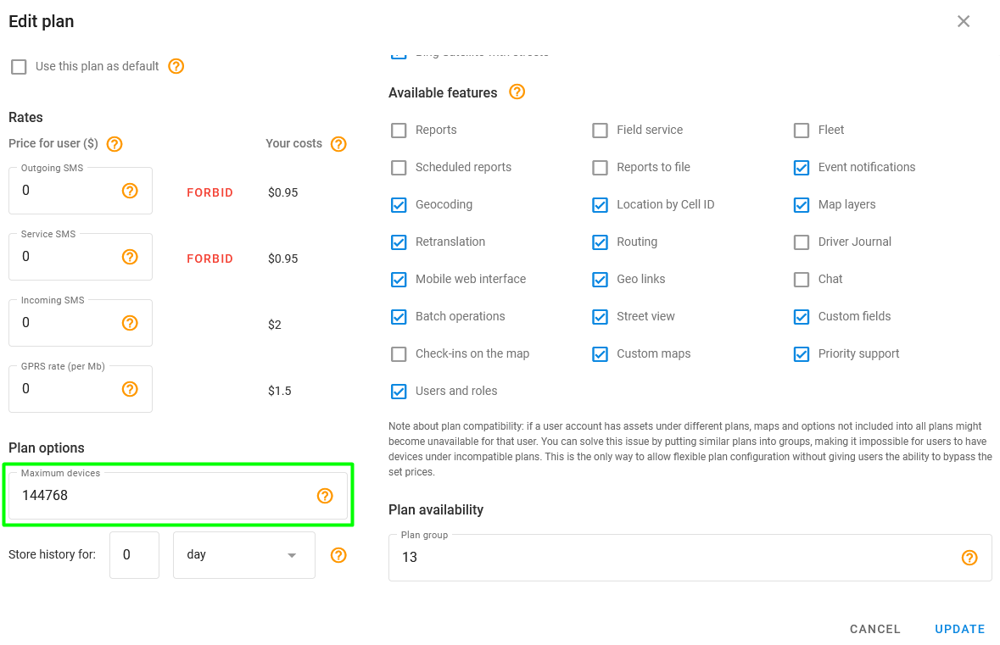
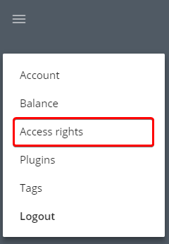

# Pricing plans conflicts

While pricing plans are essential for managing devices and users, they include several nuanced features. This article clarifies these details to help you optimize your configuration and improve the user experience.


if a user account has assets under different plans, maps and options not included into all plans might become unavailable for that user. You can solve this issue by putting similar plans into groups, making it impossible for users to have devices under incompatible plans. This is the only way to allow flexible plan configuration without giving users the ability to bypass the set prices.


### Devices not displayed in UI

If the device count in a user’s account doesn't match the Admin Panel, verify the pricing plan settings. Note that when an account contains devices on different plans, the system automatically applies the restrictions of the most limited plan to the entire account.

<figure><figcaption>
Maximum devices
</figcaption></figure>

If you have devices with pricing plans that allow 100 and devices with pricing plans that allow 30 devices, only 30 devices will be shown in the user account.

### History limits for the plan

The **Store history for** option in plan settings determines how history works for the plan:&#x20;

<figure><figcaption>
Store history
</figcaption></figure>

This option defines the time period during which tracking points will be stored. If you will try to get tracks made earlier, you will get the error below:

<figure><figcaption>
Tracking error
</figcaption></figure>

### User can't create or edit roles and sub-users

Users can create and manage sub-accounts and custom roles, provided their pricing plan supports it. If any device within an account is assigned a plan where the **Users and roles** feature is disabled, this functionality will be restricted for the entire account.

<figure><figcaption>
Users and roles checkbox
</figcaption></figure>

The corresponding section will be also removed from the menu:

<figure><figcaption>
Access rights
</figcaption></figure>

Make sure to pay attention and triple-check all pricing plans parameters.

### User can't select maps

If some maps can't be selected in the user account, check which tariff plan is used. The unavailable maps might be disabled:

<figure><figcaption>
Map checkboxes
</figcaption></figure>

Select the available maps in the user’s plan settings.
