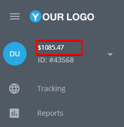

# SMS commands are not delivered

This article describes some of the potential reasons why SMS commands may not be delivered to devices. While devices can typically be set up automatically without the need for manual configuration using USB cables, drivers, configuration utilities, or complicated SMS commands, there may be instances where SMS commands fail to be delivered.

## Insufficient funds in the SMS gateway’s balance

If you're using a custom SMS gateway integrated with your Navixy account, SMS commands might not arrive because there isn't enough money in the gateway account.\
Make sure the balance is topped up and has enough funds for sending SMS messages.

## Insufficient funds in the customer’s balance

Service SMS is a message sent from the platform to devices, normally without any special user approval. Such messages might be used during automatic device activation to deliver initialization commands (APN settings, server address, etc.), or when your support team performs remote device diagnostics.

If these SMS commands aren't free for the user according to the tariff plan, and there are not enough funds to send messages, SMS commands will not be sent.

<figure><figcaption><p>Service SMS price</p></figcaption></figure>

In this case, make sure that there are enough funds on the user’s account.

<figure><figcaption><p>Available balance</p></figcaption></figure>

## Service SMS messages are forbidden

Activation commands might not be sent because of the tariff plan’s restrictions:

<figure><figcaption><p>Service SMS forbidden</p></figcaption></figure>

To allow sending activation commands from the platform, enable this option. Each device has its own tariff plan, and its settings may vary across devices.

## Configuring devices with leading space passwords

GPS devices produced by certain manufacturers, such as Teltonika, Ruptela, and Bitrek, are configured using activation commands with a double space symbol in the beginning, for example:

```
setparam 2004:tracker.navixy.com
```

These characters serve as the default password. Most SMS gateways cut these space symbols as useless, though they are not. Because of that, SMS commands sometimes cannot be delivered. You can try to configure the device via its configurator or try manually sending SMS commands to the tracker from your mobile device.

## SMS gateway errors

If you're using a customm SMS gateway, check the SMS gateway logs. This section describes the most common errors in the logs.

* **Message blocked**: The destination number you are trying to reach is blocked from receiving this message. Please check that the recipient SIM card is able to receive SMS commands.
* **Unknown destination handset**: The destination number you are trying to reach is unknown and may no longer exist.
* **Unknown phone number.**

If you encounter these errors, make sure you've entered a correct phone number and that the SIM card is connected.
