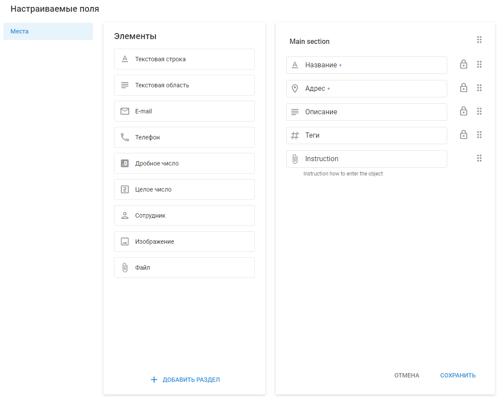

# Настраиваемые поля

Настраиваемые поля позволяют добавлять персонализированную информацию в описание объектов, например мест. Пользовательские поля работают так же, как и стандартные, позволяя хранить ценные данные, которые можно использовать для фильтрации и повышения эффективности работы.

**Примеры:**

- В системе “Управление сотрудниками” настраиваемые поля могут дополнять информацию о клиентах или обслуживаемых помещениях. Сотрудник, работающий в полевых условиях, используя [X-GPS трекер](https://x-gps.ru/) Мобильное приложение позволяет просматривать и редактировать подробную информацию о местах, например, данные о клиентах и требованиях к обслуживанию, что повышает эффективность выполнения задач. [Подробнее в блоге](https://www.navixy.ru/blog)

## Пользовательские типы полей

| **Тип поля** | **Описание** |
| --- | --- |
| **Текстовая строка** | Длина до 700 символов, допускаются любые символы. |
| **Текстовая область** | Длина до 20 000 символов, не сортируется. |
| **Электронная почта** | Только для адресов электронной почты. |
| **Телефон** | Только для телефонных номеров. |
| **Дробное число** | Для дробных значений. |
| **Целое число** | Для целочисленных значений. |
| **Сотрудник** | Позволяет назначить ответственного сотрудника, сделав это место видимым в приложении X-GPS Tracker. |
| **Изображение** | Позволяет добавить изображение. |
| **Файл** | Позволяет прикрепить файл. |

### Добавление и редактирование настраиваемых полей

Чтобы добавить новое настраиваемое поле, перейдите в раздел **Аккаунт → Настраиваемые поля**.

1. **Выберите тип поля:** Выберите тип поля из списка Элементы слева.
2. **Перетаскивание:** Перетащите выбранный тип поля в раздел Main справа.
3. **Укажите информацию:**
  - **Название поля:** Введите название поля.
  - **Описание:** Предоставьте описание для поля.
  - **“Обязательный”:** Укажите, является ли это поле обязательным. При добавлении нового места его нельзя сохранить, пока не будут заполнены все обязательные поля.

### Дополнительные действия для пользовательских полей

- **Добавить раздел:** Распределите пользовательские поля по разным разделам для лучшей организации.
- **Пересортировать:** Перетаскивайте поля и разделы, чтобы расположить их в нужном вам порядке.
- **Удалить:** Чтобы удалить поле, выделите его и нажмите на значок мусорной корзины. Обратите внимание, что первичные поля, отмеченные значком замка, удалить нельзя.

#### Важные замечания

- **Максимальное количество настраиваемых полей:** Вы можете добавить до 50 настраиваемых полей.
- **Автоматические обновления:** При редактировании полей изменения в их названии, описании и порядке автоматически отражаются во всех созданных местах.
- **Удаление:** При удалении поля оно будет удалено из всех мест навсегда без возможности восстановления.

## Вопросы и ответы и устранение неполадок

- **Можно ли добавить настраиваемые поля к другим объектам, кроме мест?** В настоящее время настраиваемые поля можно добавлять только в места, но в будущем планируется расширить эту функциональность.
- **Как можно заполнить настраиваемые поля из CRM-систем через API Navixy?** Да, вы можете заполнять настраиваемые поля в Navixy, выполняя вызовы API для синхронизации данных из вашей CRM. Это обеспечивает беспрепятственную передачу и обновление данных, гарантируя, что вся информация будет актуальной и доступной в обеих системах. Подробнее в разделе [Navixy API Документация](https://developers.navixy.com/general/getting-started/).