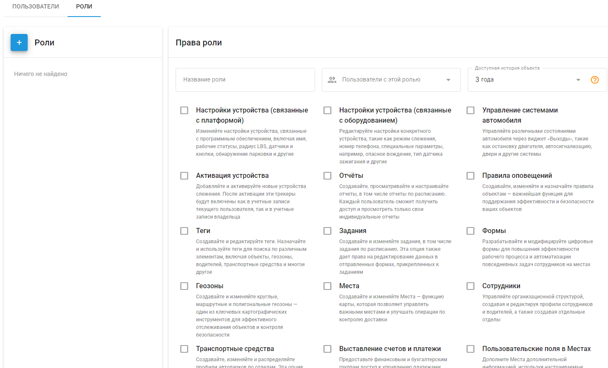

# Определение роли пользователей

Роль пользователя в Navixy - это набор разрешений и прав доступа, назначенных пользователю и определяющих, что он может просматривать и чем управлять в платформе. Роли пользователей настраиваются и позволяют владельцу контролировать уровень доступа каждого пользователя к различным функциям и данным. Роли определяют возможности пользователя:

- Управление транспортными средствами, сотрудниками и активами
- Просмотр телематических данных с GPS-устройств и датчиков
- Работа с геозонами и точками интереса (POI)
- Создание отчетов, использование специальных плагинов и инструментов для приложений

Назначая роли, владелец может обеспечить пользователям соответствующий доступ, необходимый для выполнения их задач, не нарушая при этом безопасность и целостность бизнес-данных и операций. Каждая роль может включать в себя основные права, доступные всем пользователям, а также дополнительные права, отвечающие конкретным потребностям и обязанностям различных пользователей.

## Добавление и управление ролями

Чтобы добавить новую роль, перейдите в раздел Настройки учетной записи → Пользователи и роли и выберите вкладку "Роли". Нажмите на кнопку добавления роли (кнопка со знаком "+").

2. **Создать новую роль**:

- Придумайте название для роли.
- Выберите необходимые права доступа для этой роли.
- Нажмите "Сохранить", чтобы создать роль.

### Виды прав

Все права делятся на три категории: Владелец, Основные и Дополнительные.

#### Права собственника

Права владельца доступны только владельцу учетной записи (основному пользователю) и не могут быть назначены другим ролям. К ним относятся:

- Добавление и редактирование пользователей
- Управление группами объектов
- Настройка пересылки данных
- План изменений

**Основные права**

Основные права доступны для всех ролей и не могут быть отключены. К ним относятся:

- Инструменты работы с картой (слои, планирование маршрутов и т.д.)
- История поездок и событий
- Сервисные операции
- Интерактивные виджеты (изменение статуса работы, изменение состояния выхода и т.д.)
- Доступ к связанным данным (назначенные задания, правила управления и т.д.)

**Дополнительные права**

Дополнительные права настраиваются индивидуально для каждой роли. К ним относятся:

- **Настройки устройства (со стороны программного обеспечения)**: Изменение настроек устройства, связанных с программным обеспечением, включая имя, статус работы, радиус действия LBS, датчики и кнопки, обнаружение парковки и многое другое.
- **Настройки устройства (аппаратная часть)**: Редактирование настроек для конкретных устройств, таких как режим слежения, номер телефона, специальные параметры, например жесткое вождение, источник зажигания и другие.
- **Управление системами транспортных средств**: Управление различными состояниями автомобиля с помощью виджета "Выходы", включая выключение двигателя, автосигнализацию, двери и другие системы.
- **Активация устройства**: Добавление и активация новых устройств слежения. После активации устройства слежения будут включены как для учетной записи текущего пользователя, так и для учетной записи владельца.
- **Отчеты**: Создание, просмотр и настройка стандартных или запланированных отчетов. Каждый пользователь может просматривать только свои индивидуальные отчеты.
- **Правила оповещений**: Создание, изменение и назначение правил для объектов, чтобы поддерживать эффективную работу и протоколы отслеживания.
- **Теги**: Создание и редактирование тегов. Назначение и использование тегов для поиска различных элементов, включая объекты, геозоны, водителей, автомобили и многое другое.
- **Задачи**: Создание и изменение индивидуальных и запланированных заданий. Эта опция также дает право редактировать данные в формах, прикрепленных к задачам.
- **Геозоны**: Создание и редактирование круговых, маршрутных и полигональных геозон - ключевой картографический инструмент для отслеживания объектов и обеспечения безопасности.
- **Места**: Создание и редактирование точек интереса (POI) - функция карты, позволяющая управлять важными местами и улучшать операции по контролю доставки.
- **Сотрудники**: Управление организационной структурой, создание и редактирование профилей сотрудников и водителей, а также создание отделов.
- **Транспортные средства**: Создание, изменение и распределение профилей автопарка по отделам. Эта опция также позволяет назначать водителей на конкретные автомобили.
- **Счета и платежи**: Предоставление финансовым и бухгалтерским группам доступа к управлению платежами, истории транзакций и настройкам оповещения о низком балансе.
- **Видеотелематика**: Доступ к прямым трансляциям, просмотр событий и воспроизведение видео с видеорегистраторов и MDVR, что повышает безопасность на дорогах и охрану автопарка.
- **Гео-ссылки:** Предоставление доступа к местоположениию отслеживаемых объектов в реальном времени с третьими лицами с помощью инструмента, который можно встроить в любой веб-сайт или приложение.
- **Курьер на карте**: Предоставление клиентам возможности отслеживать свои заказы на веб-сайте, предлагая обновления местоположения и маршрута курьера в режиме реального времени.