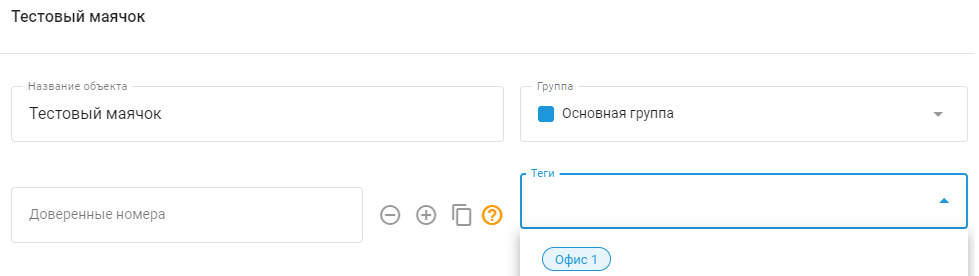

# Теги

**Тег -** это метка, которая обеспечивает удобный и быстрый поиск нужной информации. В Navixy метки помогают быстро находить информацию, связанную с местами, сотрудниками, транспортными средствами и задачами. Вы можете создавать собственные метки в соответствии с вашими потребностями, и у одного объекта может быть несколько тегов.

## Использование тегов для поиска

Чтобы найти объекты с одинаковыми тегами:

- Введите название тега в поле поиска.
- Система отобразит все результаты поиска, связанные с этим тегом.

Вот несколько примеров:

- **Транспортные средства.** Чтобы найти автомобили с определенными тегами, например "Самосвал" или "Арендованный", введите название соответствующего тега в поле поиска в списке автомобилей.
- **Сотрудники.** Если вы пометили сотрудников на основе их ролей или проектов, введите соответствующий тег, например "Проект Альфа" или "Полевой Инженер", в поле поиска, чтобы увидеть всех сотрудников, связанных с этим тегом.
- **Нахождение задачи.** Для задач, помеченных как "Срочные" или "Обслуживание", ввод этих тегов в поле поиска поможет вам быстро получить доступ ко всем задачам, помеченным как срочные или связанные с обслуживанием.

## Создание и назначение тегов

Вы можете создать неограниченное количество меток в соответствии с вашими организационными потребностями; однако каждому GPS-устройству или объекту можно присвоить не более 5 меток.

### Метод 1. В контексте

Чтобы создать или присвоить метку объекту, просто введите метку в поле **Теги** поле. Если теги с аналогичными исходными данными уже существуют, они появятся в выпадающем списке, из которого вы можете выбрать.

### Способ 2. В каталоге тегов

Перейдите в раздел **Настройки учетной записи → Теги**:

- Нажмите на кнопку **"+"** чтобы добавить новый тег.
- Введите нужное имя метки.
- По желанию назначьте метке цвет для лучшего визуального различения.

## Управление

Чтобы управлять тегами, перейдите в раздел **Аккаунт → Теги**. Это приведет вас к экрану управления тегами, где вы можете просматривать, создавать, редактировать и удалять теги.

При удалении тега ссылка на связанный с ним объект удаляется, но сам объект не удаляется.