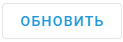
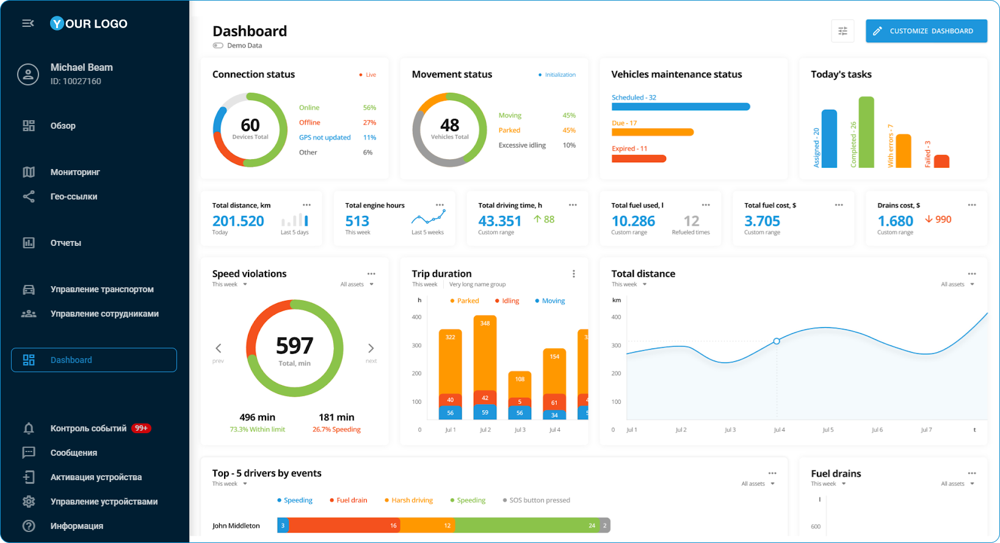

# Создание новых Приложений

При настройке нового **Приложения** вам доступно несколько ключевых конфигураций, которые определяют, как ваше внешнее приложение интегрируется с платформой. Давайте рассмотрим каждый важный компонент.

Начните с нажатия 

 в списке **Приложений**. В появившейся форме конфигурации выполните следующие действия:

### **1\. Настройте URL**

Укажите URL вашего приложения - адрес, на котором оно размещено. Это основной шаг для интеграции.

> [!INFO]
> **Важно:**
> - Убедитесь, что URL действителен, использует HTTPS-соединение, ведет на заслуживающий доверия ресурс и содержит не более 1000 символов.
> - Убедитесь, что в приложении включен параметр iFrame, иначе вы не сможете открыть его в интерфейсе платформы.

### **2\. Добавьте параметры в URL**

Чтобы персонализировать ваше приложение, вы можете включить в URL различные параметры. Параметры можно добавлять вручную в поле URL или воспользоваться одним из наших предложений: язык, идентификатор пользователя или часовой пояс. Нажмите на предложенный параметр, чтобы добавить его в конец URL. Разверните описание ниже, чтобы узнать больше о предлагаемых параметрах и их примерах.

Понимание предлагаемых параметров URL

Мы предлагаем несколько основных параметров для персонализации

1. `?locale={locale_code}`  
Параметр языка, который автоматически соответствует языку платформы пользователя.

- Пример: `https://your-app.com/dashboard?locale=en`

2. `?user_id={user_identifier}`  
Параметр пользовательского контекста, передающий идентификатор пользователя для фильтрации персонализированной информации.

- Пример: `https://your-app.com/dashboard?user_id=12345`

3. `?timezone={timezone}`  
Параметр времени, который автоматически соответствует часовому поясу платформы пользователя.

- Пример: `https://your-app.com/dashboard?timezone=UTC+1`

Вы можете изменить имя предложенного параметра или указать для него определенное значение.

> [!NOTE]
> Проверьте свою конфигурацию, чтобы убедиться, что приложение загружается правильно. Нажмите 
> 
>  для предварительного просмотра встраивания.

### **3\. Настройте отображение**

Создайте узнаваемый идентификатор для своего приложения, чтобы облегчить доступ к нему из скписка. Следующие настройки помогут вам в этом:

- **Название** \- Добавьте уникальное и понятное название для вашего приложения (до 24 символов). Оно будет отображаться в боковой панели платформы.
- **Описание** \- Добавьте краткое пояснение к функциональности приложения или выделите важную информацию (до 50 символов). Информативное описание поможет вашим пользователям лучше понять назначение приложения.
- **Иконка** \- выберите иконку, отображающую функции вашего приложения, для еще более удобной навигации.

### **4\. Выберите способ отображения**

Определите, как будет открываться ваше приложение, выбрав один из двух вариантов в выпадающем списке **Способ отображения**:

- **Интерфейс платформы**\- приложение появляется в интерфейсе платформы
- **Новая вкладка** \- приложение открывается в отдельной вкладке браузера

> [!NOTE]
> Наша платформа использует iFrame для встраивания. Поскольку не все URL-адреса могут быть успешно обработаны с помощью этой технологии, обязательно предварительно просмотрите результат встраивания. Если у вас возникнут проблемы с этим методом отображения, пожалуйста, рассмотрите возможность использования новой вкладки.

### **5\. Настройте аутентификацию (необязательно)**

Настройте способ аутентификации, если ваше приложение использует API платформы. В этом случае платформа будет предоставлять аутентификационные данные непосредственно при открытии приложения, и избавит вас от необходимости реализовывать дополнительный вход в систему на стороне приложения.  
Вы можете выбрать один из двух методов аутентификации:

- **API** **Ключ**
  - Этот метод подходит для приложений, где не требуется управление ролями или уровнями доступа пользователей.
  - Ключ API соответствует уровню доступа владельца аккаунта. Это означает, что предоставление обычному пользователю ключа API может предоставить ему доступ ко **всем данным**, доступным основному пользователю.  
Например, если ваше приложение работает с трекерами, к которым пользователь имеет ограниченные права или вообще не имеет доступа, использование ключа API все равно откроет доступ ко всем трекерам из основного аккаунта.

- **Ключ сессии**
  - Этот метод рекомендуется использовать, когда требуется управлениие ролями.
  - Передает приложению ключ текущей сессии пользователя.

> [!NOTE]
> Выбор метода API-ключа автоматически отключит метод сеансового ключа, и наоборот. Одновременно можно использовать только один метод.

Если аутентификация включена, платформа добавляет параметр `?session_key=` к URL приложения.

- Если вы выбрали **ключ API**, значение параметра будет содержать этот ключ.
- Если вы выбрали **ключ сессии**, значение параметра будет включать ключ текущей сессии пользователя, из которой осуществляется доступ к приложению.

Убедитесь, что ваше приложение способно читать и использовать этот параметр.

### **6\. Сохраните новое приложение**

Нажмите кнопку **Сохранить**. Ваше приложение появится в списке **Приложений** в настройках и на боковой панели платформы. Включенные приложения автоматически становятся доступными для пользователей учетной записи.

Быстрые советы по устранению неполадок

Если ваше приложение не отображается должным образом при встраивании, попробуйте:

- Открывайте его в новой вкладке
- Проверка правильности и доступности вашего URL-адреса
- Проверка правильности форматирования всех параметров

Созданные приложения остаются полностью настраиваемыми после сохранения. Вы можете в любой момент изменить их параметры и внешний вид. Дополнительные сведения об управлении приложениями см. в разделе [Управление существующими приложениями пользователя](../page-ff931773-686d-4a07-b481-fae8b0a24f11/page-e11a8cb7-332b-481b-a6db-ce8170f137ec.md).