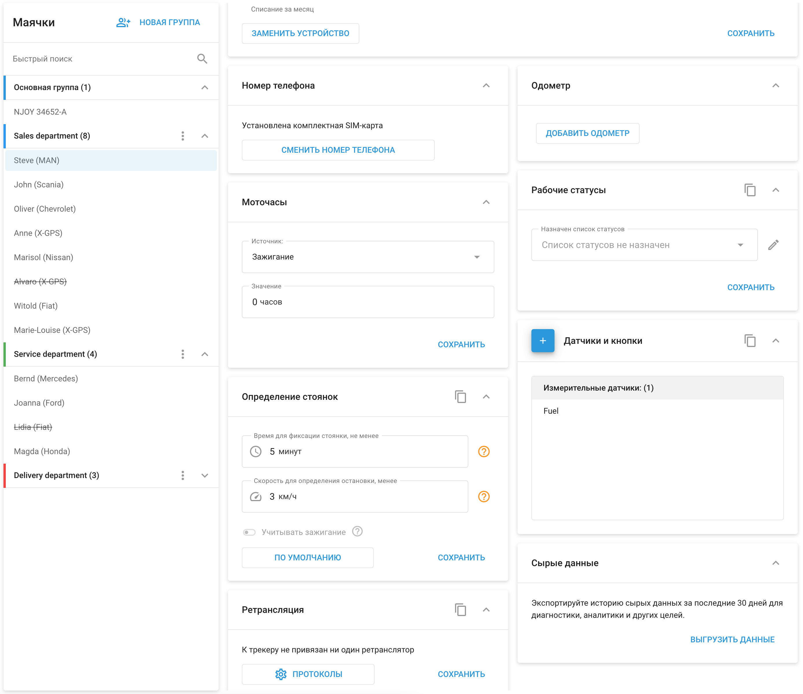

# Управление устройствами

Меню **Управление устройствами** - раздел, позволяющий руководителям автопарков настраивать и управлять устройствами мониторинга удаленно. Этот раздел необходим для точной настройки работы устройства, установки датчиков и применения специальных настроек для каждого объекта в автопарке.

#### Основные характеристики и варианты конфигурации

1. **Название объекта:**
  - Это имя, присваиваемая каждому устройству. Оно помогает легко идентифицировать и управлять устройствами в вашем парке.
2. **Группа:**
  - Устройства можно группировать по отделам, функциям или любым другим категориям, соответствующим потребностям вашего парка. Такая организация помогает эффективно управлять множеством устройств.
3. **Теги:**
  - Метки обеспечивают быстрый и простой способ категоризации и поиска устройств в платформе. Эта функция улучшает организацию и поиск информации об устройствах.
4. **Номер телефона:**
  - Отображает номер телефона, связанный с SIM-картой, установленной в устройстве, и имеющий решающее значение для связи и передачи данных.
5. **Режим мониторинга:**
  - Настройте поведение отслеживания на основе времени, расстояния или поворота. Это позволяет точно настроить частоту передачи данных о местоположении устройства, сбалансировав точность данных и стоимость передачи.
6. **Определение стоянки:**
  - Установите параметры, определяющие, когда автомобиль считается припаркованным. Сюда входят такие условия, как минимальное время простоя и максимальная скорость холостого хода после прекращения движения.
7. **Опасное вождение :**
  - Используйте встроенный акселерометр, чтобы обнаружить и сообщить о резких движениях, таких как резкое ускорение, резкое торможение или резкий поворот. Эти настройки помогают контролировать поведение водителя и повышают безопасность.
8. **Обнаружение эвакуации:**
  - Для устройств, поддерживающих обнаружение эвакуации, настройте чувствительность так, чтобы обеспечить точное обнаружение и свести к минимуму ложные срабатывания.
9. **Датчики и кнопки:**
  - Сопоставьте входы устройства с подключенными датчиками и определите типы датчиков. Сюда входит настройка датчиков уровня топлива, применение калибровочных данных и конфигурирование других подключенных входов.
10. **Ретрансляция данных:**
  - Передавайте данные с устройства GPS-слежения на другие серверы в удобном для вас формате или протоколе. Эта функция очень важна для интеграции Navixy с другими платформами, для обеспечения соответствия нормативным требованиям или для получения данных в режиме реального времени.
11. **Состояние подключения:**
  - Отслеживайте состояние подключения устройства, включая настройки таймаута, когда устройство считается отключенным.
12. **Дополнительные функции:**
  - В зависимости от модели устройства могут быть доступны дополнительные опции конфигурации, такие как отслеживание моточасов, настройка источников зажигания, обнаружение несанкционированных перемещений и другие.

## Групповые действия

Navixy позволяет применять настройки к нескольким устройствам одновременно с помощью групповых действий. Эта функция упрощает процесс настройки схожих устройств, экономит время и обеспечивает согласованность действий во всем парке:

- **Настройки копирования:**
  - В правом верхнем углу любого виджета настроек находится значок копирования. Используйте его, чтобы применить те же настройки к другим устройствам в вашем парке. Если устройство не отображается в выпадающем списке, это означает, что выбранные настройки несовместимы с данной моделью устройства.