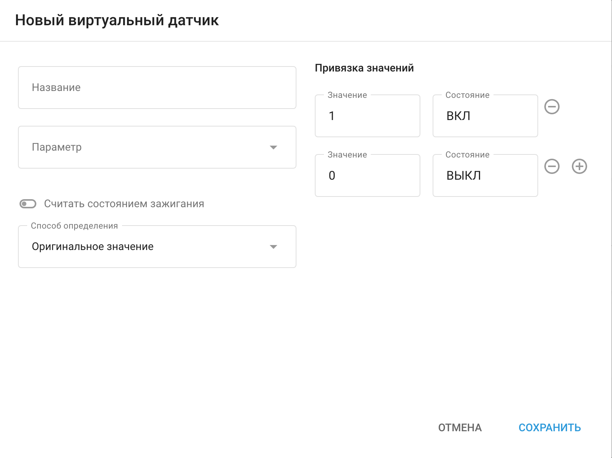
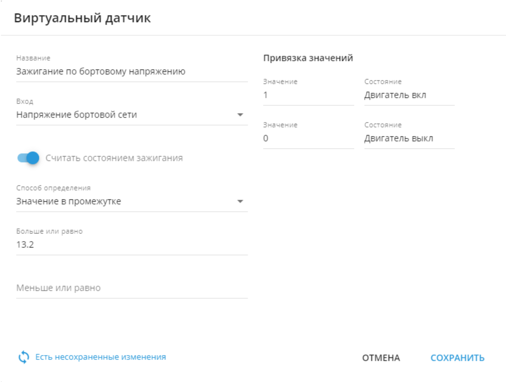
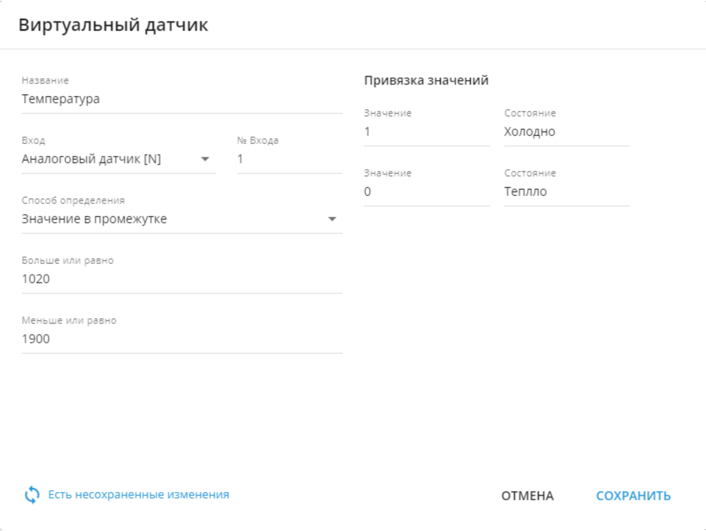

# Виртуальные датчики

# Виртуальные датчики

Виртуальные датчики позволяют более эффективно обрабатывать данные телеметрии. Сопоставляя напряжение на плате, они могут помочь вам рассчитать время работы двигателя на основе заданных условий и значений. Кроме того, они позволяют преобразовывать множество точек данных от различных датчиков, подключенных к устройству, в более простые для понимания показатели, такие как "горячий", "холодный", "открытый" и "закрытый", независимо от производителя или модели устройства. Это открывает новые возможности для мониторинга, отслеживания и прогнозирования работы сложных технологий.

## Как создать виртуальный датчик

Виртуальный сенсор можно создать с помощью портлета "Сенсоры и кнопки", расположенного на вкладке "Устройства и настройки":

1. Войдите в раздел устройств и настроек.
2. Выберите GPS-трекер.
3. Нажмите "+".
4. Выберите "Опция виртуального датчика".

Каждое устройство может иметь до 100 виртуальных датчиков.

Дальнейшие действия зависят от того, какую задачу необходимо решить с помощью виртуального датчика. Ниже приведены примеры и инструкции для различных методов расчета.

## Способы определения

Виртуальные датчики имеют три различных типа расчета:

- Значение в промежутке.
- Оригинальное значение.
- Номер бита.

Все значения для виртуальных датчиков должны соответствовать форме, в которой они получены от устройства. Все состояния являются вашими определениями для этих значений.

Здесь мы опишем, как работают различные методы расчета. Нажмите на название метода расчета, чтобы раскрыть его.

### Значение в диапазоне

Этот тип виртуальных датчиков помогает нашим клиентам поддерживать в заданном диапазоне такие важные параметры, как виртуальное зажигание, температура, влажность и уровень топлива.

Вот как это работает:

- если значение датчика находится внутри указанных границ, то для платформы оно равно 1. А 1 равно вашему значению A.
- если значение датчика находится за пределами этих рамок, то значение виртуального датчика для платформы равно 0. А 0 равно вашему значению B.

### Пример с виртуальным зажиганием

Если у вас нет входа зажигания или устройство уже работает на полную мощность, вы можете использовать Virtual Ignition Tool для определения состояния зажигания. Напряжение бортовой сети автомобиля значительно увеличивается при включении двигателя, что позволяет использовать пороговое напряжение в качестве индикатора того, работает двигатель или нет. Как правило, напряжение на бортовой сети должно превышать 13,2 В, что свидетельствует о работе двигателя.

Чтобы создать этот датчик:

1. Начните с того, что дайте ему название.
2. Установите на входе напряжение на плате или любой другой датчик, если это необходимо.
3. Включите в настройках функцию "Учитывать как состояние зажигания".
4. В качестве метода расчета выберите "Значение в диапазоне".
5. Укажите минимальное значение диапазона, например 13,2 В. Максимальное значение не обязательно, так как напряжение на плате может меняться при включенном зажигании.
6. Наконец, установите значения состояний 0 и 1 - обычно это On и Off соответственно.

После того, как вы установите пороговый диапазон, если отправляемое устройством бортовое напряжение находится в пределах этого диапазона, платформа переключит состояние зажигания на "Включено". И наоборот, если оно находится за пределами этого диапазона, оно будет переключено в состояние "выключено".

Виртуальное зажигание также будет учитываться в отчетах и уведомлениях на основе его состояния; например, вы можете использовать его для создания отчетов по моточасам, счетчика моточасов или предупреждений о чрезмерном холостом ходе.

Кроме того, это виртуальное зажигание будет использоваться для определения поездок и парковок с учетом зажигания.

### Пример с аналоговым датчиком

Этот пример похож на предыдущий, но вместо контроля зажигания автомобиля он отслеживает температуру.

Предположим, у вас есть аналоговый датчик, который собирает данные о температуре - допустим, он выдает 1020 для -10°C и 1900 = 0°C. Данные, поступающие от аналоговых датчиков, не калиброваны, поэтому для виртуального датчика они также должны быть заданы в такой форме.

Мы можем задать диапазон - все, что находится между 1020 и 1900, будет классифицироваться как "холодное" (1), а все, что выше 1900, будет считаться "горячим" (0).

### Оригинальное значение

С помощью виртуальных датчиков, вы можете присвоить свое определение любым принимаемым значениям. Этот способ работает с предопределенными наборами значений и строк, что упрощает работу со статическими значениями без необходимости задавать различные диапазоны. Кроме того, он может работать с любыми необходимыми данными. Например:

- 0/1,
- true/false,
- Вкл/Выкл,
- Открыт/Закрыт,
- постановка/снятие с охраны,
- состояние 1/состояние 2/состояние 3,
- ключ 1/ключ 2/ключ 3, и так далее.

Этот способ определения работает следующим образом:

- значение от датчика 1, это ваше значение А;
- значение от датчика 2, это ваше значение B;
- а значение от датчика 3, это ваше значение C и так далее.

Давайте проиллюстрируем этот тип функциональности на конкретных примерах.

### Пример с показаниями CAN шины автомобиля

Некоторые датчики CAN могут выдавать платформе различные значения. Например, у нас есть грузовик с датчиком состояния ВОМ, который может выдавать только следующие значения:

- 0 - Выключено,
- 1 – Удержание,
- 2 - Удаленное удержание,
- 3 - Режим ожидания,
- 4 - Удаленный режим ожидания,
- 5 – Установить,
- 6 – Замедление,
- 7 – Возобновление,
- 8 – Ускорение,

Чтобы настроить такой датчик, выполните следующие действия:

1. Укажите имя виртуального датчика.
2. Выберите вход.
3. Параметр Считать состоянием зажигания должен быть выключен. Он не появится, если датчик виртуального зажигания уже создан.
4. Выберите "Исходное значение" в качестве способа определения.

Заполните таблицу, указав справа собственные значения, а слева - соответствующие им значения датчиков. Добавляйте строки, нажимая на знак "+", и удаляйте их с помощью кнопки корзины.

*Пример конфигурации для метода расчета исходного значения на CAN датчике*

### Считывание аппаратных ключей для водителей, оборудования или прицепов

Некоторые устройства могут считывать водителей и их iButton, RFID-ключи. Также устройства могут считывать метки, подключаемые к устройству через Bluetooth. У всех этих объектов есть свой идентификатор - аппаратный ключ.  
Платформа может определять ближайшее к устройству оборудование или водителя, а виртуальный датчик способен отображать такие названия.

Одним из примеров, которым хочется поделиться является чтение Bluetooth меток, подключенных к тяжелому оборудованию или прицепам. Когда транспортное техника приближается к этому оборудованию или прицепу, маячок отправляет его аппаратный ключ на платформу, а связанное с этим ключом имя может быть отображено в понятной форме - аналогично тому, как были определены значения для ВОМ. Например, подключается ковш - одна метка со своим ключом. Платформа сможет отобразить название этого ковша.

*Пример конфигурации для способа определения Исходное значение для считывания аппаратного ключа или датчика поля состояния*

### Номер бита

Некоторые устройства могут предоставлять в своих пакетах расширенные данные, иногда объединяя несколько параметров [в одно значение](https://www.navixy.ru/blog/indeksnye-polja/). Виртуальные датчики позволяют работать с частями таких параметров, декодируя данные, передаваемые GPS-оборудованием.

Предположим, в поле 123 передается значение 011 - мы должны прочитать эту информацию в little endian (от младшего бита к старшему) в соответствии с протоколом:

- 1 - Показывает состояние ремня безопасности водителя: 0 - пристегнут, 1 - не пристегнут. Нулевой бит или бит 0.
- 1 - Отображает состояние двери водителя: 0 - закрыта, 1 - открыта. Первый бит или бит 1.
- 0 - Показывает состояние капота: 0 - закрыт, 1 - открыт. Второй бит или бит 2.

Каждый бит параметра отображает значение различных систем автомобиля. Для их отображения необходимо создать один виртуальный датчик для каждого параметра/бита.

Для датчика, отображающего состояние капота автомобиля в нашем примере:

1. Задайте имя датчика.
2. Выберите вход в соответствии с документацией устройства.
3. Выберите Номер бита в качестве способа определения.
4. Выберите бит 2 для этого поля.

Ниже приведен пример для датчика, показывающего состояние капота автомобиля.

*Пример конфигурации для виртуального датчика со способом определения номер бита*

После того как виртуальный датчик настроен и связанный с ним датчик устройства предоставил данные, их можно просмотреть в виджете "Показания датчика" на вкладке "Информация" устройства. Теперь датчики вашего устройства могут разговаривать на вашем языке.