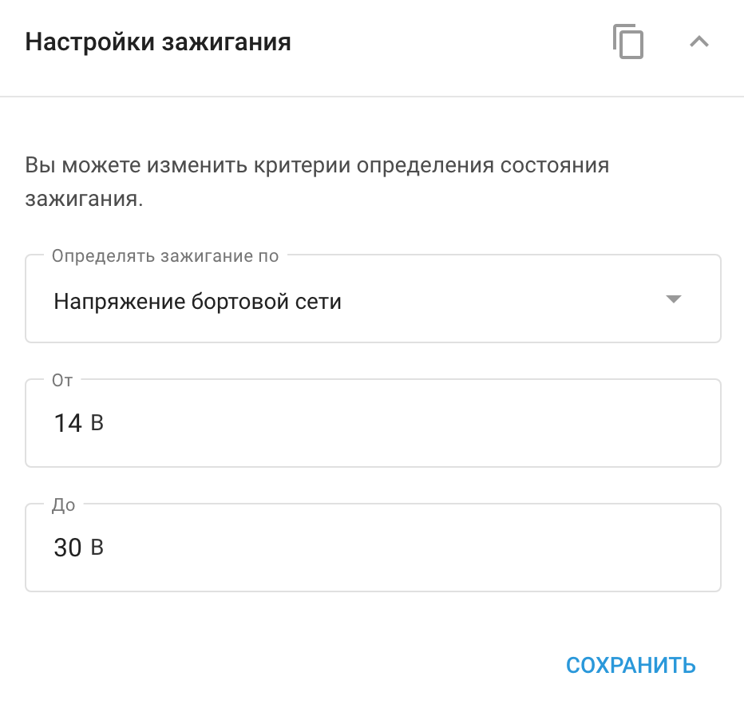

# Настройки зажигания

Многие современные GPS-устройства позволяют определять **настройки зажигания** не только с помощью прямого подключения кабеля зажигания, но и с помощью **виртуального источника зажигания** на основе показаний датчика движения или бортового напряжения автомобиля.

## Варианты виртуальных источников зажигания

- **Определение зажигания по напряжению**: Когда двигатель работает, генератор автомобиля подает энергию с более высоким напряжением, чем аккумулятор, чтобы поддерживать его заряд. Контролируя это повышение напряжения, устройство может точно определить, когда включено зажигание.
- **Обнаружение возгорания с помощью датчика движения**: Эта опция полезна, когда устройство не подключено к электрической системе автомобиля. Состояние зажигания определяется по движению автомобиля. Однако обратите внимание, что этот метод может обнаружить зажигание и при буксировке автомобиля, даже если двигатель не работает.

## Конфигурация виртуального источника зажигания

Чтобы настроить источник зажигания в Navixy, воспользуйтесь

1. Выберите нужный источник зажигания из выпадающего списка в виджете "Источник зажигания".
2. Если используется бортовое напряжение автомобиля, укажите диапазон напряжения, в котором зажигание считается "включенным".

Такая конфигурация позволяет гибко и точно отслеживать состояние зажигания автомобиля, адаптируясь к различным сценариям установки.

#### Пример конфигурации

На этом снимке экрана ниже показаны варианты выбора источника зажигания в платформе Navixy.

Виджет "Источник зажигания" позволяет пользователям выбирать критерии для определения состояния зажигания. Вы можете выбрать один из следующих вариантов:

1. **Напряжение на плате**: Определяет зажигание по напряжению бортовой сети автомобиля, что полезно, когда напряжение увеличивается по мере работы двигателя.

2. **#1 состояние входа**: Использует состояние определенного входа, обычно провода зажигания, чтобы определить, включено или выключено зажигание.

3. **Движение**: Обнаруживает зажигание по движению автомобиля, что идеально подходит для ситуаций, когда устройство не подключено напрямую к электрической системе автомобиля. Однако этот метод может также регистрировать зажигание во время буксировки или других движений, не связанных с двигателем.