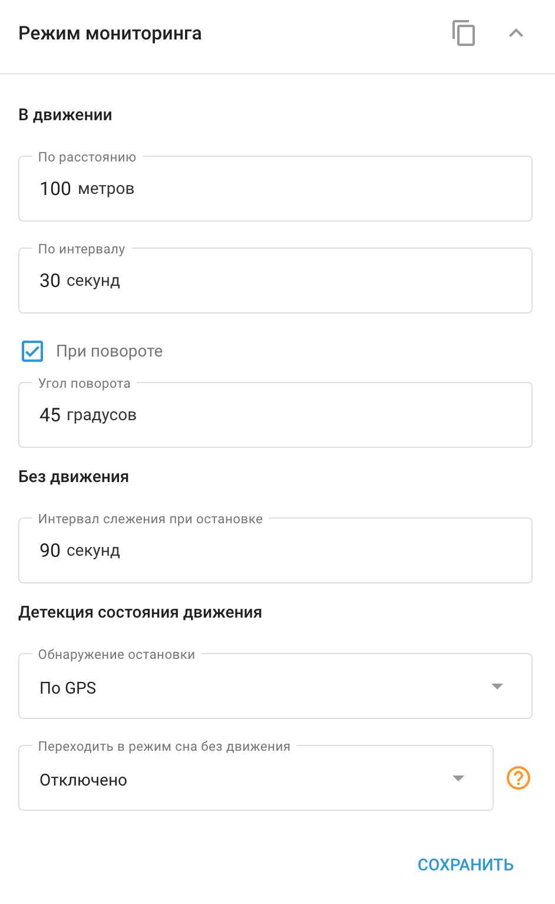

# Режим мониторинга

Виджет **Режим мониторинга** Виджет позволяет настраивать передачу данных и режимы работы устройств GPS-трекинга. Настройки, доступные в этой панели, могут отличаться в зависимости от модели трекера, принципов его работы и функциональности.

#### Настройка параметров режима мониторинга

Чтобы настроить параметры режима слежения, откройте панель и настройте следующие параметры:

- **На расстоянии:** Передача данных происходит, когда устройство перемещается на определенное расстояние.
- **По времени:** Передача данных происходит через определенные временные интервалы.
- **Поворотом:** Передача данных происходит при повороте устройства на определенный угол.

Данные будут передаваться при выполнении хотя бы одного из этих условий, обеспечивая своевременное и точное обновление информации о состоянии и местоположении устройства.