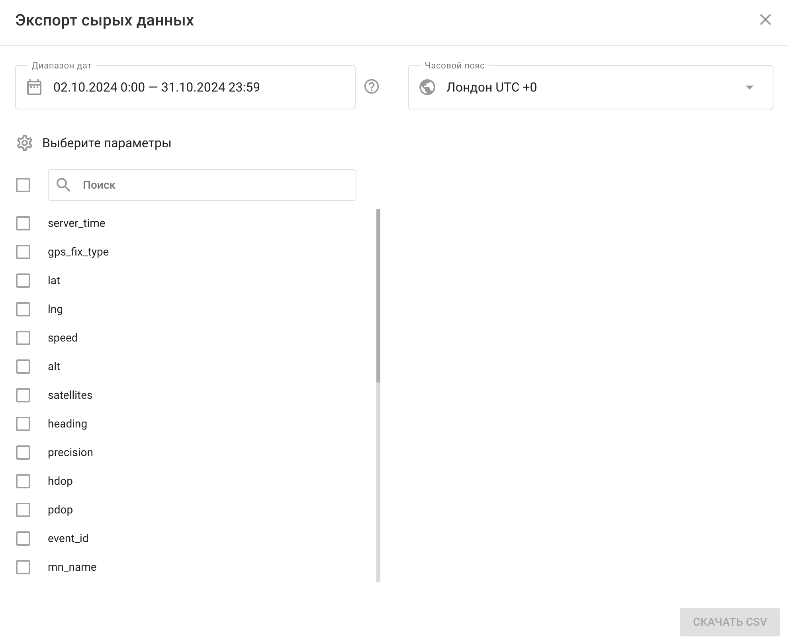
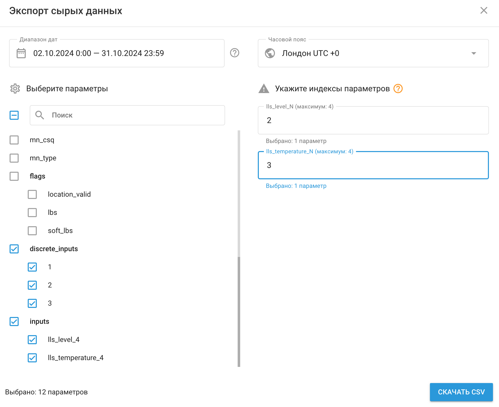

# Сырые данные

Инструмент экспорта сырых данных в Navixy позволяет загружать декодированные сырые данные с любого GPS-трекера на платформе в формате CSV. Эта функция необходима для диагностики устройств, аналитики данных и интеграции данных с программами AI / ML.

## Обзор

С помощью инструмента экспорта необработанных данных вы можете:

- **Выгрузить декодированные исходные данные** с любого GPS-трекера на платформе.
- **Выберите конкретные атрибуты** для включения в CSV-файл, с удобной функцией поиска.
- **Доступ к истории** с указанием временного окна.
- **Настройка часового пояса** в предпочтительный часовой пояс, что упрощает управление данными в разных регионах.

Сырые состоят из декодированной информации полученной из сообщений по протоколам передачи данных конкретных моделей и устройств. После декодирования данные сохраняются в универсальном формате, включая такие ключевые сведения, как местоположение и показания датчиков. Данные предоставляются в формате CSV для удобства доступа и интеграции.

## Как использовать экспорт необработанных данных

Для начала перейдите в раздел "**Управление устройствами**" и найдите устройство. Затем нажмите кнопку "**Выгрузить данные**" в портлете "**Сырые данные**".

Откроется инструмент "Экспорт сырых данных". Выберите диапазон дат, часовой пояс и параметры, которые должны быть включены в файл csv.

Чтобы избежать случайного закрытия окна, инструмент "Экспорт сырых данных" можно закрыть, только нажав на "X" в правом верхнем углу. Кроме того, если вы не переключали устройства и не обновляли страницу, инструмент запомнит выбранные ранее настройки. Эта функция позволяет легко просмотреть настройки GPS-трекера или датчика, вернуться и продолжить работу.

### Выбор диапазона дат

Вы можете выбрать до 30 последних дней или больше, в зависимости от вашего плана. Даты можно выбрать, щелкнув по календарю или введя их вручную. Можно также задать конкретное время. Вот несколько вариантов быстрого выбора:

- Вчера
- На прошлой неделе
- Последние 30 дней

Нажав на них, вы автоматически установите соответствующий диапазон дат.

Чтобы упростить процесс, счетчик показывает, сколько дней вы выбрали. Если вы попытаетесь выбрать дату более чем на 30 дней назад, вы получите сообщение, а кнопка выбора будет отключена.

### Выбор часового пояса

Часовой пояс по умолчанию равен часовому поясу учетной записи пользователя, но может быть изменен:

- Выбор из списка доступных часовых поясов.
- Ввод названия часового пояса.
- Ввод смещения часового пояса (например, -8, +2).

### Выбор параметров

Доступные параметры зависят от модели устройства и включают все параметры, интегрированные в платформу для каждой модели. В одном файле можно выбрать до 1000 параметров.

Варианты выбора параметров включают:

- **Выбрать все**: Нажмите на флажок, чтобы выбрать все параметры.
- **Выберите конкретные параметры**: Используйте флажки рядом с каждым параметром.
- **Поиск**: Найдите конкретные параметры, набрав их название или часть названия.

Для нескольких входов одного типа система отдает предпочтение входу с наибольшим номером индекса. Вы можете указать, какие индексы следует включить, введя числа, разделенные запятыми, или задав диапазон с помощью тире (например, "1-2, 4, 7").

Отображается количество выбранных параметров, и каждый выбранный параметр добавляет колонку в CSV-файл.

## Как прочитать файл необработанных данных

Выбрав необходимые параметры, нажмите кнопку "Загрузить CSV", чтобы загрузить файл.

- Файл можно открыть любым текстовым редактором или программой просмотра таблиц, поддерживающей формат CSV. Столбцы разделяются запятыми.
- Имя файла включает в себя идентификатор устройства, метку трекера, а также указанные дату и временной диапазон.
- Каждая строка (начиная со второй) представляет собой сообщение, отправленное с устройства на платформу. Первая строка содержит время сообщения в выбранном часовом поясе, за которым следуют выбранные параметры.

Этот инструмент необходим для диагностики и аналитики, позволяя получить подробную информацию о данных вашего устройства.