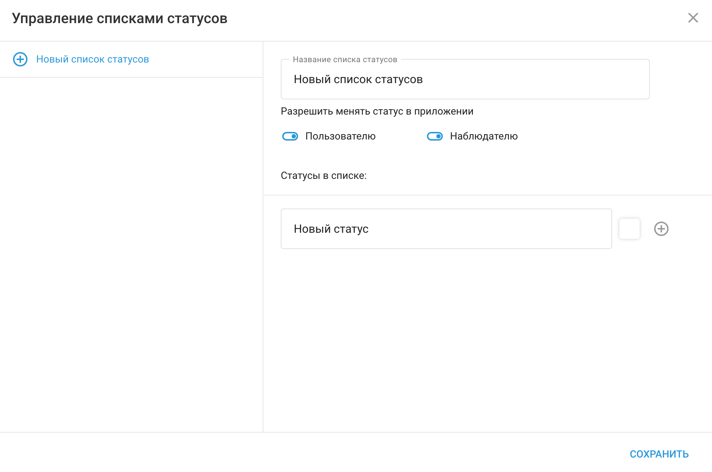

# Рабочие статусы

Когда вы нажмете кнопку 

 откроется окно управления списком состояний с новым списком для создания. Укажите его имя и нажмите кнопку создать.

Используйте “+” чтобы добавить новый статус в список. Там вы можете указать его название и выбрать цвет.

Разрешите изменить статус:

**Пользователем** - может ли сотрудник изменить статус на своем телефоне с помощью приложения X-GPS tracker.

**Наблюдатель** - если статус может быть изменен оператором в приложении мониторинга.