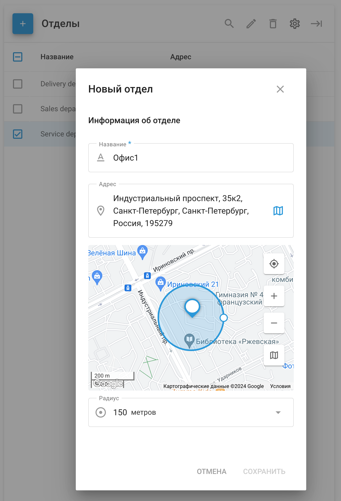

# Отделы - Управление сотрудниками

Секция **Отделы** позволяет эффективно организовать персонал, распределяя сотрудников по определенным отделам. Такая организационная структура помогает упростить распределение задач, отчетность и общее управление полевыми операциями.

## Управление отделами

В разделе "**Отделы**" вы можете создавать, просматривать и управлять различными отделами в вашей организации. Каждый отдел можно обозначить соответствующим образом, например "Отдел доставки" или "Отдел продаж", чтобы отразить конкретную функцию команды.

#### Создание нового отдела

1. **Перейдите на вкладку "Отделы”**
2. **Нажмите кнопку "+"**
3. **Введите данные отдела**:
  - **Название**: Укажите название отдела, например "Главный офис" или "Отдел обслуживания".
  - **Адрес**: Введите физическое местоположение отдела или воспользуйтесь картой, чтобы выбрать точное местоположение.
  - **Радиус**: Определите радиус вокруг местоположения отдела. Это поможет назначать задания в зависимости от близости к отделу.
4. **Сохранить**: После заполнения необходимых данных нажмите кнопку "Сохранить", чтобы создать отдел.

### Сведения об отделе

После создания отдела он появится в разделе "Отделы", где вы сможете просмотреть его подробную информацию, такую как название и адрес. В этом разделе также можно редактировать или удалять отделы по мере необходимости.

Эффективно используя раздел "Отделы", вы сможете обеспечить распределение задач по соответствующим командам, повышая эффективность и производительность работы выездных служб.