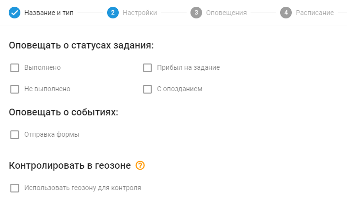

# Выполнение заданий

## Обзор

Правило "Выполнение заданий" предназначено для того, чтобы помочь компаниям отслеживать и управлять ходом выполнения задач, поставленных перед сотрудниками на местах. Независимо от того, контролируете ли вы большой штат удаленных сотрудников или небольшую команду, это правило позволит вам всегда быть в курсе важных событий, связанных с выполнением задач, таких как завершение задач, задержки, неудачи и отправка форм.

Система обеспечивает своевременное оповещение через SMS, электронную почту, push-уведомления или непосредственно в веб-интерфейсе пользователя. Используя эту функциональность, предприятия могут контролировать процесс выполнения задач, что повышает эффективность и улучшает процесс принятия решений.

## Настройки правила

#### События и состояния задач

В настройках правила укажите статусы задач и события, для которых вы хотите получать уведомления. Вы можете выбрать такие параметры, как завершение задачи, задержки, неудачи, прибытие и отправка формы. Выбрав соответствующие параметры, компании смогут быть в курсе ключевых событий, происходящих в их полевых операциях, что поможет свести к минимуму сбои и обеспечить бесперебойное выполнение задач.

Общие настройки см. в разделе [Контроль событий](../../page-fa59fa08-3182-4a5f-b6a9-07137b43161e.md).

## Сведения о работе системы

- Оповещение "Выполнение заданий" срабатывает каждый раз, когда происходит событие, связанное с задачей, без таймера сброса, то есть оповещение будет уведомлять вас немедленно при каждом событии. Это отличается от других правил на платформе, которые имеют таймеры сброса для ограничения частоты уведомлений.
- Это правило обрабатывается на сервере и не зависит от конкретного оборудования, что позволяет применять его к нескольким трекерам одновременно. Такая гибкость позволяет пользователям эффективно управлять несколькими трекерами в рамках одного правила.