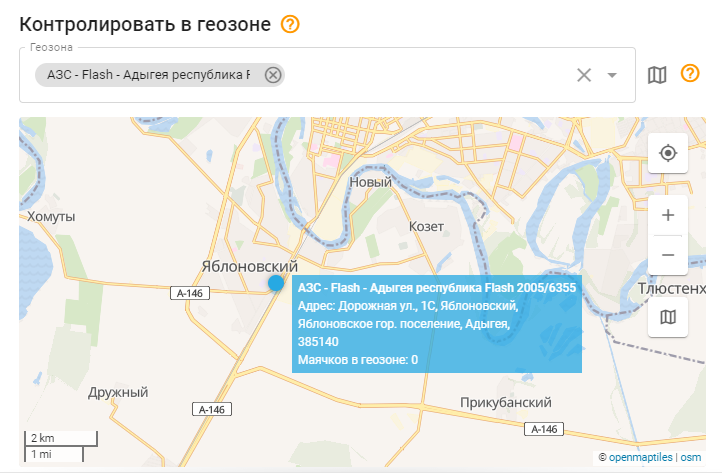

# Вход / выход из геозоны

## Обзор

Геозона - это обозначенная область на карте, которая действует как виртуальная граница. Это правило отслеживает, когда трекеры входят или выходят из указанной зоны геозоны. Пользователи будут получать уведомления, когда их объекты пересекают границы геозоны. Например, если строительная техника покидает заданную зону, сотрудник компании может получить уведомление через пользовательский интерфейс, электронную почту или SMS, если это настроено в правиле.

Эта функциональность обеспечивает ценные сведения и контроль над перемещением объектов, гарантируя соблюдение заданных границ. Она повышает безопасность, предупреждая пользователей о любых несанкционированных перемещениях или потенциальных кражах за пределами заданной зоны геозоны. Кроме того, она обеспечивает эффективное управление активами, позволяя пользователям отслеживать и оптимизировать использование своего оборудования в пределах заданных зон.

## Настройки правила

#### Геозоны

Укажите геозоны, пересечение которых будет вызывать уведомления. В одном правиле можно перечислить несколько геозон.

Общие настройки см. в разделе [Контроль событий](../../page-ef46671f-257e-47bf-9670-3cbb349431ef.md).

## Сведения о работе системы

- Оповещение "Вход / выход из геозоны" имеет 60-секундный таймер сброса, что означает, что оповещение не будет срабатывать чаще, чем раз в минуту. Если событие произойдет, пока правило ожидает сброса, платформа пропустит его, в том числе в отчетах.
- Это правило обрабатывается на сервере и не привязано к конкретному оборудованию, что позволяет применять его к нескольким трекерам одновременно. Такая гибкость позволяет управлять несколькими трекерами в рамках одного правила.
- Обратите внимание, что система может генерировать предупреждение о въезде/выезде даже при наличии искажений GPS. Хотя недействительные GPS-координаты фильтруются, небольшие GPS-искажения все равно могут появиться в треке. В зависимости от функциональных возможностей модели трекера существуют различные методы предотвращения GPS-искажений. Подробные сведения о предотвращении GPS-искажений см. в руководстве к устройству.