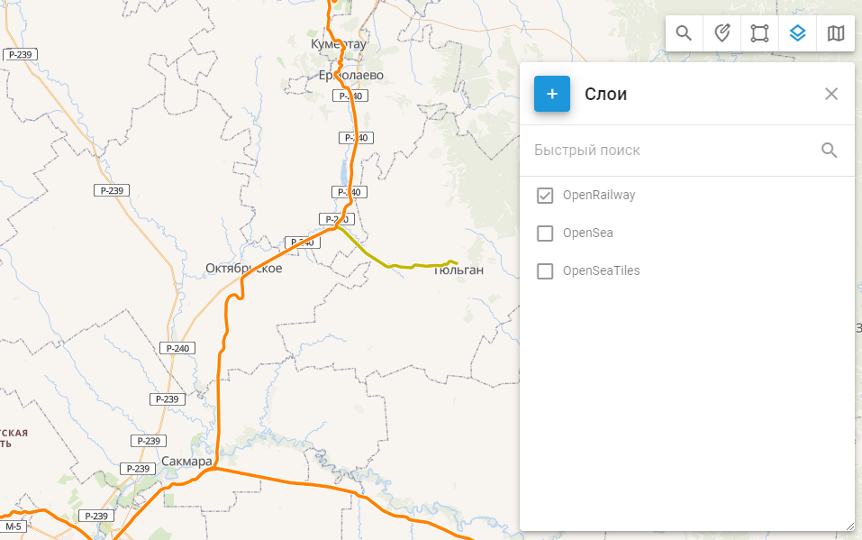

# Слои

## Обзор

Слои карты позволяют добавлять на карту пользовательские наложения данных, улучшая визуализацию определенных областей, которые не включены в стандартный вид карты. Эта функция особенно полезна для отображения уникальных географических деталей, таких как городские районы, зоны ответственности, пользовательские маршруты и другие специализированные карты. Используя слои карты, вы и ваша команда сможете лучше понять местоположение и ситуацию с вашими транспортными средствами или активами.

Вот несколько практических применений слоев карты:

- Отметить конкретные места и выделить их графически.
- Загрузка пользовательских маршрутов сельского хозяйства, поездов или кораблей.
- Отображение специализированных карт, таких как рельеф местности, глубина океана или плотность леса, которые отсутствуют в стандартном списке карт и создаются специализированными компаниями.

## Как создать слой KML

KML (Keyhole Markup Language) - это формат файлов, используемый для отображения географических данных в браузере Earth, таком как Google Earth. Слои KML могут включать точки, линии, полигоны и изображения. Эти слои полезны для добавления на карты пользовательской географической информации, например, определенных маршрутов, границ и областей интереса.

### Создание слоев KML

Существует несколько инструментов для создания слоев KML, начиная от профессионального программного обеспечения ГИС и заканчивая доступными картографическими онлайн-сервисами. Google My Maps и Google Earth Pro - два удобных варианта для создания слоев KML, а более продвинутые инструменты включают ArcGIS и QGIS.

Создание слоев KML осуществляется с помощью Google Earth

1. Откройте Google Earth
2. Найдите место, для которого вы хотите создать KML
3. Выберите Добавить полигон, Добавить метку или Нарисовать контур.
4. Назовите полигон, путь или метку.
5. Установите цвет контура и сделайте фигуру прозрачной
6. Нарисуйте границы участка, щелкнув по угловым точкам.
7. Нажмите OK, чтобы окончательно утвердить границы участка.
8. Щелкните правой кнопкой мыши название сайта в окне "Места" слева.
9. Выберите Save Place As (Сохранить как), выберите пункт назначения для сохранения файла.
10. Сохраните файл в формате KML

## Как добавить слой карты в учетную запись Navixy

1. **Откройте инструмент "Слои”**: Выберите инструмент "Слои" из инструментов карты в правом верхнем углу карты.
2. **Добавьте новый слой KML**: Нажмите на большую кнопку с плюсом, чтобы добавить новый слой KML.
3. **Укажите детали слоя**: Введите имя слоя, выберите созданный KML-файл и сохраните его.

После того как вы успешно добавили слой карты, его можно отобразить, нажав на флажок слева от названия слоя.