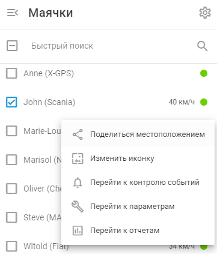
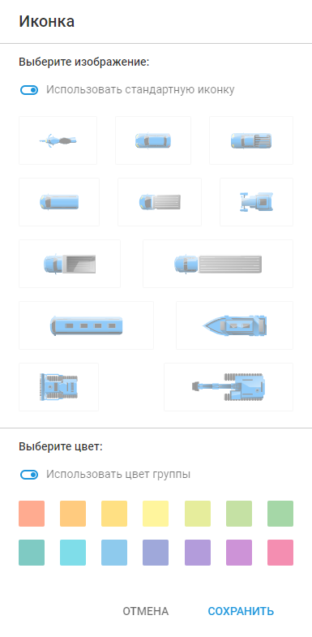
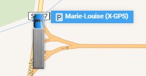

# Иконки маячка

Иконки, связанные с каждым маячком, дают важные визуальные подсказки о его текущем состоянии, например, движении, остановке или стоянке.

Помимо стандартных иконок, вы можете использовать пользовательские иконки для представления объектов. Пользовательские иконки особенно полезны при управлении большим количеством объектов, поскольку они улучшают визуальную идентификацию и организацию, позволяя быстро различать объекты и при этом эффективно отслеживать их состояние.

## Стандартные иконки

В зависимости от текущего состояния объекта (движется, остановился, припарковался) его иконка на карте будет меняться соответствующим образом. Переход из одного состояния в другое тесно связан с портлетом ***"Определением стоянки"***.

Ниже приведены различные иконки и их значения:

| **Икона** | **Состояние и описание перемещения** |
| --- | --- |
|  | **В движении**   Трекер движется, и поездка записывается. |
|  | **Остановлен (еще не припаркован)**   Трекер остановился, его скорость равна нулю, но путешествие еще не завершено. |
|  | **Припаркованный**   Поездка окончена, и трекер поставлен на стоянку. |
|  | **Приблизительное местоположение (нет сигнала GPS**, **используется LBS)**   Сигнал GPS отсутствует, и местоположение определяется базовыми станциями сотовой связи и/или точками доступа Wi-Fi. Из-за низкой точности координат в этом статусе не фиксируются треки, парковки и остановки. |

## Пользовательские иконки

Пользовательские иконки улучшают визуальную идентификацию, позволяя быстро различать различные маячки на карте, и улучшают организацию благодаря специальным иконкам для различных типов активов или статусов. Они также способствуют эффективному мониторингу, позволяя мгновенно распознавать статус или тип объекта, что ускоряет принятие решений и время реагирования.

Чтобы изменить пользовательскую иконку объекта на платформе Navixy, выполните следующие действия:

1. **Перейдите к списку маячков:** Откройте раздел "Мониторинг" в главном меню.
2. **Щелкните правой кнопкой мыши на нужном объекте:** Найдите объект, для которого нужно изменить иконку. Щелкните правой кнопкой мыши на имени объекта, чтобы открыть контекстное меню.
3. **Выберите "Изменить иконку":** В меню правой кнопки мыши выберите пункт "Изменить иконку". Откроется диалог выбора иконки.

4. **Выберите новую иконку:** В диалоговом окне выбора иконки выберите новую иконку из доступных вариантов. Подтвердите свой выбор, чтобы применить новый иконку к объекту.

Если вы решили использовать пользовательские иконки, состояние объекта будет отображаться рядом с его меткой.

