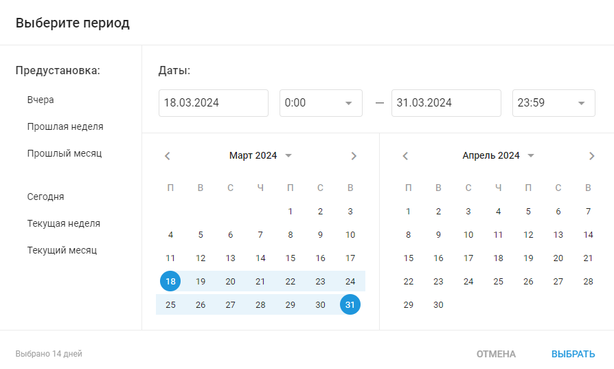
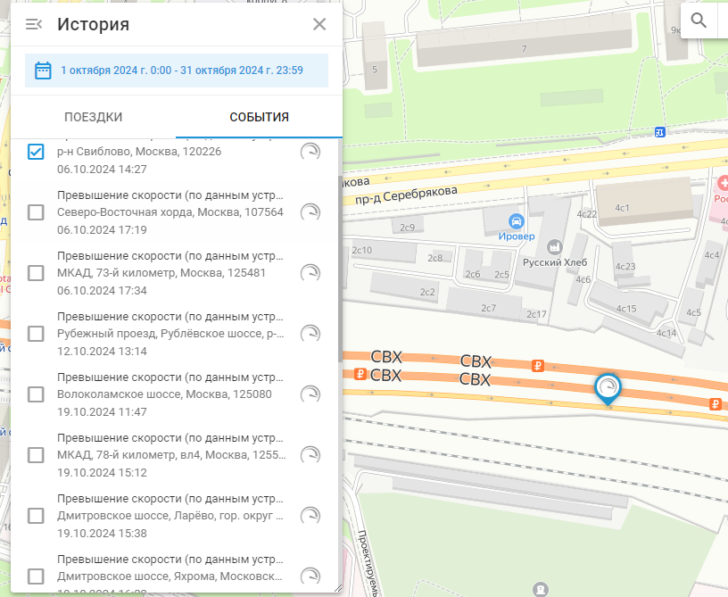

# История событий

На вкладке "События" в представлении "История" представлен подробный журнал всех событий, связанных с выбранными объектами за определенный период. Эти события зависят от типа трекера и отслеживаемых действий, что позволяет получить полное представление о рабочем состоянии вашего парка и о том, что произошло с отслеживаемыми активами.

Чтобы просмотреть историю событий, выберите объекты, которые вы хотите просмотреть, и нажмите кнопку истории (синяя круглая стрелка в правом нижнем углу списка объектов). Вам будет предложено выбрать диапазон времени и даты. Выбрав нужный диапазон, перейдите в диалоговое окно История и выберите пункт **Вкладка "События"**.

## Список событий

В списке событий отображается хронологическая последовательность событий для каждого объекта. Каждая запись включает:

- **Временная метка**: Дата и время наступления события.
- **Тип события**: Конкретное событие, например "Tracker switched OFF" или "Tracker switched ON".
- **Расположение**: Где произошло событие, если применимо.
- **Подробности события:** В зависимости от типа контролируемого события, например порогового значения температуры.

## Типы событий

Типы отображаемых событий определяются отслеживаемыми событиями. Navixy может обнаруживать и регистрировать широкий спектр событий, от базовых уведомлений о движении и остановке до более сложных предупреждений датчиков и напоминаний об обслуживании. Для получения более подробной информации о настройке и управлении этими событиями см. раздел [контроль событий](../../../page-1b282157-5547-4094-bbdd-4bd3f3938d69/page-1838a04b-dcb6-46f1-8977-818bf6e34008.md).