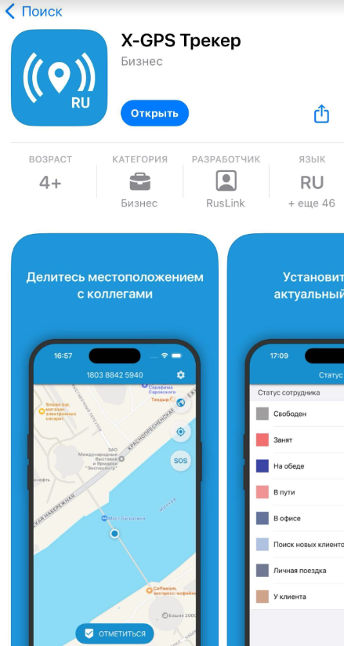

# Активируйте приложение отслеживания X-GPS Трекер

[Приложение X-GPS Трекер](https://x-gps.ru/) трансформирует смартфон или планшет в GPS-трекер, обеспечивая слежение в режиме реального времени за сотрудниками на местах - водителями, курьерами, специалистами по обслуживанию, строителями, торговыми представителями и т. д. Используя комбинацию спутниковых навигационных сигналов (GPS), GSM и Wi-Fi сетей, приложение точно определяет местоположение владельца устройства, сохраняя при этом низкое энергопотребление.

Кроме того, мобильное приложение X-GPS Tracker позволяет сотрудниками на местах сообщать о своем местоположении, статусе и выполнении задач в режиме реального времени. Оно позволяет пользователям делиться своими GPS-координатами, загружать фотографии и заполнять формы, облегчая компаниям отслеживание прогресса своих сотрудников, эффективное управление задачами и обеспечение бесперебойной работы на местах.

Активация приложения X-GPS Tracker на платформе Navixy состоит из двух простых шагов.

## Шаг 1: Отправьте приглашение сотруднику

Сначала отправьте приглашение сотруднику для установки приложения X-GPS Tracker. Это можно сделать из веб-интерфейса Navixy или приложения X-GPS Monitor.

#### **Использование веб-интерфейса Navixy:**

- Войдите в свою учетную запись пользователя Navixy
- В левом меню нажмите на значок "Активация устройства".
- Выберите группу производителя "X-GPS" и модель X-GPS Tracker.
- Введите название для устройства (например, "Водитель Сергей Сергеев").
- Введите номер телефона и/или адрес электронной почты вашего сотрудника, чтобы отправить ему приглашение.

#### **Использование приложения X-GPS Monitor:**

- Откройте приложение X-GPS Monitor на своем мобильном устройстве
- Выберите пункт меню "Добавить объект".
- Выберите опцию "Мобильное приложение".
- Введите контактную информацию для отправки приглашения

## Шаг 2: Примите приглашение и настройте приложение

#### Получите приглашение

Сотрудник получит приглашение в виде текстового сообщения (SMS) или по электронной почте. Приглашение включает в себя:

- 12-значный персональный идентификатор
- Ссылка для загрузки приложения X-GPS Tracker

#### Загрузите и установите приложение

Попросите сотрудника принять приглашение, которое также предполагает загрузку приложения X-GPS Tracker на мобильное устройство сотрудника:

1. Посетите [App Store (iOS)](https://apps.apple.com/us/app/x-gps-tracker/id1612047534) или [Google Play Store (Android)](https://play.google.com/store/apps/details?id=com.navixy.xgps.tracker)
2. Найдите "X-GPS Tracker" (не путайте его с X-GPS Monitor, это другое приложение).
3. Загрузите и установите приложение на свое мобильное устройство

#### Установите и настройте приложение

Запустив приложение, сотрудник должен будет ввести 12-значный идентификатор из приглашения, чтобы завершить настройку.

- В приложении X-GPS Tracker запустите функцию отслеживания
- Убедитесь, что приложение имеет необходимые разрешения для доступа к местоположению вашего устройства.

Выполнив эти действия, вы сможете успешно активировать и использовать приложение X-GPS Tracker с платформой Navixy, что позволит вам эффективно отслеживать и управлять мобильным устройством. Если у вас возникнут какие-либо проблемы, обратитесь в службу технической поддержки вашего поставщика услуг.