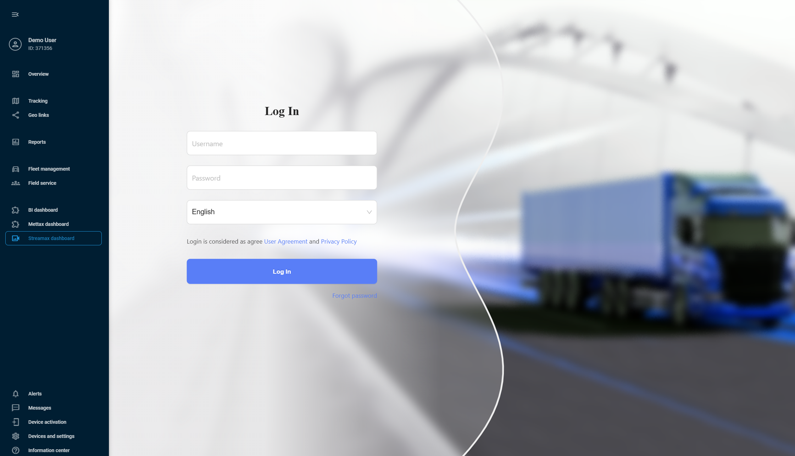

# Интеграция Streamax для видеотелематики

Streamax — ведущий производитель MDVR, хорошо зарекомендовавший себя на мировом рынке. С их устройствами вы можете обеспечить круглосуточную видеозапись с ваших транспортных средств, собирать телематические данные, удаленно получать доступ к видеоматериалам и контролировать безопасность вождения с помощью технологий ADAS (Системы помощи водителю) и DSM (Мониторинг состояния водителя).

Интегрируя Streamax с Navixy, вы получаете комплексный видеомониторинг в сочетании с продвинутым управлением автопарком в едином интерфейсе. Давайте подробнее рассмотрим, как реализовать эту мощную комбинацию и встроить панель управления Streamax в интерфейс Navixy.

## 1\. Установка интеграции

Для установки интеграции вам необходимо получить учетные данные API из вашей учетной записи Streamax и запросить настройку интеграции у нашей службы поддержки.

### Получение учетных данных API от Streamax

1. **Получите ключ API и секрет**: Следуйте процессу аутентификации, описанному в [документации по аутентификации Streamax](https://ftcloud.streamax.com:20002/DOC/Sign%20Authentication), чтобы получить ваш ключ API и секрет.
2. **Свяжитесь с Navixy**: После получения учетных данных API, свяжитесь с вашим менеджером по работе с клиентами или используйте [эту форму](https://www.navixy.com/contact/). Отправьте запрос на интеграцию Streamax с вашей учетной записью Navixy, содержащий следующую информацию:
  - Ваш ключ API
  - Ваш секрет API
  - Данные вашей учетной записи Navixy
  - Запрос на активацию интеграции Streamax
3. **Дождитесь подтверждения**: Наши специалисты настроят интеграцию с нашей стороны в течение 1-3 дней и подтвердят, когда она будет готова к использованию.

> [!TIP]
> После получения подтверждения от нашей службы поддержки ваша учетная запись Streamax готова к интеграции!

## 2\. Добавление устройства Streamax в Navixy

После получения подтверждения от нашей службы поддержки о готовности интеграции вы можете добавить ваше устройство Streamax на платформу. Для этого следуйте обычной процедуре активации устройства:

1. Перейдите в **Активация устройства**.
2. Выберите ваше устройство Streamax из списка.
3. Выберите опцию **SIM-карта приобретается отдельно** и перейдите к следующему шагу.
4. Введите правильный **ID устройства** (IMEI устройства)
5. Завершите настройку устройства

Подробные инструкции по активации устройства в Navixy см. в разделе [Активируйте GPS-устройство](https://squaregps.atlassian.net/wiki/spaces/UDOCRU/pages/2922809628/GPS-?atlOrigin=eyJpIjoiZTcxMzFhZGMxZTk1NGYwYTkyMjQ1M2I1ZTQyYzQ5YmQiLCJwIjoiYyJ9).

> [!TIP]
> Ваше устройство и учетная запись Navixy готовы к интеграции!

## 3\. Встраивание Streamax в интерфейс Navixy

На этом этапе мы выполняем фактическую интеграцию, встраивая панель управления Streamax в ваш интерфейс Navixy.  
Navixy предлагает функциональность [Пользовательские приложения](https://squaregps.atlassian.net/wiki/spaces/UDOCRU/pages/3016753291?atlOrigin=eyJpIjoiZWNjMTg1ZmU3N2FmNDkxZGJmYTEwNGQ4MGYwMTVkZjciLCJwIjoiYyJ9), которая позволяет встраивать сторонние приложения непосредственно в интерфейс платформы. Мы будем использовать ее для встраивания Mettax.

> [!NOTE]
> **Навигация**
> Раздел **Пользовательские приложения** доступен **Владельцам** учетной записи в разделе **Настройки учетной записи**. Чтобы найти его:
> 1. Нажмите на значок профиля в верхнем левом углу экрана, чтобы открыть настройки учетной записи
> 2. В боковой панели настроек выберите **Пользовательские приложения**

1. Создайте новое приложение  
Начните с нажатия кнопки 
 в списке **Пользовательские приложения**.
2. Настройте новое приложение
  1. Поместите ссылку на вашу учетную запись Streamax в поле **URL приложения**, например: `https://{ваш_экземпляр}.ifleetvision.com/ftv/ft/dashboard#`.
  2. Введите **Метку** для приложения (например, Панель управления Streamax).
  3. Выберите **Встроенное** в поле **Показать как**, чтобы отображать функциональность Streamax в Navixy.
3. Нажмите **Сохранить** для завершения настройки.

> [!TIP]
> Ваше новое приложение автоматически появляется в левой боковой панели Navixy. Откройте его и войдите в систему с вашими учетными данными Streamax, чтобы получить доступ к вашей комплексной панели управления видеотелематикой с мониторингом на 360°, обнаружением событий на основе ИИ и многоканальными видеопотоками — все интегрировано с вашими существующими инструментами управления автопарком Navixy.
> 