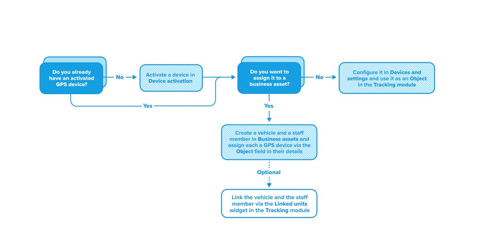

# Бизнес-активы

## Умный способ управления автопарком

**Бизнес-актив** — это отслеживаемая единица, имеющая конкретное бизнес-назначение. Это структурированный способ управления автопарком, выходящий за рамки простого мониторинга GPS-устройств. Бизнес-активы обеспечивают интуитивный подход к управлению автопарком, предлагая более высокую степень видимости, контроля и эффективности при работе с транспортом и персоналом.

Преимущества бизнес-активов:

- Отслеживание местоположения, контроль событий и просмотр истории реальных единиц автопарка, а не абстрактных GPS-устройств.
- Связывание различных активов между собой с возможностью выбора, какое из GPS-устройств отслеживать.
- Быстрое визуальное определение типа отображаемого актива.
- Просмотр текущего сотрудника, назначенного к каждому транспортному средству.
- Возможность ручной или автоматической смены назначенного персонала.
- Выявление незадействованных транспортных средств без назначенных сотрудников.
- Ведение отдельной истории для каждого актива с сохранением связей между ними.

## Типы активов

Существует несколько типов бизнес-активов, но все они работают по схожему принципу. Каждый актив относится к определённому типу, отражающему реальные бизнес-объекты — например, транспорт или сотрудника. Активы разных типов могут быть связаны между собой, что позволяет моделировать реальные связи, например, назначение водителя на транспорт. Эти связи гибкие и могут быть изменены в любой момент.

Если к связанным активам подключено несколько GPS-устройств, их данные обрабатываются отдельно. Связь не влияет на сбор или обработку данных GPS.

Доступные типы активов:

- **Транспорт** — физические единицы автопарка: автомобили, фургоны или грузовики.
- **Персонал** — сотрудники компании: водители или рабочие бригады.

Для сравнения, **Объекты** представляют собой активированные GPS-устройства без дополнительного функционала, предоставляемого бизнес-активами. Подробнее об этом см. в разделе [Бизнес-активы и объекты](#assets-vs-objects).

## Практическое применение

Бизнес-активы полезны в различных сценариях и позволяют значительно повысить операционную эффективность, упростив работу менеджеров и диспетчеров. В то время как традиционные методы GPS-мониторинга ограничиваются отслеживанием устройств по отдельности, бизнес-активы формируют единые отслеживаемые сущности, которые обеспечивают комплексное представление о процессах благодаря сохранению отдельной истории поездок и событий при получении GPS-данных с разных устройств.

Например, компания по доставке может создать активы транспорта для реальных автомобилей автопарка и активы сотрудников для водителей. Связав эти активы между собой, менеджеры могут с легкостью определить, кто назначен на тот или иной автомобиль, и переключаться между отслеживанием GPS-устройства автомобиля и мобильного устройства водителя, обеспечивая непрерывный мониторинг даже в случае недоступности одного из устройств.

Такой интегрированный подход даёт более полную картину, чем просто отслеживание GPS-устройств, сохраняя при этом гибкость настройки под конкретные бизнес-требования.

## Бизнес-активы и объекты

В чём же разница между управлением бизнес-активами и обычным отслеживанием GPS-устройств? Navixy поддерживает оба подхода:

- **Бизнес-активы** — это структурированные сущности, представляющие транспорт и сотрудников, которые можно отслеживать как по отдельности, так и в связке.
- **Объекты на базе GPS-устройств** предлагают простое отслеживание GPS-устройств (отображаются как **Объекты** в модуле **Мониторинг** и управляются в разделе **Управление устройствами**). Такой подход не предполагает связей, но поддерживает существующие группы объектов.

Оба подхода работают независимо друг от друга, но вы можете назначить любой существующий объект вашему активу, выбрав его в поле **Объект** при создании или редактировании транспортного средства или сотрудника. После этого он перестаёт функционировать как отдельная сущность и становится неотъемлемой частью актива.

Также доступен массовый импорт активов через шаблон Excel.

Подробнее о создании и импорте активов см. в разделах [Транспорт](#) и [Сотрудники](#).

