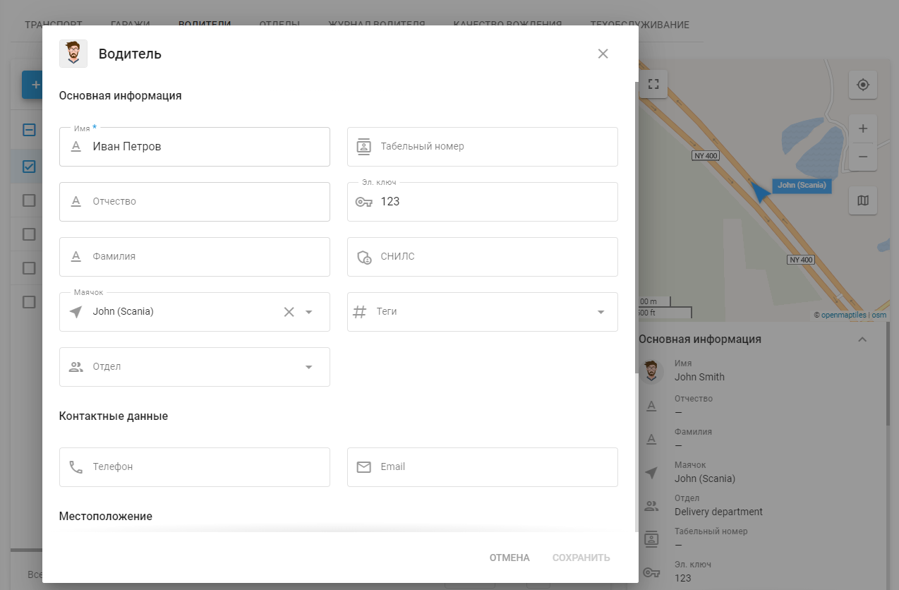
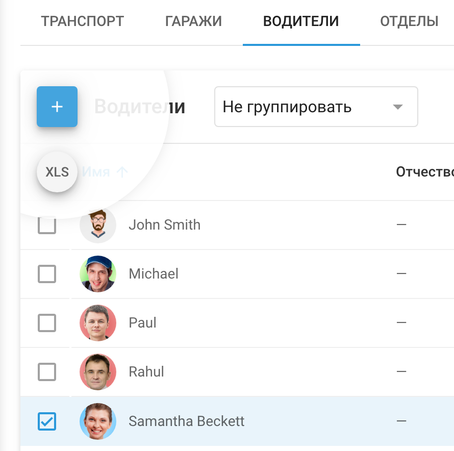

# Водители

Раздел **Водители** на платформе Navixy создан для того, чтобы помочь руководителям автопарков эффективно управлять и контролировать своих водителей. Этот раздел позволяет создавать и управлять подробными профилями водителей, привязывая их к конкретным транспортным средствам или объектам в вашем автопарке. Ведение подробного учета водителей позволяет оптимизировать работу автопарка, улучшить отчетность водителей и повысить общую эффективность работы автопарка.

## Список водителей

На вкладке Водители можно просмотреть список всех водителей, связанных с вашим автопарком. Каждый профиль водителя содержит важную информацию, такую как имя водителя, назначенный автомобиль или объект, отдел, а также другие важные данные, такие как идентификатор сотрудника, аппаратный ключ и контактная информация. Эти данные отображаются в виде таблицы, что облегчает доступ к ним, а в правой части экрана отображается визуальная сводка для быстрой справки.

### Настройка списка

Нажав на “Шестеренку” вы можете выбрать, какие поля вы хотите видеть, например имя, фамилию, объект, отдел и другие. Эта функция обеспечивает гибкость при просмотре и управлении информацией о водителях, позволяя адаптировать интерфейс к вашим конкретным потребностям.

### Боковая панель с подробной информацией

Когда вы выбираете водителя из списка, в правой части экрана появляется краткая информация о его профиле. Эта сводка включает в себя такие ключевые сведения, как имя водителя, его автомобиль, отдел, идентификатор сотрудника, аппаратный ключ и номер социального страхования (если указано). Кроме того, в ней указана контактная информация, включая номера телефонов и адреса электронной почты, что очень важно для поддержания четкой связи с водителями.

## Профиль водителя

Окно Водитель содержит важную информацию о каждом водителе в вашем автопарке. Она включает в себя такие сведения, как имя водителя, контактная информация, закрепленный за ним автомобиль, отдел и идентификационные номера, такие как идентификатор сотрудника и аппаратный ключ. Профиль также может содержать дополнительные данные, такие как информация о водительских правах и метках, что помогает менеджерам автопарка эффективно контролировать и управлять водителями в системе.

Чтобы добавить нового водителя нажмите кнопку **“+”**. Откроется форма, в которую можно ввести все необходимые сведения о водителе, включая его контактную информацию, местоположение и данные водительских прав. Вы также можете привязать водителя к конкретному автомобилю или отделу в вашей организации. Кроме того, вы можете загрузить фотографию водителя, чтобы улучшить его профиль.

## Идентификация водителя

Эффективная идентификация водителей необходима для точного управления автопарком, обеспечивая правильное закрепление каждого водителя за соответствующим транспортным средством. Navixy предлагает надежные решения как для автоматической, так и для ручной идентификации водителей, удовлетворяя разнообразные потребности менеджеров автопарков.

### Автоматическая идентификация водителя

Navixy поддерживает автоматическую идентификацию водителей с помощью электронных ключей, таких как i-button или RFID-устройства. Эта функция позволяет беспрепятственно назначать водителей на транспортные средства.

#### **Настройка автоматической идентификации**

1. **Назначение аппаратного ключа:**
  - Чтобы обеспечить автоматическую идентификацию, необходимо связать электронный ключ водителя с его профилем. Для этого необходимо вручную ввести уникальный код электронного ключа, указанный на кнопке i-button или RFID-устройстве, в специально отведенное поле в карточке сотрудника водителя.
2. **Автоматическое назначение:**
  - После того как электронный ключ будет указан в профиле водителя и подключен к автомобильному считывателю i-button, платформа автоматически идентифицирует водителя и назначит его на соответствующий автомобиль при обнаружении ключа.

**Требования к автоматической идентификации:**

- Устройство слежения должно поддерживать интерфейс 1-Wire для подключения электронного ключа.
- Функция "Аппаратный ключ" должна быть включена для конкретной модели трекера, что можно проверить на сайте [Страница поддерживаемых устройств Navixy](https://www.navixy.com/devices/). Если опция "Аппаратный ключ" доступна в **State Fields** раздел для вашего устройства, значит, оно поддерживает функцию идентификации драйверов.

### Идентификация водителя вручную

В ситуациях, когда автоматическая идентификация невозможна или предпочтительна, Navixy предлагает ручной процесс назначения водителей:

#### Назначение водителей вручную

- Создав карточки сотрудников для своих водителей, вы можете вручную назначить их на автомобили в платформе Navixy. Для этого перейдите в приложение "Мониторинг", выберите объект и назначьте водителя с помощью панели виджетов.

### Отчетность на основе данных о водителях

Для автопарков, где несколько водителей используют один и тот же автомобиль, Navixy предоставляет подробную отчетность по конкретным водителям. Эта функция позволяет менеджерам автопарка генерировать отчеты о поездках, организованные по водителям, а также отчеты о смене смен, обеспечивая четкое представление о поездках и рабочих часах каждого водителя.

Эти отчеты неоценимы для контроля работы водителей, управления нагрузкой и обеспечения соответствия нормам рабочего времени.