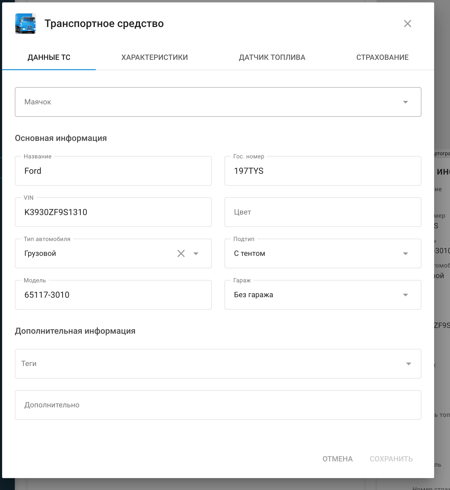
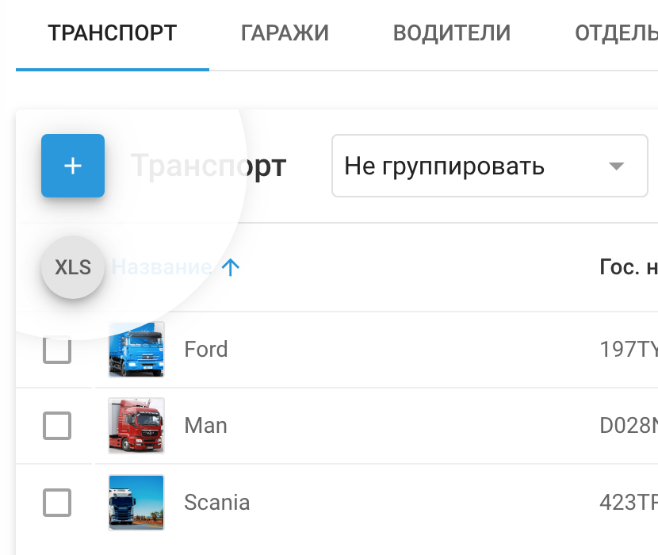
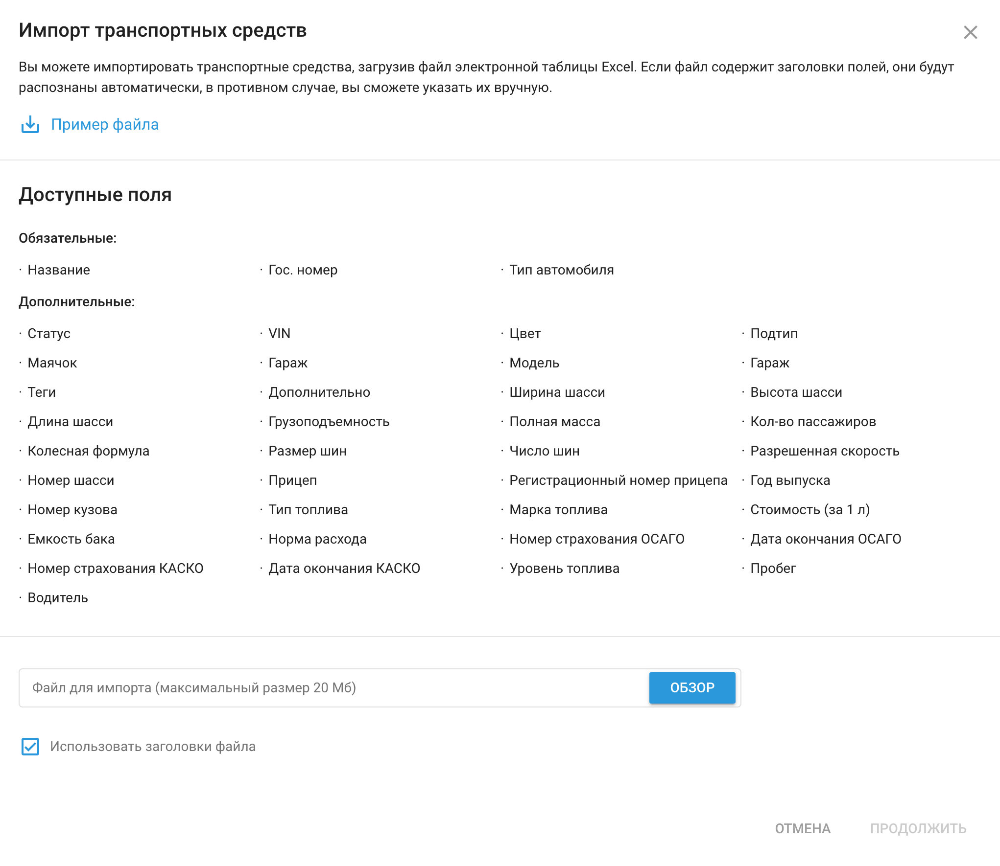

# Транспорт

Транспортные средства это объекты мониторинга для управления автопарком. Они позволяют отслеживать различные аспекты, такие как местоположение, расход топлива, графики технического обслуживания и общую производительность автопарка, обеспечивая эффективную работу и принятие решений.

На вкладке Транспорт отображается информация об автомобилях пользователя в виде таблицы и дополнительного визуализированного меню в правой части экрана.

На этой вкладке можно добавлять и редактировать транспортные средства, прикреплять их к депо и связывать с трекерами, активированными на платформе.

### Добавление нового автомобиля

Нажмите 

 чтобы добавить новый автомобиль.

В отдельном окне, во вкладке **"Данные ТС"** вы можете внести всю основную информацию об автомобиле и дополнительную информацию, например, метки или текстовые заметки.

Вкладка **"Характеристики"** необходимо заполнить дополнительную информацию о транспортном средстве, такую как габариты автомобиля, размер и количество колес в колесной базе, а также разрешенная скорость, наличие прицепа и год его выпуска.

Вкладка **"Датчик топлива"** Вкладка используется для заполнения информации о типе топлива, емкости бака и норме расхода на 100 км, что необходимо для дальнейших расчетов в топливных отчетах.

Вкладка **"Страхование"** позволяет ввести номер страховки с датой окончания срока действия.

Расход топлива в профиле автомобиля и его роль в отчетах о расходе топлива

В Navixy настройка **Датчик топлива** в профиле автомобиля - важнейший шаг для точного отслеживания и составления отчетов об использовании топлива в вашем автопарке на основе пройденного пробега, даже без использования данных OBDII или специализированных датчиков топлива.

Этот параметр обычно определяется в литрах на 100 км (L/100 km) или милях на галлон (MPG), в зависимости от ваших региональных предпочтений.

#### Как расход топлива используется в отчетах по топливу

1. **Оценка расхода топлива:**
  - Значение расхода топлива, введенное в профиле автомобиля, служит в качестве базовой величины для оценки расхода топлива автомобилем на определенном расстоянии. Например, если автомобиль настроен на расход 10 л/100 км, система оценит, что он расходует 10 литров топлива на каждые 100 км пути.
2. **Расчет ожидаемых затрат на топливо:**
  - Navixy использует установленную норму расхода топлива вместе с зарегистрированным пробегом для расчета ожидаемых расходов на топливо. Введя в настройках цену за литр или галлон, система может генерировать отчеты, оценивающие, сколько вы должны потратить на топливо, что помогает в составлении бюджета и финансовом планировании.
3. **Сравнение с фактическими данными по топливу:**
  - В сочетании с данными от датчиков уровня топлива Navixy может сравнивать расчетный расход топлива с фактическим. Такое сравнение помогает выявить несоответствия, например, хищение топлива, неэффективное вождение или проблемы с двигателем автомобиля, которые могут привести к более высокому, чем ожидалось, расходу топлива.

### Импорт транспортных средств

Если у вас большой автопарк и необходимо создать профили для нескольких автомобилей, эффективнее импортировать всю информацию сразу одним файлом, а не создавать профили автомобилей по одному. Данные должны быть в формате XLS.

Чтобы импортировать профили автомобилей:

1. Откройте приложение "**Управление транспортом**", подсветите курсором кнопку “Добавить” и выберите "XLS".
2. В окне импорта вы найдете пример файла Excel, который можно использовать в качестве шаблона.
3. Убедитесь, что столбцы в вашем файле соответствуют правильным полям в системе отслеживания, введя соответствующие поля заголовков. Это можно сделать как до импорта, так и в процессе.
4. В загружаемом файле вам нужно будет указать такие ключевые данные, например:
  - Название
  - Модель
  - Тип
  - Тип топлива
  - и так далее

