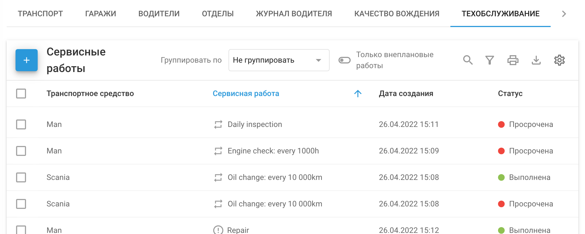
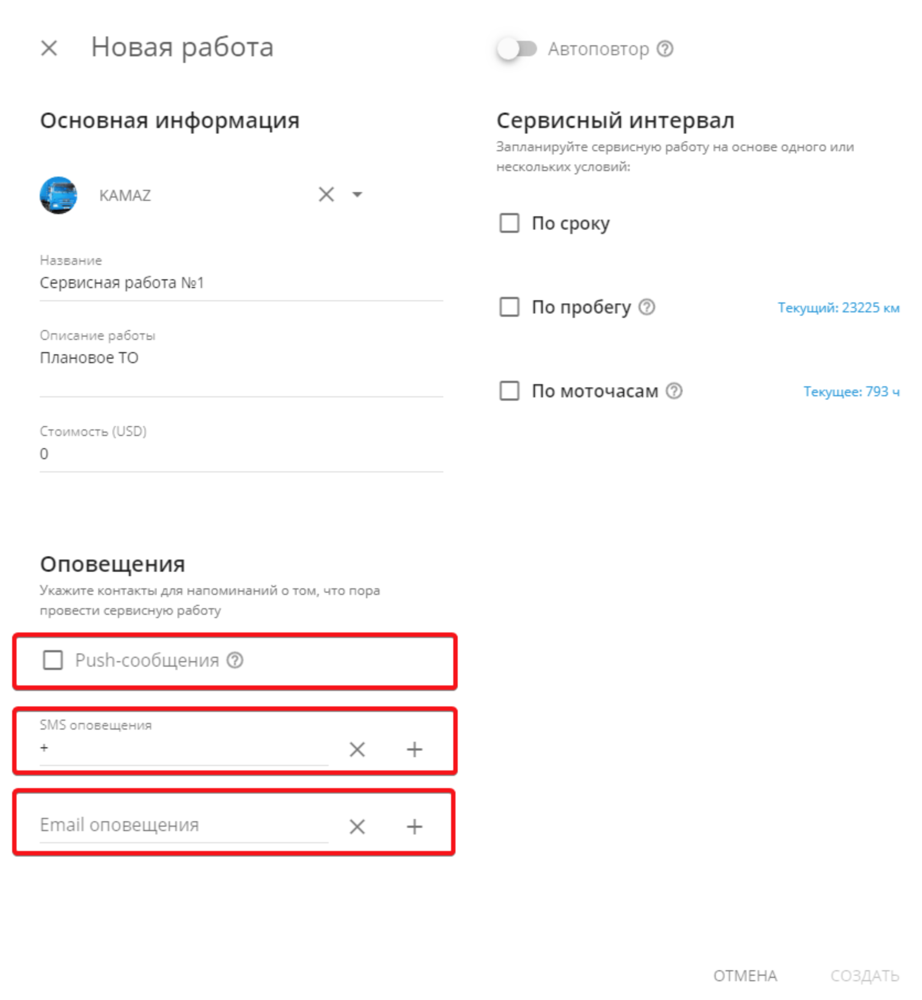
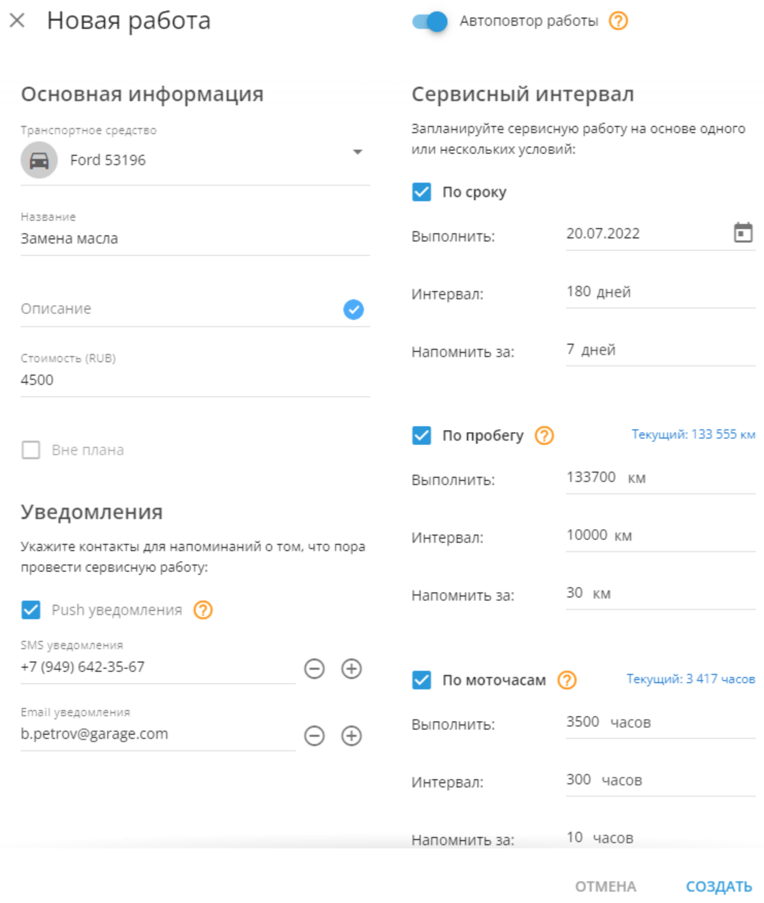
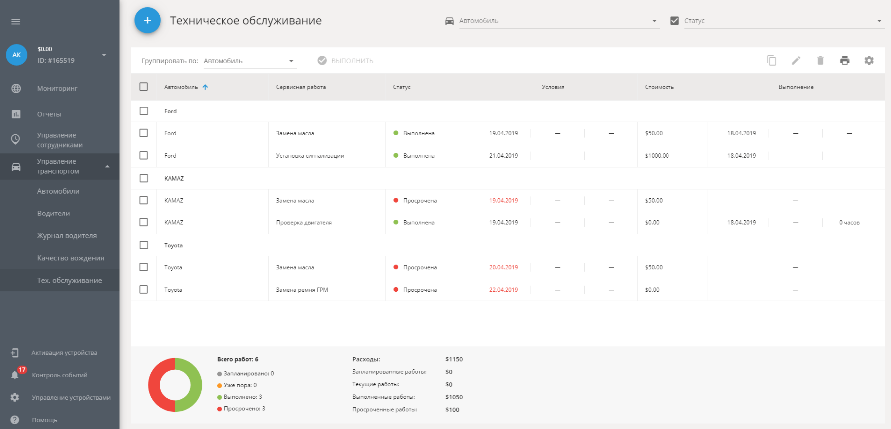

# Техобслуживание

Техобслуживание - это комплексный инструмент, предназначенный для эффективного управления задачами по обслуживанию автомобилей. В этом документе

объясняется, как создавать, управлять и контролировать задачи обслуживания, чтобы поддерживать ваш автопарк в идеальном состоянии.

Тех. обслуживание позволяет:

- Запланировать сервисные работы (по сроку/ по пробегу / по моточасам)
- Запланировать обновление документации (например, обновление страховки)
- Оценивать задачи технического обслуживания, основываясь на состоянии автомобиля
- Обеспечивать своевременное завершение работ по техобслуживанию
- Вести журнал запланированных и срочных работ по обслуживанию и их стоимости

## Добавить сервисные работы

### Как создать сервисную работу

1. Перейдите в приложение «Управление транспортом» во вкладку «Тех. обслуживание»
2. Нажмите на кнопку с плюсом в верхнем левом углу
3. Выберите транспортного средства, которому запланированы сервисные работы
4. Выберите одно или несколько условий сервисного интервала:

**По сроку** — выберите дату сервисной работы в поле календаря.

В поле «Напомнить за» введите количество дней до запланированной даты, за сколько вы хотите быть уведомлены о предстоящей сервисных работах.

**По пробегу** — в поле «Заданный пробег» введите значение счетчика пробега, по которому должны быть завершены сервисные работы

В поле «Напомнить за» введите количество километров да «заданного пробега», за которые вы хотите быть уведомлены о предстоящей сервисных работах.

Для установления значений одометра перейдите в «Управление устройствами».

**По моточасам** — в поле «Целевое значение» введите значение часов работы двигателя, по которым должны быть завершены сервисные работы.

В поле «Напомнить за» введите количество часов работы двигателя до «целевого значения», за которое вы должны быть уведомлены о предстоящих сервисных работах.

При наступлении одного из условий технического обслуживания будет отправлено уведомление, и статус работы будет автоматически обновлен до «Уже пора». Все текущие состояния доступны в списке заданий технического обслуживания.

Чтобы выставить значения моточасов перейдите в «Управление устройствами».

5. Сохраните сервисную работу

После нажатия кнопки «Создать» задание сразу же появится в списке заданий технического обслуживания.

### Дополнительные параметры

- **Описание сервисных работ** — подробная информация о новых сервисных работах, например: название, организация техобслуживания или предпочитаемая марка моторного масла.
- **Стоимость** — вы можете добавить стоимость сервисных работ.
- **Оповещения** — вы можете указать контакты, которым будет приходить уведомления о предстоящих сервисных работах.
  - **Push-сообщения** — установите приложение X-GPS Monitor на ваш мобильный телефон, чтобы получать уведомления о предстоящих сервисных работах через приложение.
  - **SMS** — вы можете добавить до 5-ти номеров, которым будут приходить СМС о предстоящих сервисных работах.
  - **Email-оповещения** — вы можете добавить до 5-ти адресов электронной почты, на которые будут приходить уведомления о предстоящих сервисных работах

### Файлы

Вы можете прикрепить до 10 файлов для каждого задания. В файле может содержаться такая информация, как счёт. Также это может быть внутренний документ для сервисной работы.

# Редактирование сервисной работы

Если условия эксплуатации автомобиля изменились, можно рассмотреть возможность изменения условий его технического обслуживания. Например, если транспортное средство в настоящее время используется на бездорожье, его подвеска будет нуждаться в более частом техническом обслуживании.

### Редактирование работы

1. Выберите требуемую сервисную работу в списке задач технического обслуживания.
2. Нажмите нажмите на кнопку «Редактировать» (символ Карандаша) выше списка задач.
3. Добавьте необходимые изменения.
4. Нажмите кнопку «Сохранить».

> [!INFO]
> Учтите, что вы можете редактировать только задачи со статусов «Уже пора» и «Запланировано».
> Вы можете изменить статус задания на «Выполнено» во время редактирования.Установите повторяемость сервисных работ

# Повторяющиеся сервисные работы

Повторяющиеся сервисные работы необходимы для автоматического создания задач по техобслуживанию автомобилей. Такие работы будут создаваться системой через определенные промежутки.

Например, необходимо заменить масло в двигателе. Здесь у вас есть возможность указать - когда сервисная работа должна быть проведена в первый раз. А затем, платформа будет автоматически создавать такую задачу каждые 180 дней, 10000 км или 300 моточасов.

## Настройка повторяющихся работ

1. Активируйте опцию **Автоповтор работы.** Следующая аналогичная работа будет создана платформой после выполнения текущей.
2. Выберите транспортное средство, для которого создается сервисная работа. Транспортное средство должно быть назначено GPS трекеру. От него платформа будет брать информацию о моточасах и пробеге.
3. Введите название работы. По желанию можно заполнить описание и стоимость работ.
4. Укажите, кто будет получать уведомления. Здесь можно указать почту и/или телефон ответственного за проведение работ. Для добавления дополнительной почты или телефона, нажмите "+". При включении Push уведомлений они будут приходить в веб-интерфейсе и в приложении X-GPS Monitor.
5. Укажите сервисный интервал на основе одного или нескольких условий.

a. По сроку - то есть работу нужно выполнять через определенные промежутки времени. Актуально для планового техобслуживания автомобиля.

- Выполнить: установите дату первой сервисной работы.
- Интервал: укажите через какое время после выполнения первой работы будет создаваться новая задача.
- Напомнить за: введите за сколько дней необходимо отправить уведомления о предстоящей работе.

Платформа учитывает параметр напомнить за для установки первого выполнения и интервалов.

b. По пробегу - работу нужно выполнять по достижении определенного пробега. Чтобы такое условие стало доступно, необходимо настроить счетчик одометра для GPS трекера, который назначен транспортному средству.

- Выполнить: укажите целевой пробег первой задачи. Он может быть меньше, чем текущий на случай, если необходимо будет внести изменения в счетчик одометра.
- Интервал: введите через сколько км должна производиться новая сервисная работа.
- Напомнить за: установите за сколько км необходимо оповестить ответственного о предстоящем проведении работ.

с. По моточасам - работу нужно выполнять по достижении определенного количества моточасов. У GPS трекера должен быть настроен счетчик моточасов.

- Выполнить: укажите при скольки моточасах должна быть выполнена первая сервисная работа.
- Интервал: введите через сколько моточасов должны выполняться последующие работы.
- Напомнить за: установите за сколько часов необходимо уведомить ответственного о проведении работ.

Параметр напомнить за для всех условий должен быть меньше, чем интервал

6. Если необходимо, можете прикрепить файл с необходимой информацией.

Сервисная работа с автоматическим повторением создана.

## Просмотр списка сервисных работ

Все новые сервисные работы будут незамедлительно отображены в списке задач технического обслуживания. Список разбит на следующие строки:

- **Автомобиль** — название автомобиля у которого проводятся сервисные работы.
- **Сервисная работа** — название сервисной работы, которое было присвоено при его создании.
- **Статус** — текущее состояние сервисной работы. Имеется 4 состояния:

**Запланировано** — условия (по сроку / по пробегу / по моточасам) еще не выполнены, сервисная работа помечена как «Запланировано».

**Уже пора** — дата проведения сервисных работ еще не наступила, но уведомление о проведении работ уже произошло.

**Выполнено** — сервисные работы успешно произведены в срок.

**Просрочено** — сервисные работы не были выполнены, срок проведения истек.

- **Условия** — содержит информацию о выбранных условиях сервисной работы (по сроку / по пробегу / по моточасам)
- **Стоимость** — стоимость сервисных работ, указанная при создании работы.
- **Выполнение** — содержит информацию о дате выполнение, проценту выполнение, а также количество часов, которые были необходимы для выполнения.

