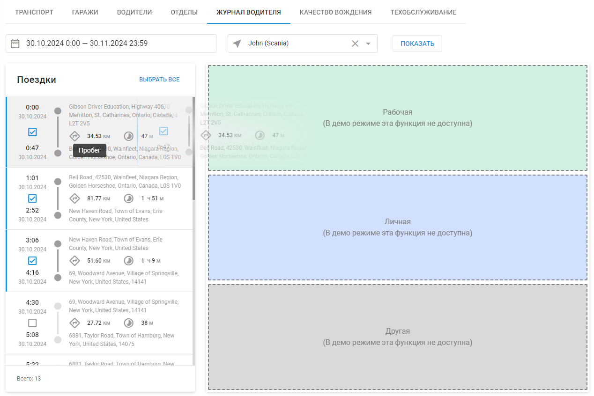
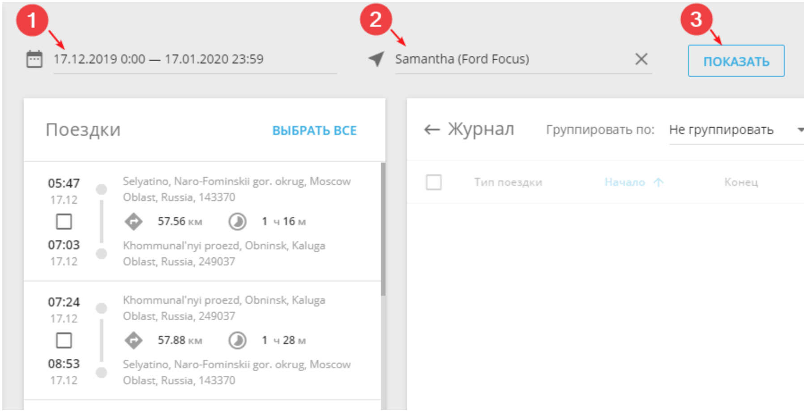

# Журнал водителя

С помощью журнала водителя вы можете контролировать поездки и распределять их по статусам, чтобы видеть полную картину использования транспорта.

Поездки можно распределить на:

- Личные - позволяют контролировать, как сотрудники используют автопарк предприятия
- Рабочие - позволяют рассчитывать расход топлива и амортизацию служебного транспорта
- Другие - поездки, не относящие к двум другим категориям. Можно добавить описание поездок в Примечании

## Выбор статуса поездки

Для присвоения статуса поездкам, выполните следующие шаги:

1. Выберите временной интервал поездок
2. Выберите транспортное средство
3. Отобразите поездки, нажав на кнопку "Показать"

Вы можете присвоить статус отдельной поездки путем перетаскивания ее в правый угол экрана, либо отметить несколько поездок сразу и выбрать им статус, нажав кнопку "Добавить в журнал".

## Интерфейс журнала

Журнал водителя может содержать следующие поля (которые также могут быть скрыты):

- Тип поездки
- Начало
- Конец
- Время в пути
- Начальное положение
- Одометр в начале поездки
- Конечное положение
- Одометр в конце поездки
- Пробег
- Водитель
- Заметка

Заметки редактируются непосредственно в журнале, для этого необходимо нажать на поле заметок и ввести текст.

Журнал водителя можно скачать в формате отчета PDF или XLSX.