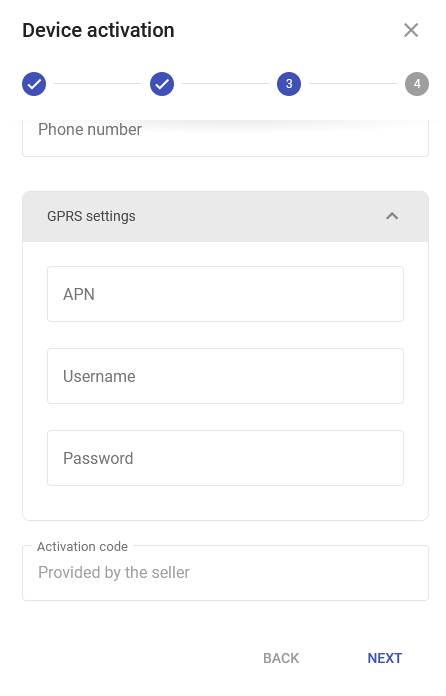

# Activation codes

The **Activation codes** page allows you to view, find, create, and edit activation codes for activating your trackers in the device activation wizard available either in [User details](users/user-details.md) or in the Navixy platform. For more information about this process, see [Activate GPS device](https://www.navixy.com/docs/user/guide/quick-start/activate-gps-device).

<figure><figcaption></figcaption></figure>

The page consists of three main sections:

* **Code toolbar:** A toolbar used to easily create, find, and edit activation codes
* **Codes list:** A list of existing activation codes formatted as a table
* **Code details:** Information about the selected activation code

## What are activation codes?

Activation codes are unique 10-digit random numbers that restrict the process of adding a new tracking device to a user's account. This process is typically utilized to prevent users from activating devices purchased from sources outside of your organization.

<figure><figcaption>
Activation code explanation
</figcaption></figure>

## How to create an activation code

To create a new activation code, click  on the toolbar. This will open the **Create activation codes** window:

<figure><figcaption>
Create activation codes window
</figcaption></figure>

Here, you can create any number of codes, set the bonus and free days for them, and select the tariff plan you want to use.

## Using activation codes

If you enforce the usage of activation codes for your users, the activation process is generally the same as for other methods. The only difference is the user will have to enter the provided code into the **Activation code** field during step 3 of the device activation process:

<figure><figcaption>
Activation code in the device activation wizard
</figcaption></figure>

You can link activation codes directly to specific [device plans](plans/) to automate the onboarding process. When a user activates a device using a code, the system automatically configures the appropriate access levels and features.

This feature is disabled by default. To enable it for your Navixy instance, please contact our customer success team.
