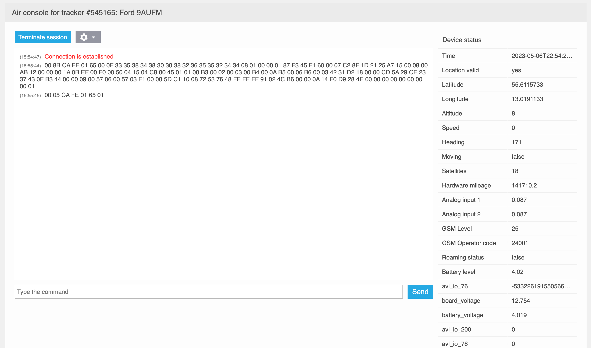

# Air console

Air Console enables technical specialists, such as technical support team members, to monitor all messages sent by the tracker to the server and send commands to the device if supported. Powered by WebSocket technology, the Air Console facilitates real-time data exchange without any lag or delay.

Navixy Air Console enables technical specialists to perform various tasks, such as:

- Managing device settings and configurations remotely
- Checking device statuses and locations in real-time
- Sending diagnostic commands to devices
- Perform OTA firmware update and remote reboot
- Viewing raw device data

## Using the Air Console

To use the GPRS terminal, select the desired tracker (which must be online) and then click on "GPRS terminal" in the right menu. The terminal will open, where you can establish a connection with the tracker by clicking on the "Start connection" button.

There are additional options that can be utilized:

- Autoscroll is responsible for automatically scrolling the console when new messages appear. You can disable it if you are working with a specific package or your device sends messages frequently.
- Show message time enables or disables the message time display. The time is displayed according to your time zone.
- The Show Status option can hide the part of the terminal with decoded information and leave only a window for reading raw messages and sending commands.
- The clear console option is required to clear all received messages.

When the session is complete, click "Terminate Connection" to close the connection.

On the left side you will find an information window that displays all information from your device in raw form. Below it you will find a command line where you can send commands to your device in the form provided by the protocol. These commands will be sent to the device in the same form in which they were specified in the command line.

On the right side, you will see the device status and a list of parameters decoded from the device data packet. This may include information about speed, location, inputs and outputs, battery level, fixed satellites, signal strength, and more. With each new message, the status information will be updated. Updated fields with the most recently received messages will be marked with a red triangle.

## Reading input and output states

Input and output status data can be displayed in two ways, depending on the communication protocol of the device. To read them, pay attention to the name of the parameter responsible for the state of the inputs and outputs.

### Inputs status (Set/Reset) and Outputs status (Set/Reset)

When this parameter name is displayed, the statuses will be displayed as \[1RNS\]. This type is used if the device protocol does not provide for sending the status of all I/Os at once with a single value.

Each item in parentheses displays the following values:

- Digit - input/output number
- S - Set (on)
- R - Reset (off)

For example, if the value \[8S\] comes in, it means that input 8 is enabled and the status of the other inputs is unknown.

Consider the additional example of \[1S2R3S\]

- Inputs 1 and 3 are enabled
- Input 2 is off

### Digital input status and Digital output status

This parameter name will be displayed if the device sends the status of all I/O devices at once in one field of the packet. The terminal displays the information about them in decimal form. It is necessary to convert the decimal number into binary and read it in little-endian format (from right to left). The last digit is responsible for input 1, the penultimate digit for input 2 and so on.

For example, the console displays the state of the inputs as 5. In binary form it is 0101. It must be read from right to left:

- Input 1 - on
- Input 2 - off
- Input 3 - on
- Input 4 (if present on the device - off