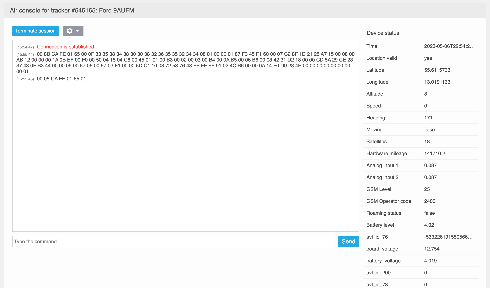

# Air Console

Air Console enables technical specialists, such as technical support team members, to monitor all messages sent by the tracker to the server and send commands to the device if supported. Powered by WebSocket technology,  Air Console facilitates real-time data exchange without any lag or delay.

Navixy Air Console enables technical specialists to perform various tasks, such as:

* Managing device settings and configurations remotely
* Checking device statuses and locations in real-time
* Sending diagnostic commands to devices
* Perform OTA firmware update and remote reboot
* Viewing raw device data

## Using Air Console

To use the GPRS terminal, select a tracker (which must be online) and click **Air Console** on the right side panel. This will open a window where you can establish a connection with the tracker by clicking **Start connection**.

<figure><figcaption></figcaption></figure>

The left panel displays all information from your device in the raw format. The command line below allows sending commands to your device in the form provided by the protocol. These commands will be sent to the device in the same form in which they were entered.


New messages are automatically scrolled down as they appear.


The **Device status** panel to the right displays additional information, such as message time in ISO 8601 (UTC) format and parameters decoded from the device data packet: the device's speed, location, battery level, [inputs and outputs status](air-console.md#reading-input-and-output-states), and other technical data. The status is updated as new messages arrive.

When the session is complete, click **Close connection**.

## Reading input and output states

Input and output status data can be displayed in two ways, depending on the communication protocol of the device. To read them, pay attention to the name of the parameter responsible for the state of the inputs and outputs.

### Inputs status (Set/Reset) and Outputs status (Set/Reset)

When this parameter name is displayed, the statuses will be shown as \[1RNS]. This type is used if the device protocol doesn't permit sending the status of all I/Os at once with a single value.

Each item in parentheses contains the following values:

* Digit: input/output number
* S: Set (on)
* R: Reset (off)

For example, if the value \[8S] comes in, it means that input 8 is enabled and the status of the other inputs is unknown.

Consider the additional example of \[1S2R3S]:

* Inputs 1 and 3 are enabled
* Input 2 is off

### Digital input status and output status

This parameter name will be displayed if the device sends the status of all I/O devices at once in one packet field. The terminal displays the information about them in decimal form. It is necessary to convert the decimal number into binary and read it in little-endian format (from right to left). The last digit is responsible for input 1, the penultimate digit for input 2, and so on.

For example, the console displays the state of the inputs as 5. In binary form it is 0101. It must be read from right to left:

* Input 1: on
* Input 2: off
* Input 3: on
* Input 4 (if present on the device ): off
