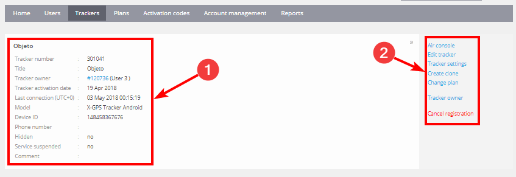
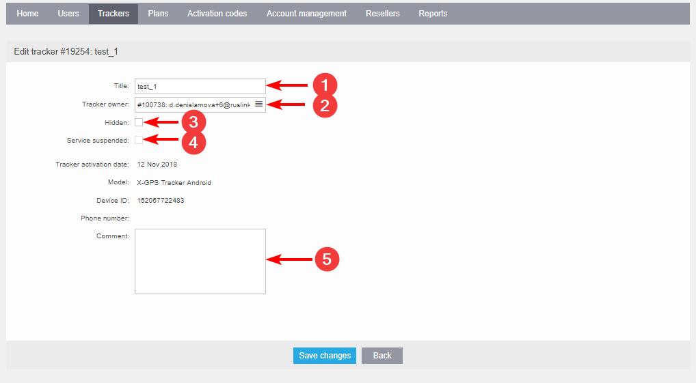

# Basic operations

The "Trackers" tab in the Admin panel contains a list of all the trackers currently registered on the Navixy instance. Each tracker is identified by its ID, title, status, model, device ID, phone number, and activation date. Using the quick search feature, you can easily find the tracker you’re looking for.

## Tracker information

To view detailed information about a specific tracker, simply click on its name in the "Trackers" tab. This will take you to the tracker's information page, where you can find the following details:

1. **General Information** - includes the tracker's current status, last device update time, battery level, and other relevant information.
2. **Tools Menu** - menu provides you with all the available operations that you can perform on the tracker, such as configuring settings, managing users, and editing the tracker's details.

## Edit tracker

In the "Tools menu", you can select the "Edit tracker" option to modify the tracker's parameters. The following parameters can be changed:

1. **Title** - You can modify the tracker's name to better identify it on the platform.
2. **Tracker owner** - You can assign the device to a new user.
3. **Hidden** - If you need to deactivate a tracker and remove it from billing, you can check this box. You can reactivate the tracker at any time.
4. **Service suspended** - If this option is checked, the tracker will still be visible in the list, but monitoring and other operations will be unavailable. This option cannot be changed and is for reference only.
5. **Comments** - You can add a few words about the tracker for reference purposes.

In the Navixy Admin panel, the "Trackers" tab provides you with a comprehensive list of all the registered trackers, along with their detailed information. You can access the "Tools Menu" to perform various operations on the tracker, including editing its parameters, managing users, and configuring settings. If you have any questions or require assistance with managing your trackers on the Navixy platform, please contact our support team for assistance.