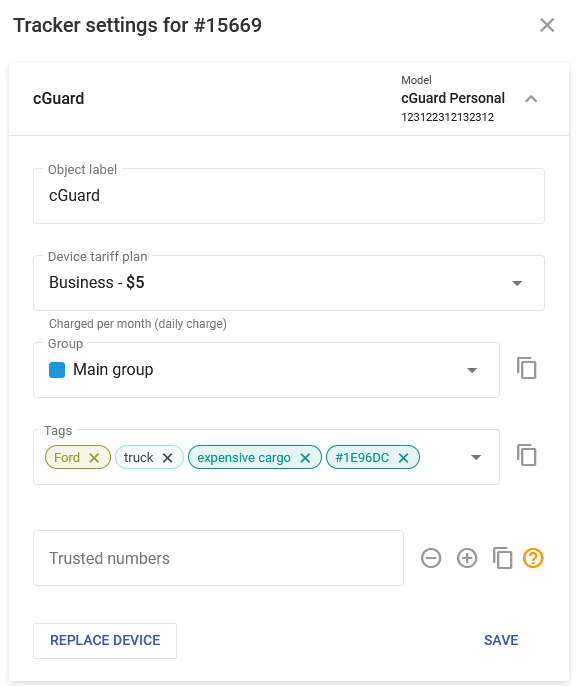

# Tracker details and operations

## Tracker details

To view detailed information about a tracker, simply double-click its name in the table. Its details will appear on the right of the tracker list, including the tracker's connection status, last update time, battery level, and other relevant information.

You will also see the following operations below:

* **Edit tracker:** Allows you to change the tracker's name and owner or make it hidden. See [Editing tracker](basic-operations.md#editing-tracker) for more information.
* **Air Console:** Opens [Air Console](air-console.md) for the tracker.
* **Tracker settings**: Opens the **Tracker settings** window for the tracker that shows its information. Only available to activated and non-suspended trackers.\
  This information can also be viewed in the **Devices and settings** module of the Navixy platform. To learn more, see [Devices and settings](https://app.gitbook.com/s/446mKak1zDrGv70ahuYZ/guide/devices-and-settings).

<figure><figcaption></figcaption></figure>

* **Create clone:** Creates a [tracker clone](tracker-clones.md). Only available to trackers that aren't clones.
* **Remove clone**: Deletes a [tracker clone](tracker-clones.md). Only available to trackers that are clones.
* **Change plan:** Opens the [Change plan](change-plan.md) window for the tracker. Only available to trackers that aren't hidden.
* **Retry activation**: Sends default activation commands to the device.
* **Cancel activation:** Permanently removes the device from the database.

## Editing tracker

Click **Edit tracker** to modify the tracker's parameters. The following parameters can be changed:

1. **Label**: Update the tracker's name for easier identification on the platform.
2. **Tracker owner:** Reassign the device to a different user within your organization.
3. **Hidden:** Check this box to deactivate the tracker and remove it from future billing cycles.


While a tracker is hidden, it will not be included in the next billing period. The tracker remains active until the end of the current paid period. If the device continues to transmit data during this time, it is still considered active for the billing purposes for the current cycle.

You cannot change the subscription plan for a tracker while it is set to hidden.


4. **Comments:** You can add a few words about the tracker for reference purposes.
