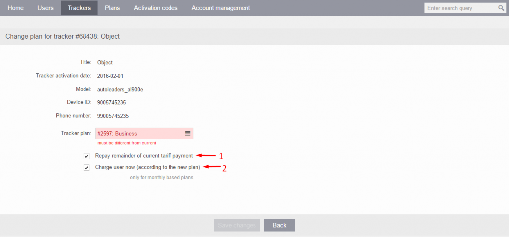

# Change plan

Changing the pricing plan for a tracker in the Navixy platform is a straightforward process that can be completed in just a few steps via the Admin Panel.

## Pricing plans for users

A pricing plan in Navixy is a set of rates and fees that determine the cost of using the platform's GPS tracking and monitoring services. Navixy offers various pricing plans with different features and levels of access, allowing users to choose a plan that best suits their needs and budget.

The pricing plan you choose for your Navixy account determines how much a user will be charged for accessing the platform's services, such as real-time GPS tracking, device management, and reporting. Different plans may also offer different levels of access and control, such as the ability to create sub-users or customize reports.

Navixy's pricing plans are designed to be flexible and scalable, allowing customers to adjust their plan as their needs change over time. This means that a customer can start with a basic plan and upgrade to a more advanced plan as their business grows and fleet management or GPS tracking needs become more complex.

## Changing pricing plan

To change the pricing plan for your GPS tracker in the Navixy platform, follow these steps:

1. Click on the "Change Plan" button located in the right-hand side of the tracker's card
2. This will open a new tab where you can assign the new pricing plan for your tracker
3. You will have the option to choose how to charge the user with monthly-based plans. There are two options:
4. Repay remainder of current plan payment: Select this option if you want to charge the user (according to the current plan) up to the end of the month.

* Charge user now (according to the new plan): Select this option if you want to take money from the user's account according to the previous plan up to the current date, and then start to charge the user according to the new plan. If the user has a zero balance, the plan will be changed, but all services will be blocked.

It's important to note that when changing a plan for a tracker, the new plan will only take effect after the current plan's billing cycle ends. This means that the user will continue to be charged according to the current plan until the end of the current billing cycle, at which point the new plan will take effect.

For further details on Plans, please see our documentation [here](../plans/).
