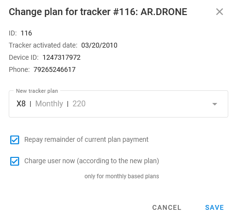

# Changing plan

Changing the pricing plan for a tracker in the Navixy platform is a straightforward process that can be completed in just a few steps via Admin Panel.

## Pricing plans for users

A pricing plan in Navixy is a set of rates and fees that determine the cost of using the platform's GPS tracking and monitoring services. Navixy offers various pricing plans with different features and levels of access, allowing users to choose a plan that best suits their needs and budget.

The pricing plan you choose for your Navixy account determines how much a user will be charged for accessing the platform's services, such as real-time GPS tracking, device management, and reporting. Different plans may also offer different levels of access and control, such as the ability to create sub-users or customize reports.

Navixy's pricing plans are designed to be flexible and scalable, allowing customers to adjust their plan as their needs change over time. This means that a customer can start with a basic plan and upgrade to a more advanced plan as their business grows and fleet management or GPS tracking needs become more complex.

## Changing pricing plan

To change the pricing plan for your GPS tracker in the Navixy platform, follow these steps:



### Open the Change plan window

Select the tracker and click **Change plan** (located in the right side panel). This will open the **Change plan** window:

<figure><figcaption></figcaption></figure>




### Select the tracker plan

In the drop-down menu, select the new pricing plan for your tracker. Plan names have the following format:  `name | billing cycle | price` .



### Configure payment options

You can choose how to handle switching from an old plan to a new one. There are two options:

* **Repay remainder of current plan payment**: Select this option to be refunded for the remaining period under the old pricing plan.
* **Charge user now (according to the new plan)**: Only for monthly-based plans. Select this option if you want to start charging the user under the new plan from the next day after the change. If the user has zero balance, the plan will be changed, but all services will be blocked.



### Save and exit

Save the new configuration and close the **Change plan** window.




When changing a plan to non-monthly billing (such as daily or annual), the new plan will only take effect after the current plan's billing cycle ends. This means that the user will continue to be charged according to the current plan until the end of the current billing cycle, at which point the new plan will take effect.


For more information on plans, see the [Plans](../plans/) documentation.
