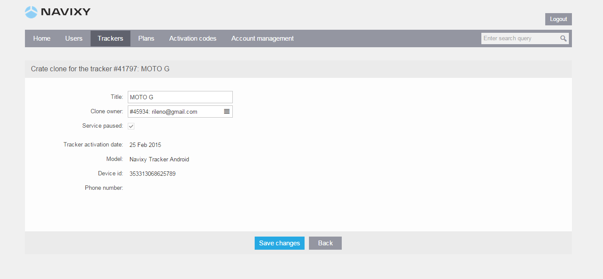
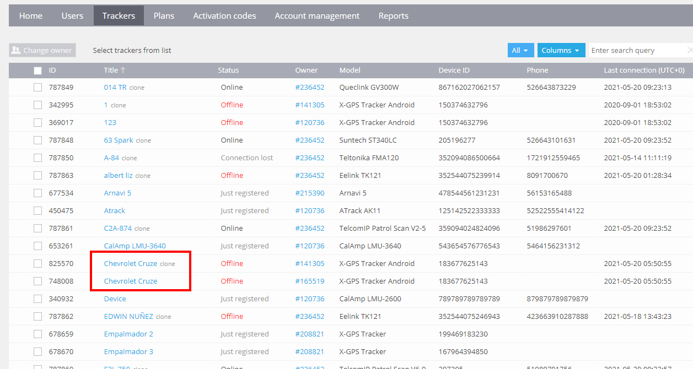

# Tracker clones

A *clone* is a virtual instance of an existing GPS tracker in the Navixy platform. Clones allow you to create one or more copies of an existing tracker and place them in multiple independent user accounts. This means that several users can monitor the same GPS tracker from their individual accounts.

Cloning a tracker is a useful feature when you want to provide access to the same GPS tracker to multiple users while still maintaining separate user accounts. For example, if you have registered all your trackers in one user account but need your colleagues to monitor and supervise particular groups of trackers, you can create separate user accounts for them in the Admin Panel and clone the necessary trackers into their accounts.

It's important to note that cloning a tracker is not the same as allowing sub-users to monitor the same object. With cloning, the same GPS tracker can be monitored by independent users, while sub-users can only monitor objects within the same user account. In short, cloning in the Navixy platform allows independent users to monitor the same GPS tracker from their individual accounts, providing flexibility and control over who has access to the tracking information.

## Difference between trackers and clones

While both trackers and clones in the Navixy platform are used to monitor GPS devices, there are some important differences between the two.

**Trackers**

A tracker in the Navixy platform is a physical GPS device that is registered on the platform. The user who owns a tracker can manage and change its settings and configuration. This includes changing tracking mode, setting up parking detection, and other device-specific settings.

**Clones**

A clone in the Navixy platform is a virtual instance of an existing GPS tracker. The owner of a clone is limited in actions compared to the owner of a tracker. A user who owns clones can perform only read-only actions, such as monitoring on the map or using reporting tools. They have no ability to change any of the configuration and settings in the Devices application, such as tracking mode, parking detection, and other settings.

In summary, while both trackers and clones in the Navixy platform are used for GPS device monitoring, the major difference lies in the level of control and access that the owner has. The tracker owner has full control over the device's configuration and settings, while the clone has limited actions and cannot change any of the device's configurations and settings

## Creating and Managing Clones

Here are the steps to create and manage clones in Navixy:

1. Log in to the Navixy Admin Panel and select the tracker(s) that you want to clone.
2. Click on the "Clone" button and give your clone a name.
3. Assign the clone to the desired user account (i.e. the clone owner) by selecting the account from the drop-down list.
4. Save your changes, and the clone will be created and ready to be monitored by the assigned user account.

To manage your clones, simply click on the clone that you want to edit and click on the "Edit Tracker" button. From there, you can change the clone owner or other details as necessary.

You can also clone a device across Admin Panels, however you will need to reach out to Support team for assistance.

Since clones are virtual reflections of trackers, there is no additional charge for creating and using them. You will only be charged for the original trackers, and not for their clones.