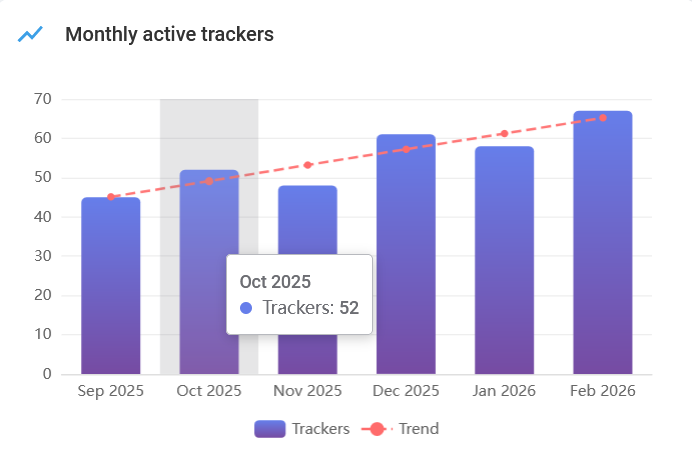
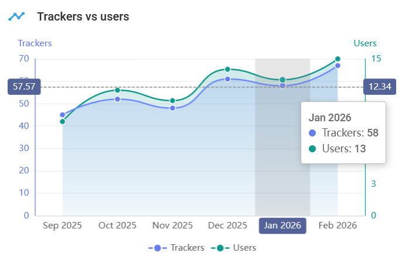

# Overview

The **Overview** page serves as the central command center for the health and growth of your tracking system. It provides a real-time snapshot of hardware deployment and user engagement through a combination of high-level KPI cards and detailed trend visualizations.

<figure><figcaption>
Overview page
</figcaption></figure>

## Key Performance Indicators (KPIs)

The top row features six metric blocks designed to give you an immediate pulse on the current month's performance.

<table><thead><tr><th width="240.4000244140625">Metric</th><th>Description</th></tr></thead><tbody><tr><td>Active trackers</td><td>Total number of trackers that were active during the current month.</td></tr><tr><td>Inactive trackers</td><td>Trackers that were active last month but aren't currently active.</td></tr><tr><td>Active users</td><td>Number of unique users with at least one active tracker this month.</td></tr><tr><td>Inactive users</td><td>The decrease in the number of active users compared to the previous month.</td></tr><tr><td>Avg trackers per user</td><td>The average number of trackers per user this month.</td></tr><tr><td>Resellers</td><td>Total number of registered resellers.</td></tr></tbody></table>

## Growth and engagement trends

The lower section of the screen provides data to help identify patterns and seasonality.

### **Monthly active trackers & users**

These bar charts illustrate monthly totals for the last six months.

* Trend line: The red dashed line indicates the general trajectory of growth over time.
* Interactive tooltips: Hovering over any individual bar reveals the specific numerical value for that month.

<figure><figcaption>
Monthly active trackers chart
</figcaption></figure>

### **Trackers vs. users (trend chart)**

This dual-axis line chart provides a comparative view of hardware scaling versus user acquisition.

* Primary axis (left): Measures the total volume of trackers.
* Secondary axis (right): Measures the number of unique users.
* Detailed analytics: Hovering over the chart displays a synchronized tooltip showing both metrics for the selected month and dashed horizontal lines indicating the precise value points on each axis. This allows you to quickly assess if hardware growth is keeping pace with user growth.

<figure><figcaption>
Trackers vs users chart
</figcaption></figure>

### Trackers vs users (ranking)

This leaderboard provides a granular breakdown of your top-performing accounts.

* Rank: The numerical standing of the user based on their total hardware count.
* User: The name or entity associated with the account.
* Trackers: The total number of trackers currently assigned to that specific user.

Click the user in the ranking table to open their details window.

<figure><figcaption>
User details in ranking table
</figcaption></figure>
