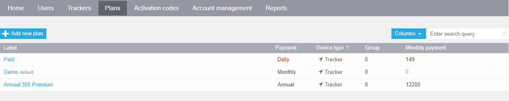
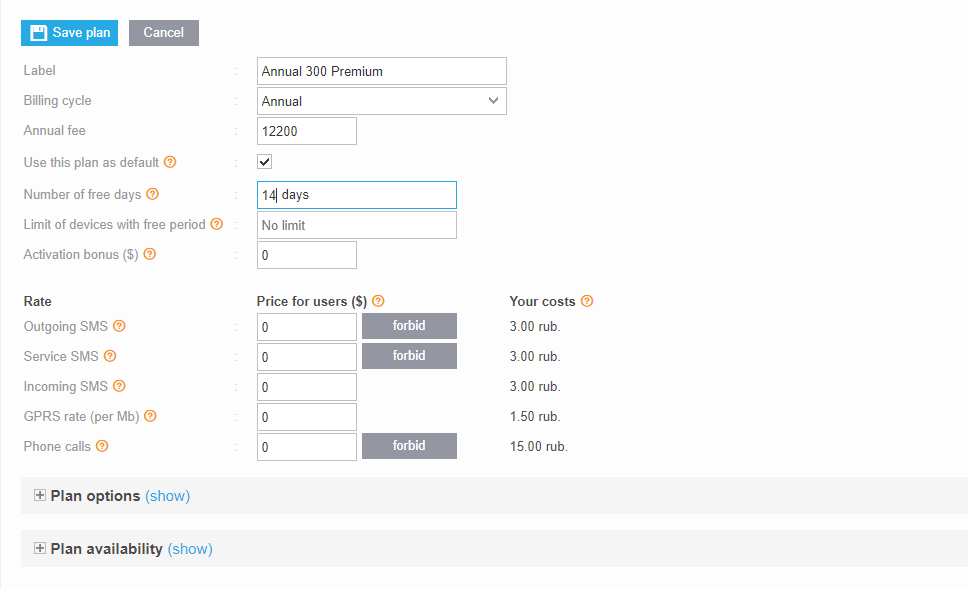
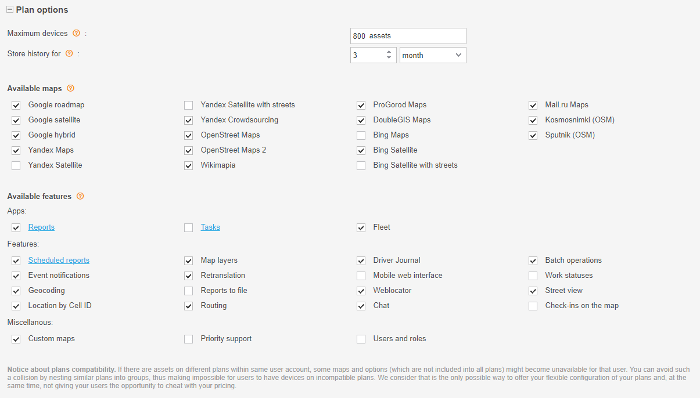
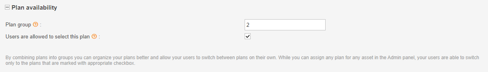

# Plans

In this tab, you can view, edit, or create new pricing plans for your Navixy account. The pricing plans allow you to offer your end-users flexible packages that can make your service more attractive. You can create any number of pricing plans to choose from.

## Advance payments

The billing system uses an advance payment method, where users can only access the services when they have enough funds in their personal account.

## Plan settings

A pricing plan is a set of commercial terms that defines the structure of the service packages and their prices available to a user. Each tracker can be assigned its own pricing plan, allowing users to track assets with different pricing plans.

When a user creates an account, Navixy Server automatically creates a test Demo pricing plan, which is recommended for use only during the test period.

Here, you can:

* Assign a label to the pricing plan that will be available in the user's account
* Set up the billing cycle (monthly, daily debit, daily)
* Set up monthly fee and proportional charge
* Set a pricing plan as the default for all devices
* Set rates for SMS and GPS traffic and restrict usage if necessary

## Billing cycles

Billing Cycles There are four billing cycle types to choose from:

* **Monthly:** the user is charged on the first day of the month at 00:05 UTC, or immediately after applying the pricing plan. If you set the "proportional charge" checkbox, the user is charged for the number of days left in the month; otherwise, they will be charged for the full month.
* **Monthly (daily debit):** the user is charged each day at 00:05 UTC proportionally to the monthly fee.
* **Daily:** the user is charged each day at 00:05 UTC. This is a post-paid plan, meaning the user will be charged only if the tracker connected to the server at least once in the last 24 hours.
* **Annual:** the user is charged on the first day of the year at 00:05 UTC. This is a pre-paid plan, meaning the user will be charged for the year ahead regardless of whether the device will be used or not.

## Plan options

In this field, service providers can set up all the features and options that will be applicable for trackers on the pricing plan, including the maximum number of devices allowed on the plan, storage period, maps available, and other options.

1. **Maximum number of devices** – if a user reaches this limit, they will not be able to add or track any additional assets. If a user has assets on different plans, the plan with the minimum value will be applied.
2. Users can also set up a **period for which data will be stored** in the system, ranging from one or several days to months or years.
3. Service providers can select **which maps will be available to users** who track assets on this plan.
4. Plan settings also include the range of **desired applications**, such as Reports, Tasks, and Fleet, as well as other features and miscellaneous options.

## Plan availability

In this section you can set up a _group_ that the pricing plan belongs to. By combining pricing plans into groups, you can organize them better and allow your users to switch plans on their own within the same group. While you can assign any pricing plan for any asset in the Admin panel, users are only able to switch between plans that are marked with the appropriate checkbox.

If there are assets on different plans within the same user account, some maps and options might become unavailable for that user. You can avoid this by nesting similar plans into groups, thus making it impossible for users to have devices on incompatible plans. This way, you can offer flexible plan configurations without giving your users the opportunity to manipulate your pricing.

## Default pricing plan

You can set the _default pricing plan_ that will be automatically assigned to all new devices in the account. It will be also applied to trackers when transferring trackers between user accounts.

To set a default plan:

1. Go to the admin panel and open the list of users
2. Select a user and click "Edit User"
3. Select "Basic Tracker Tariff" and assign the required pricing plan You can also set a default plan when creating a new user.
