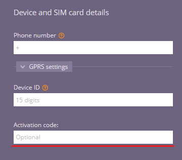

# Activation codes

## What are the activation codes?

Activation codes are unique 10-digit random numbers that restrict the process of adding a new tracking device to a user's account. This process is typically utilized to prevent users from activating devices purchased from sources outside of your organization.

-20230811-205456.png>)

Much like the typical activation process, the only difference is the user will have to input the provided code in the given space shown below:

You are able to have an activation code associated with a [device plan](./), so when a user does activate a device it’s automatically setup with what they should have access to.

The Activation code enforcement feature is disabled by default. If you would like to enable this feature for your Navixy instance, please contact our customer success team.
