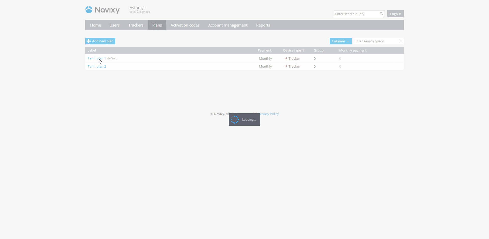

# Assets are not displayed in the account

**Problem: Some devices aren't displayed in the account**

If you're experiencing a situation where the number of devices displayed in the user interface (UI) is less than the number of devices shown in the admin panel's users tab, it's likely that some of them have been hidden due to your pricing plan's limitations.

**Solution: Adjust your pricing plan to display all devices**

Each pricing plan has a maximum devices parameter, which sets the limit on the number of devices that can be added and tracked in your account. If you reach this limit, you won't be able to add or track any more assets in your account.

If you have assets on different pricing plans, the minimum value of the maximum devices parameter will be applied.

To see all of your devices again, you can increase the maximum devices parameter in your pricing plan. This will allow you to add and track additional assets in your account.

