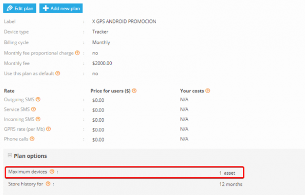
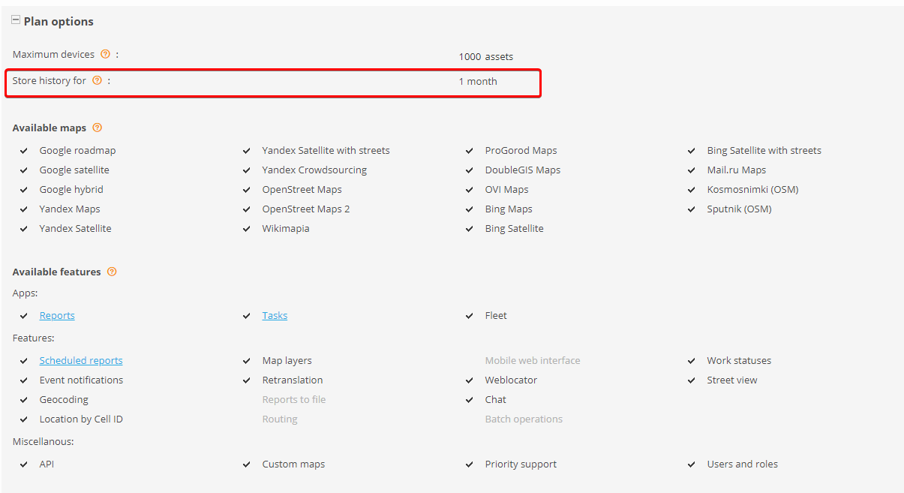
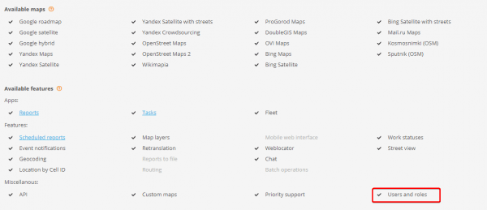
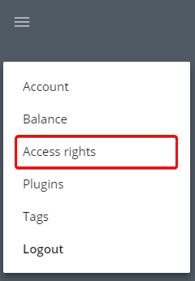
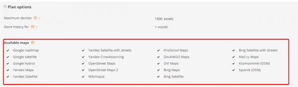

# Pricing plans conflicts

Pricing plans are very useful for device and user control, but there are some peculiarities, which are not obvious. This article will help you to understand pricing plans features, and make the platform more comfortable for using.


If there are assets on different plans within same user account, some maps and options (which are not selected in all the pricing plans) might become unavailable for that user.

You can avoid such a collision by nesting similar plans into groups, thus making impossible for users to have devices on incompatible plans. We consider that is the only possible way to offer your flexible configuration of your pricing plans and, at the same time, not giving your users the opportunity to cheat with your pricing.


### Devices do not appear in the UI

If number of devices which actually appear in the user account are not equal to number of devices specified in the admin panel, please check that pricing plan settings are correct. If there are different devices with different pricing plans assigned to them in the user account, the system will automatically apply restrictions of the most strict one:

So if you have devices with pricing plans which allow 100 and devices with pricing plans which allow 30 devices, only 30 devices will be shown in the user account.

### Tracks history is limited with pricing plan

There is “Store history for” option in pricing plan settings which affects the possibility of tracks history monitoring

This option defines the time period during which tracking points will be stored. If you will try to get tracks which were made earlier, you will get the error below:

### Customer cannot change / create roles and sub-users

There is a feature, which allow your customers to create/change sub-users and their roles. If there is a pricing plan with “Users and roles” function disabled, feature also will be not available for the whole account:

And corresponding section will be also removed from the menu:

So please pay attention and triple-check all pricing plans parameters.

### Customer cannot select maps

If some maps are not available for choosing in the user account, please check the tariff plans which are used in this account, because there is a possibility that some maps are disabled:

Please select needed maps in the settings of user’s pricing plans. The list of all available maps is defined by the preferences for your service
