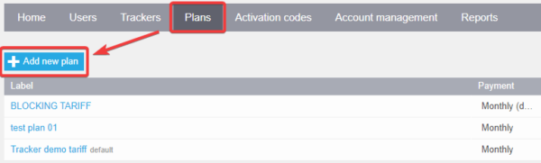
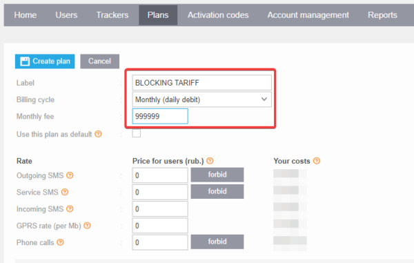
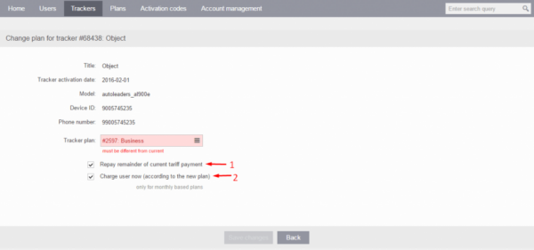

# Suspending service for a device

When providing monitoring services to your customers, there may arise situations where temporarily suspending the service for a device becomes necessary. For instance, if a customer has missed a payment. In such cases, switching the device to a pricing plan that limits its usage can be an appropriate action.

While a device is suspended, it is unavailable for use and does not record any data until the restriction is lifted. However, it's important to note that the data recorded prior to the suspension remains intact.

**To create a pricing plan that suspends the service for a device, follow these steps:**

1. Open the Admin Panel and navigate to the "Plans" section.
2. Click on "Add Plan" to create a new pricing plan and give it a name (e.g., "Suspended Plan").

2. Set the billing cycle for the plan to "Monthly (Daily Debit)" and set the monthly fee to a very high value, such as $999,999. This prevents the customer from being charged during the suspension period.

4. In the pricing plan settings, disable the features of your choice or leave the default settings to restrict device use.
5. Assign the new pricing plan to the device that you want to suspend service for.
6. The device will be suspended starting the next day after the pricing plan change.

You should enable the check boxes "Repay Remainder of Current Pricing Plan Payment" and "Charge User Now (According to the New Plan)" when changing the pricing plan.

