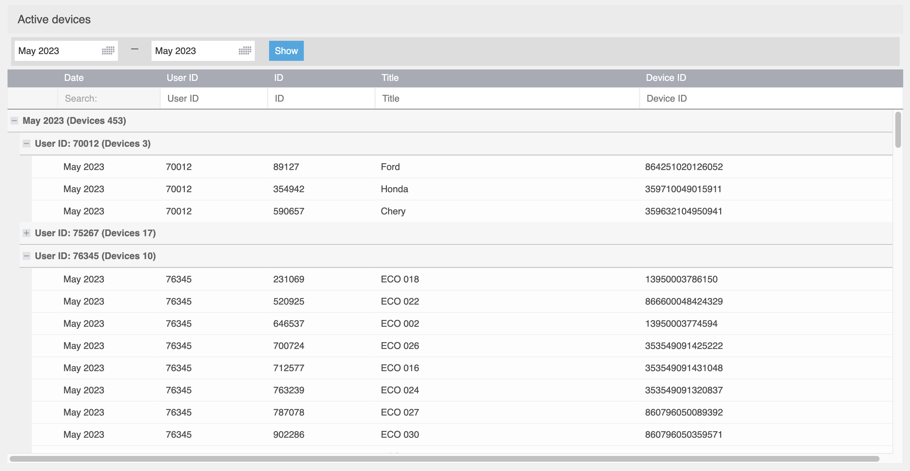

# Reports

Admin panel provides an easy way to access data on the platform usage, including the number of active devices, through the Reports feature. This is particularly useful to get an overview of how many active devices you and your dealers have during a specific period of time.

To generate a report:

1. Click on the "Reports" button in the Navixy admin panel to display the corresponding menu.
2. Select the "Your Devices" section.
3. Choose the time period for which you want to generate the report and click the "Show" button.
4. The report will be generated, showing all the users and the number of active trackers they have during the specified time period.

