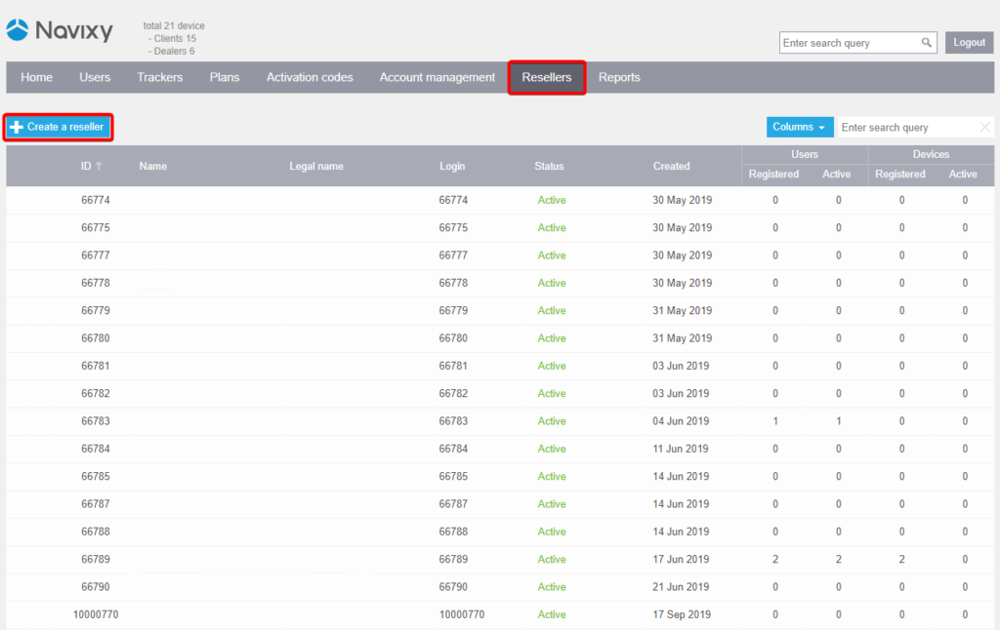
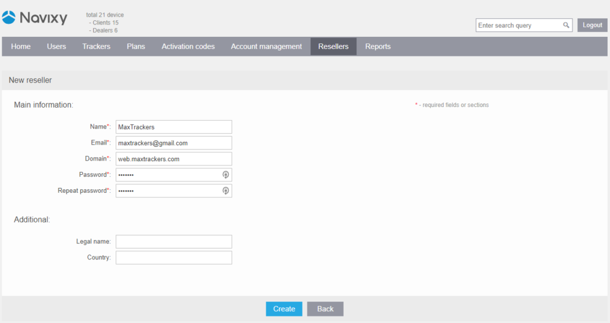

# Resellers

Navixy's channel partners have the ability to expand their business by creating a network of sub-dealers or resellers. This section describes how to create a reseller in the Admin panel and the various capabilities that partners have to manage reseller settings.

With the reseller feature, partners can invite new organizations to become their sub-dealers and assign them a set of permissions that fit their specific needs. The reseller will have access to a dedicated Admin panel, with the ability to manage their own customers, IoT devices, and billing.

## Reseller capabilities and restrictions

Resellers can perform the following actions in their Admin panel:

- Brand and customize their web services and mobile apps
- Setup service preferences, such as language and currency
- Create their own pricing plans
- Manage list of devices
- Add and manage users
- Activate, configure and diagnose devices

Resellers are not allowed:

- Modify the GIS package. The GIS package will be inherited from the partner's account.
- Create their own resellers. To do this, they will need to become a partner.
- Submit tickets to Navixy technical support: for any technical questions, they should contact the partner first.

## Creating a reseller

To create a new reseller, go to the "Resellers" section in the Navixy Admin Panel and click on the "Add reseller" button. Fill in the required information, such as the reseller's company name and contact details. After creating the reseller profile, the reseller's status will be "Not paid", which means their profile is not yet activated and their access to the admin panel is limited.

## Managing resellers

Once a reseller profile is created, the partner can manage its settings by clicking on the "Edit reseller" button. The partner can change the reseller's status, which can be one of the following:

**Not paid**

The reseller profile is not activated and access to the reseller's admin panel is limited. This status is automatically assigned to newly created resellers. If a reseller has the "Not paid" status, the partner cannot create new resellers until the payment is completed. Navixy manager will change the status to "Active" after the payment is received.

**Active**

The reseller profile is activated and the reseller has full access to their admin panel.

**Admin panel suspended**

In case of a violation of the cooperation conditions, the partner can restrict the reseller's access to their admin panel. However, the reseller's user interface is not suspended.

**Service fully suspended**

Both the reseller's admin panel and user interface are suspended.

Additionally, channel partners can install an SMS gateway for their resellers. To set this up, please contact Navixy technical support