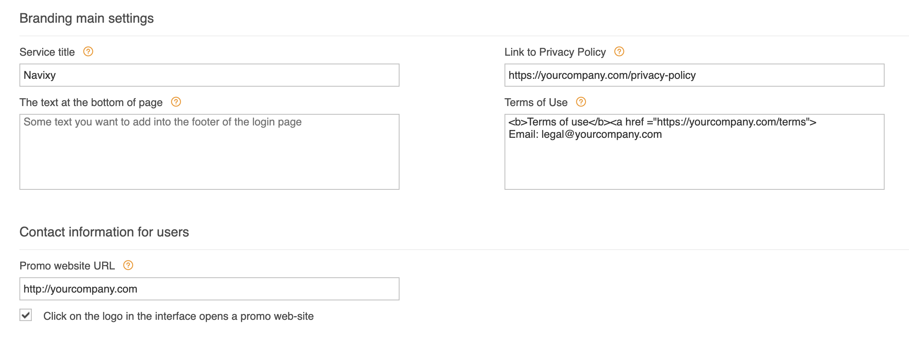
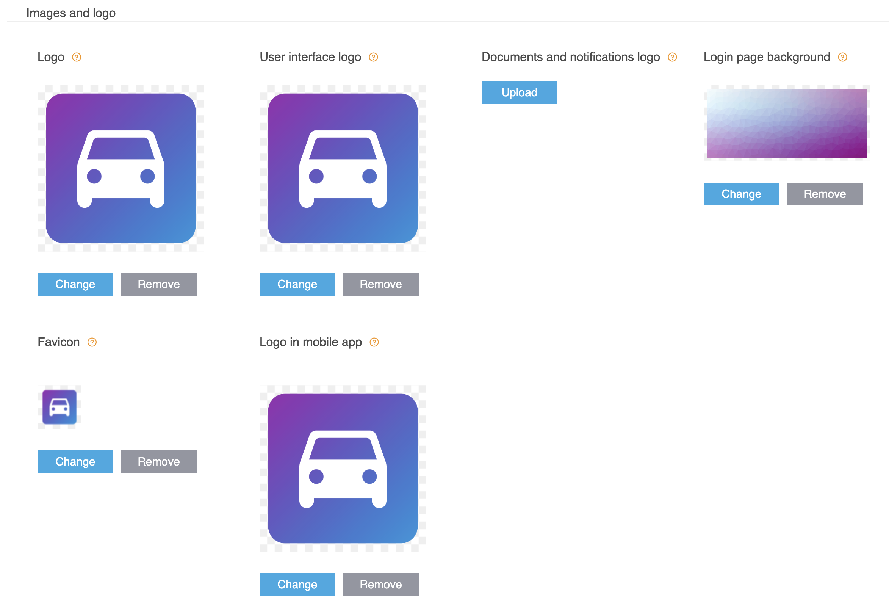
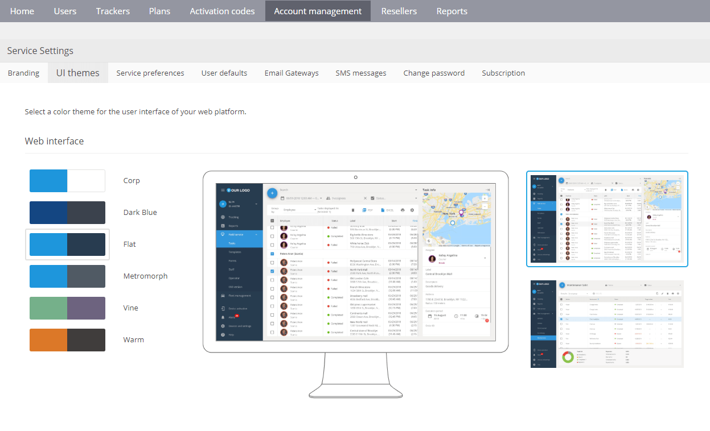
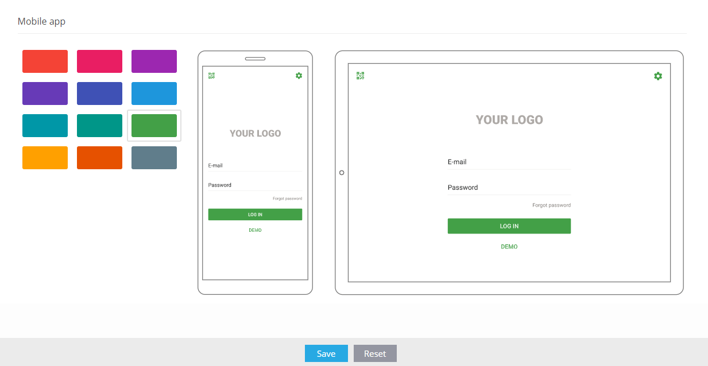

# Branding options

With Navixy, you can customize and white-label the service to make it truly your own. This feature allows you to add a personalized touch to the Navixy service and present it as a seamless part of your business.

## Branding

To access the branding options, login to the [Admin Panel](https://panel.navixy.com/) and navigate to Account Management → [Branding](https://panel.navixy.com/#settings). There you will find a range of customizable settings that you can use to reflect your company's branding and marketing attributes.

### Customizing login page

Navixy offers a range of options to customize the login/signup page of your web service. These options allow you to add your own branding and contact information to the page, as well as links to legally required sections such as privacy policy and terms of use. To access these options, go to the Admin Panel → Account Management → Branding Page. To customize these settings, simply enter your desired text and links in the appropriate fields. You can also preview your changes in real-time to ensure that the page looks exactly as you want it to.

### Uploading your logos

Navixy provides you with the flexibility to upload graphic files that can help make your service appearance unique and aligned with your company's branding. Here are two ways you can do this:

1. **Upload logos**\
   You can upload your company's logo, which will be displayed on the login page, in PDF reports, and email notifications. You can also upload a separate logo for the user interface. It is recommended that you upload horizontally oriented images with transparent backgrounds and a size of 500x300 pixels. To upload your logo, go to the Admin Panel → Account Management → Branding and select the appropriate option.
2. **Change the background of the login page**\
   You can also upload a custom background image for the login page. This can be an image that reflects your brand or an image that is pleasing to the eye. It is recommended that you upload high-resolution images that are optimized for modern retina screens, with a minimum resolution of 3840x2160 pixels and a file size of up to 1MB in JPEG format. To upload a custom background image, go to the Admin Panel → Account Management → Branding and select the appropriate option.

By customizing your service appearance with graphic files, you can create a more professional and personalized experience for your users. This also ensures that your service is consistent with your brand identity and provides a seamless experience across all platforms.

## Color theme

You have the ability to personalize your GPS-tracking service by choosing from the predesigned color themes for user web interface and mobile apps. This feature allows you to create a unique look and feel for your Navixy interface that reflects your corporate brand and enhances your company's identity. The process is simple and straightforward, allowing you to create a customized GPS-tracking and Telematics service.

### Selection of palettes

To set up the color scheme, go to the Admin Panel → Account Management → [UI Themes](https://panel.navixy.com/#settings). There you will see a list of available themes. When you click on a theme, you will see screenshots of the chosen color palette. You can also preview the theme in your monitoring page. Once you've decided on a theme, simply click on the "Save" button to apply the changes.

### Applying color theme to X-GPS mobile app

In addition to changing the color theme of the web UI, you also have the option to change the colors of the X-GPS mobile apps. This can improve the visual appearance of the platform and ensure that it aligns with your company's brand. To set up the color theme for X-GPS Monitor, navigate to the Admin Panel → Account Management → UI Themes. Here, you can view the available themes and select the one that matches your company's visual appearance.Once you click on a theme, you can preview the selected palette in the app and see screenshots of its appearance. To save your selection, simply click on the "Save" button.

After the new color theme is set, it will be automatically applied when your customers log into their accounts via the X-GPS Monitor app or scan the QR code. This feature provides a consistent and personalized user experience across all platforms while ensuring that the interface is aligned with your company's brand.
