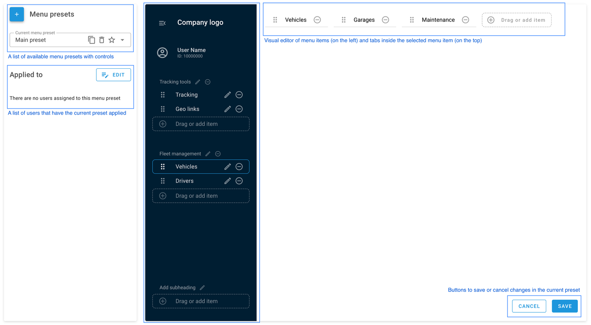
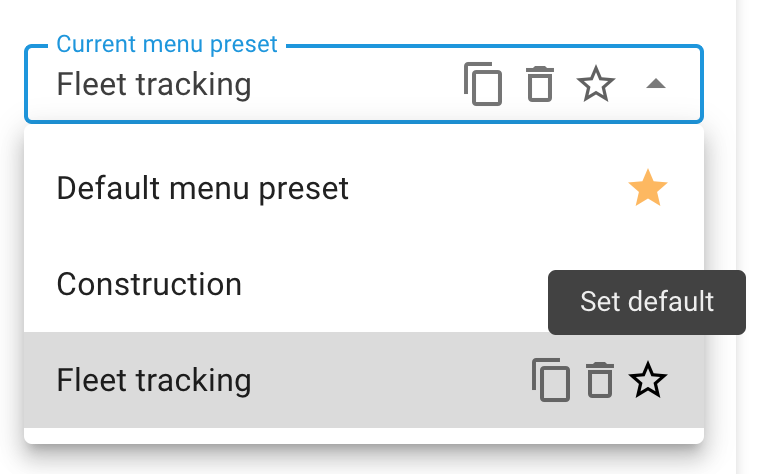
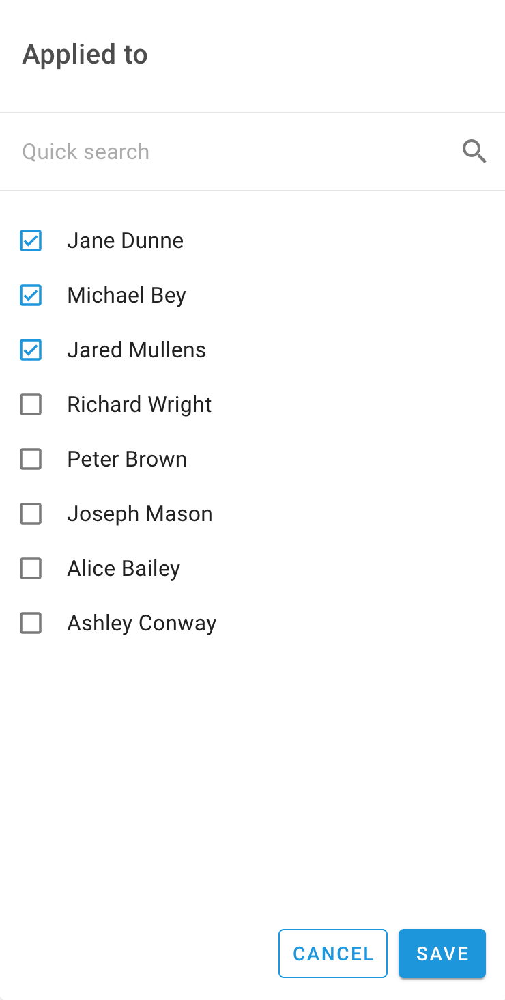
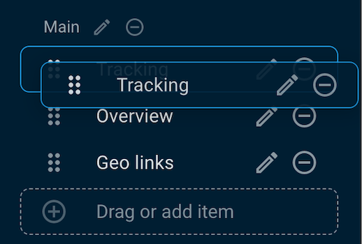

# Custom Menu Editor

## Overview

The Menu Editor is an Admin Panel tool that allows admins to control what their end users can see on the platform. Thus allowing for more consistent and standard use among their users and providing access control. With this functionality, admins can reorder and rename tabs as well as grouping users with specific builds so control is more organized.

## Creating a Menu Template

To begin, first navigate to the Admin Panel → Account Management → Menu editor. Once there, the below screen will be visible:

1. **Menu presets** - a list of created menu presets. By default, this only contains the basic template created by Navixy.

To create a new preset, click “Add new preset” and enter the name you wish. Clicking the “copy” icon will allow you to adjust an already created preset, the “trashcan” will delete the preset, and the star will allow you to set the preset as default. The chosen default will automatically be applied to all users unless specifically changed.

2. **Applied to** - select which users to apply the template to.

Presets can be applied to any chosen user. If you delete a preset, the user will be assigned the template marked as default.

3. **Visual editor** - As items are rearranged or renamed, a visual can be instantly seen on the right

All menu items can be dragged-and-dropped to order them as needed and can also be renamed. Tabs within each menu option can also be renamed and dragged where needed within the window. Groups and subheadings can also be used.

## API

For instruction on using the API, please see our documentation here: [Custom menu on Developers portal](https://app.gitbook.com/s/6dtcPLayxXVB2qaaiuIL/panel-api/resources/user/preset)
