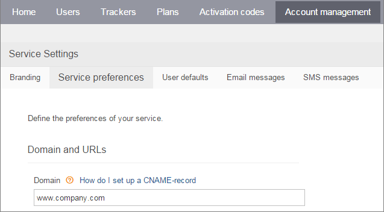
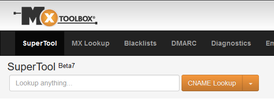

# Domain name

When you create a new Navixy ServerMate trial account, you are given a default URL in the format of **https://\*\*\*\*\*.navixy.com**. However, it is common to want to customize this URL and use your own domain name instead. This is a straightforward process that we will guide you through step-by-step.

## Setting up your domain name for Navixy account

To set up your own domain name for your Navixy cloud account, you can follow these simple steps. Let's say you have a domain called company.com and you want the subdomain **my.company.com** to point to the user web-interface.

**Step 1: Create a CNAME record on your DNS server.** You need to create a CNAME (Canonical Name) record on your DNS server that points to the Navixy server. This record serves as an alias to your domain. Once this is done, your domain (e.g. **www.company.com**) will always point to the user web-interface. _For instructions on how to create a CNAME record and examples, please refer to the section below or documentation provided by your DNS server provider._

**Step 2: Set your domain name in the Navixy Admin panel.** After you have set up your CNAME record, log in to the Navixy Admin panel and navigate to Settings > Domain. Enter the domain name you want to use (e.g. **www.company.com**). It is important to note that you should not change this parameter until you have finished Step 1 and your CNAME record is ready to use. _Read below on how to check if your CNAME record is properly configured._

### CNAME Basics

Regarding DNS, a CNAME is simply a domain name that is a nickname or alias for another domain name. In simpler terms, let’s take “www.navixy.com” for example. “navixy.com” is the domain name, and the “www” is the CNAME. If either option is input into the address bar, both will take you to the same place. The “www” is simply another way to get there. However, for our case here, you can also use a CNAME record to redirect your DNS to another domain.

Please note that CNAME records cannot be the default domain: navixy.com cannot be the CNAME record, you _must_ have a subdomain such as “**my**” or “**www**” be the CNAME record.

### Configuring a CNAME record

If you have a corporate website running on your domain, you likely have a Domain Name Service (DNS) that handles all requests to your domain name. To configure the CNAME record for Navixy, you need to access your DNS configuration and add a new CNAME record pointing to:

* `saas.navixy.com` – if your Navixy account runs on the platform in the European Union;
* `saas.us.navixy.com` – if your Navixy account runs on the platform in the United States.

If you are unsure which platform your account is running on, you can refer to the address of your Admin panel. If your panel address is [http://panel.navixy.com](http://panel.navixy.com) , then you are using the EU platform; if your panel address is [http://panel.us.navixy.com](http://panel.us.navixy.com) , then you are using the US platform.

Here are some hints to help you set up the CNAME record:

* Primary DNS service must be enabled, and you need to have access to edit the domain zone. Usually, registrars or hosting providers give access via a web interface to edit zones.
* Secondary DNS service must also be enabled, but editing the zone on the secondary server is usually not required.
* You can use any domain level, but we recommend using a third-level domain. The second-level domain usually serves your company's site and cannot be used for anything else.

After you have modified your DNS records, it may take up to several hours for the changes to propagate worldwide. You can check the status of your CNAME records with the **ping** command with your domain (e.g. **ping my.company.com**) or online DNS lookup tools like [this one](https://mxtoolbox.com/DNSLookup.aspx).

#### Examples of DNS record configuration

Here, we will show you how to create a third-level domain using two popular domain registrars: [http://GoDaddy.com](http://godaddy.com)  and [http://Enom.com](http://enom.com) . As an example, let's use the domain "http://company.com " and the subdomain "**my.company.com**"

**Example 1: GoDaddy**

1. Log in to your GoDaddy account
2. Click the "Launch" button next to "Domains." If you don't see the domain options, you may have to click the "My Account" link.
3. Click on the gear icon for the domain you're going to use.
4. Select "Domain Details" from the menu.
5. Click the "DNS Zone File" tab.
6. Click "Add Record."
7. Select "CNAME."
8. In the two boxes, enter the following information:

* Host - this field can be anything you would like your platform to point to. For example here we will be using “**my**” for example “**my**.company.com” will be the link to the platform.
* Points To: saas.navixy.com

1. Press "Save."
2. Click "Save Changes" toward the top right.

**Example 2:** [http://Enom.com](http://enom.com)

1. Log in to your account at [http://Enom.com](http://enom.com)
2. From the drop-down menu at the "Domains" tab, select "My Domain." You'll be directed to the Manage Domains page.
3. Click the domain that you'd like to use with Navixy.
4. Click "Host Settings."
5. To add a CNAME record, click "New Row." If you've already created a CNAME record for the address, simply edit the existing CNAME record.
6. Enter the first part of the address that you picked as your custom domain. For example, if you picked "**my.company.com**" as your address, enter "**my**" for step one.
7. As the host name, enter "saas.navixy.com"
8. Click "Save"

#### Checking your settings for CNAME record

To check that you configured your CNAME record properly (on Step 1) you can query the DNS servers using **NSLOOKUP** command from your terminal – it should resolve as saas.navixy.com :

`nslookup my.company.com`

You should get something like this in response:my.company.com canonical name = saas.navixy.com .

Name: saas.navixy.com

Address: 3.121.166.173

Name: saas.navixy.com

Address: 52.28.24.77

Another option is to use the CNAME lookup from MxToolBox:

If you see your CNAME (saas.navixy.com or saas.us.navixy.com) returned from either option, it means your new domain is set correctly and you can now proceed with Step 2 and change the domain name in your Navixy Admin panel.

Please note that if you aren’t seeing the CNAME with either lookup option, it sometimes takes hours for DNS records to update out to the world wide web. This is not something Navixy can control and you must simply wait for the DNS record to update before we can continue.

#### Using multiple domain names with the same Navixy instance

Unfortunately, it is not allowed to allowed to use more that one domain name with the same Navixy ServerMate instance. Please also note, that once you set up own domain name, the previous URL **#####.navixy.com** (e.g. http://1234.navixy.com ) will stop working.

**Please note that while we have recommendations on how to set up your DNS record, Navixy isn’t responsible for your domain name as that is a separate third-party system.**

### Using SSL encryption

SSL encryption is a proven way to protect web traffic between your customers and your server by encrypting it, which prevents a man in the middle from intercepting the web traffic and accessing sensitive information about your customers. To use SSL encryption, you need to have a valid SSL certificate for your domain that is signed by a trusted Certificate Authority (CA).

It is highly advisable to use SSL encryption for your domain due to the following reasons:

* SSL encryption may be a mandatory requirement when handling sensitive data for government or large clients.
* When customers click on a link from a secure site to an unsecured one, some browsers may display a warning that can discourage customers from continuing.
* The X-GPS Monitor app for Apple devices requires SSL encryption to function.

After enabling SSL encryption, the protocol in the address bar will change from http to https, and a lock icon will appear next to it, indicating that the connection is secure.

#### Installing SSL certificate

The easiest way to obtain a SSL certificate is to contact our technical support. We will issue a Letsencrypt certificate for you and will make sure that it is automatically renewed. This is free of charge and only requires your consent.

If you prefer obtaining your own certificate from another certification authority, please feel free to provide our technical support team with the certificate and the private key. We will install it on your server with no charge. If you already have a wildcard certificate for your higher-level domain, you can also provide it along with the private key.
