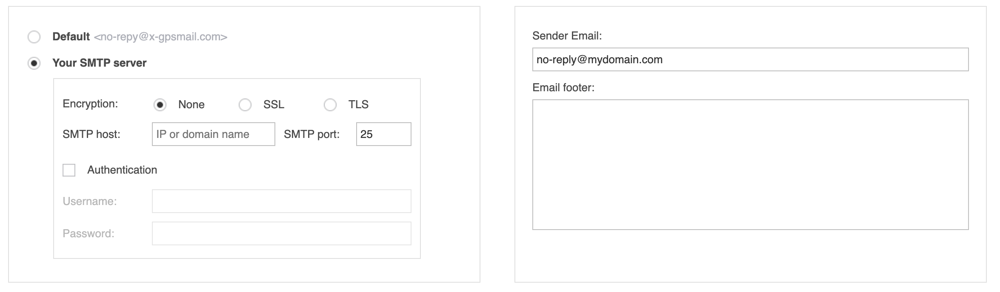

# Messaging gateways

Navixy uses two types of messaging gateways: Email and SMS. These gateways are essential tools for GPS/Telematics service providers to communicate with their customers, send alerts and notifications, and interact with IoT devices. Messaging gateways can be configured and managed in the [Service preferences](https://panel.navixy.com/#settings) section of the Admin Panel.

## Email gateway

The Email gateway is a messaging gateway that enables communication with customers via email. The email gateway allows you to send email notifications to your users when certain events occur, such as when a device goes offline or when a geofence is breached. You can also use the Email gateway to send daily or weekly reports to your users, providing them with important information about their assets and devices.

You can use Navixy's high-deliverability gateway or integrate it with your email (SMTP) service provider.

### Option 1. Navixy's high-deliverability Email service

This option is available only for Navixy ServerMate deployments

Navixy's high-deliverability free Email service is a reliable and secure option for sending Email notifications and reports to your users. This service is integrated with Navixy and ensures that your Emails are delivered to your users' inboxes without being marked as spam.

By default, the email address [no-reply@x-gpsmail.com](mailto:no-reply@x-gpsmail.com) is used in the 'from' field. To set up an alternative sender address (e.g. with your domain), you only need to provide your email address. The system will send a verification Email to the address you provided, and once you confirm it, the email gateway will be set up and ready to use with your email address.

### Option 2. Using your own SMTP service

Navixy also allows you to set up the Email gateway using your own service provider over SMTP protocol. This option provides more flexibility and control over your Email notifications and is the only choice for Navixy on-premise deployments.

To set up your own SMTP service, you need to enter the SMTP settings for your service provider in the Navixy Admin Panel. This includes the SMTP server address, port number, username, and password. Once the settings are configured, you can customize the Email notifications and reports that you want to send to your users.

_Please note that if you use your own SMTP service, it is your responsibility to ensure that the Emails are delivered to your users' inboxes and not marked as spam._

## SMS gateway

The SMS gateway is a messaging gateway that enables the service to send and receive SMS messages within Navixy.

* **SMS notifications to users.** By integrating your SMS service provider with Navixy, you can send SMS alerts and notifications to your users when certain events occur, such as when a device goes offline or when a geofence is breached.
* SMS communication with IoT devices. In addition, the SMS gateway is used to send commands and receive responses from IoT devices. It is used for fully automatic device activation on the platform, and as an alternative way to communicate with the device when the main communication over IP is not possible, such as in roaming areas.

#### Categories of SMS gateways

SMS gateways that Navixy integrates with, can be categorized into three types:

1. **Popular global service providers**\
   Navixy is integrated with several popular global service providers through their APIs, including: [Twilio](https://www.twilio.com/), [Vonage](https://www.vonage.com/) (formerly Nexmo), [Textlocal](https://textlocal.com/), [Infobip](https://www.infobip.com/), [Tyntec](https://www.tyntec.com/) and others. These service providers offer worldwide coverage, though some may have a stronger presence in certain regions to provide better connectivity and pricing. When selecting a messaging provider, we recommend considering these providers first.
2. **SMS centers that work with the common SMPP protocol**\
   Navixy can work with any SMS center that uses SMPP protocol. SMPP is widely used by different SMS centers worldwide, and if your preferred service supports SMPP version 3.4, Navixy can integrate with it easily.
3. **Hardware gateway devices**\
   Navixy also supports hardware VoIP devices such as Yeastar (formerly Neogate) devices, specifically the TG series. These devices can be used to send and receive SMS messages. This option is not recommended, but can be used with smaller instances.

### Recommendations for SMS gateways when they are used for communicating with IoT devices

Our general recommendation is to purchase a dedicated phone number as the "Sender ID" for sending commands and receiving device responses. This is preferable to using a shared number as it can help ensure successful message delivery and command execution.

Please keep in mind that certain IoT devices may require special symbols or binary commands in their SMS commands. To ensure successful execution of commands, it is important to confirm that your SMS gateway supports these symbols and message types. If not, commands may be altered during transmission and not properly executed.

Some known issues include:

* Teltonika and Ruptela devices start with two space symbols, which are used to delimit the device login and password (empty by default). Some SMS services may ignore these symbols as insignificant, which can cause issues with automatic activation. If you use trackers from these manufacturers, we recommend checking with your SMS service's support team to ensure that they don't remove these space characters from the beginning of messages.
* Some global MVNOs provide SIM cards for IoT devices without a phone number assigned to them. Instead, these SIM cards are identified by their ICCID or some other number that identifies the SIM card within the network. As a result, communication with devices that use these SIM cards must be performed via the API provided by the MVNO.

### Connecting Navixy with SMS gateways

To connect your preferred messaging gateway with Navixy, you need to provide the necessary credentials to the Navixy support team. This includes details such as the gateway name, API URL, username, password, and any other relevant parameters required by your chosen gateway provider.

Below you will find examples of required credentials for the most common choices. For any SMS gateway you also need to provide the "Sender ID", if supported. Once you have gathered this information, please send it to the Navixy support team at [support@navixy.com](mailto:support@navixy.com) to get assistance with setting up the integration and ensure that everything is working smoothly.

**SMPP**

* IP address of the SMPP server
* Port
* Login (system id)
* Password

**Twilio**

* ACCOUNT\_SID
* AUTH\_TOKEN

or

* API\_SID
* API\_SECRET

**Yeastar (ex. Neogate)**

* IP address of the device
* Port
* Login
* Password
* GSM span identifier

**Tyntec**

* URL
* Login
* Password

**Textlocal**

* Login
* API key

**Vonage (ex Nexmo)**

* API\_KEY
* API\_SECRET
