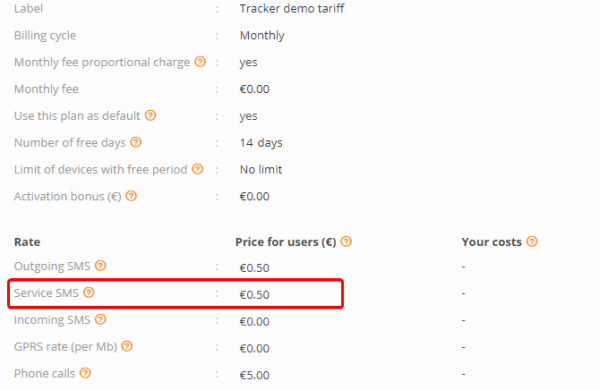
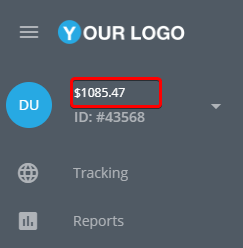
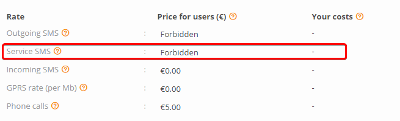

# SMS commands are not delivered

On this page we will reveal some of the potential reasons why SMS commands may not be delivered to devices. While devices can typically be set up automatically without the need for manual configuration using USB cables, drivers, configuration utilities, or complicated SMS commands, there may be instances where SMS commands fail to be delivered.

### Insufficient funds on the SMS gateway’s balance

If you use your SMS gateway that is added to your Navixy account, SMS commands may not be sent because there is not enough money on the gateway account.\
Please check that the balance is toped up and there is enough funds for SMS message sending.

### Insufficient funds on the customer’s balance

Service SMS is a message which is sent from the platform to devices, normally without any special approvement from user. For example, they are used for automatic device activation – to deliver initialization SMS commands (APN settings, server address, etc.), or when your support team performs remote device diagnostics

If these SMS commands are not free for the user according to the tariff plan, and there are not enough funds to send messages, SMS commands will not be sent



In this case, please make sure that there are enough funds on the user’s account



### Service SMS messages are forbidden

Also, activation commands may not be sent because of tariff plan’s restrictions



If you want activation commands will be sent from the platform, please enable this option. Each device has it’s own tariff plan, and tariff plan’s settings can be different for different devices.

### Devices peculiarities

There are devices such as Teltonika, Ruptela, Bitrek, which are configured by activation commands with double space symbol in the beginning, for example:

```
setparam 2004:tracker.navixy.com
```

These symbols serves as the default password. Most SMS gateways cut these space symbols as useless, though they aren’t. That’s why sometimes SMS commands cannot be delivered. You can try to configure the device via Configurator, or you can try to send SMS commands to the tracker manually from your mobile device.

### SMS gateway errors

Also if you use your own SMS gateway, you can check the SMS gateway logs. Below you can find the most common errors which you may notice:

* Message blocked. The destination number you are trying to reach is blocked from receiving this message

Please check that recipient SIM card is able to receive SMS commands.

* Unknown destination handset. The destination number you are trying to reach is unknown and may no longer exist.
* Unknown phone number

If you notice these errors, please try to check phone number correctness, perhaps it was specified incorrectly or SIM card is disconnected.
