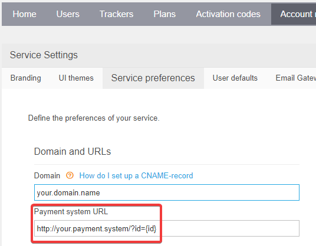

# Payment gateway

With Navixy you can provide your customers with online payment capabilities. You can use Stripe or other popular systems.

## Accepting payments with Stripe

With Navixy, you can easily integrate Stripe to receive online payments from your customers automatically.


Stripe is a global payment processor that supports more than 100 currencies and is available in over 30 countries. By integrating Stripe with Navixy, you can accept online payments from your customers using a range of payment methods, including bank cards (Visa, Mastercard, American Express), Google Pay, Apple Pay, Alipay, and many others.


To activate Stripe integration with Navixy, please contact your account manager for assistance. Once activated, you will need to configure the following technical settings in your Stripe account:

1. **Create your Stripe account:** if you don't have a Stripe account yet, you will need to create one at [http://stripe.com](http://stripe.com)
2. **Set up your payment methods:** in your Stripe account, you need to configure the payment methods that you want to accept from your customers. Stripe supports a wide range of payment methods, including bank cards, digital wallets, and bank transfers.
3. **Configure your API keys:** To enable Navixy to communicate with Stripe, you will need to configure your API keys in your Stripe account. Follow the instructions to generate your API keys and add them to your Navixy account.

The instructions below will guide you through the configuration that you need to complete in order to integrate Navxiy and Stripe.

### Stripe webhook set up

1. Login to [Stripe dashboard](https://dashboard.stripe.com/)
2. Proceed to [Developers → Webhooks](https://dashboard.stripe.com/account/webhooks)
3. Click “Add endpoint” in the top right corner. Fill out the fields in the popup dialog box:


The URL to be called depends on where you service is deployed, EU or US server:

If your service uses the platform in the EU:

`https://saas.navixy.com/api-v2/external/payments/<PlatformID>/stripe`

If your service is deployed on the US platform:

`https://saas.us.navixy.com/api-v2/external/payments/<PlatformID>/stripe`

You need to specify your platform ID: numerical value where `<PlatfromID>` is your panel number or simply what you login to the Admin Panel with.

#### Filter events

Choose “Select types to send” and check only the following 4 items:

1. `charge.refunded`
2. `payment_intent.amount_capturable_updated`
3. `payment_intent.succeeded`
4. `payment_intent.payment_failed`

#### Provide Stripe API keys

Provide your Stripe API key details to Navixy support team to complete the integration. Here are the the parameters you need to reclaim:

**Developers → API keys** | Reclaim two parameters:

* `Publishable key`
* `Secret key`


**Developers → Webhooks → Webhook** | Click on the webhook you created, and “reveal” under signing secret to claim the key:

* `Signing secret`


Once you have completed these steps, you will be ready to accept online payments from your customers using Stripe. With Navixy Stripe integration, you can streamline your payment processing and provide a seamless experience for your customers.

## Accepting payments with other methods

You can use practically any payment method by creating your script for receiving online payments. Your script should be accessible through the URL and process payments by calling Navixy Billing API.

### User interface for your custom payment methods

Once you have specified the Payment system URL in the Navixy Admin panel, the "Add money" link will be enabled in the "Account" section in the user interface.


Here's how you can set up a custom payment gateway in Navixy:

1. Go to the [Service Preferences](https://panel.navixy.com/#settings) in the Navixy Admin Panel
2. Specify the Payment system URL



Your payment system will need to process the parameter `/?id={id}`.

### Using Navixy Billing API to recharge user balance

To recharge a user balance using Navixy API, you can use the `balance/refill` method. This method allows you to refill the balance of a specific user account with a specified amount of funds.

Here's an example of how to use the `balance/refill` method with the following parameters:

* `user_id`: the ID of the user account that you want to refill the balance for
* `amount`: the amount of funds to be added to the user's balance
* `comment`: an optional comment for the transaction

```
https://api.navixy.com/v2/balance/refill/
    ?hash={api_key_hash}
    &user_id={user_id}
    &amount={amount}
    &comment={comment}

```

Make sure to replace `{api_key_hash}`, `{user_id}`, `{amount}`, and `{comment}` with the appropriate values for your request. Note that you will need to authenticate your API request with a valid API key hash.

### Automatic balance top-up

If you need your user's balance to be automatically recharged after it reaches a certain limit, you can set up auto recharge in Navixy. This can be done by configuring the auto recharge settings in the [Service Preferences](https://panel.navixy.com/#settings) section of the Navixy Admin Panel.
