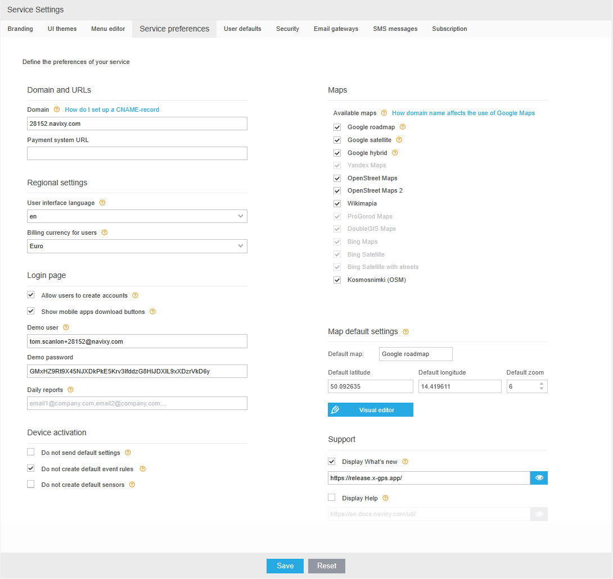

# Service preferences

This page allows you to configure the main settings of your UI. They will be used as the default settings for all users. Access them via Account Management → [Service preferences](https://panel.navixy.com/#settings).

Here, you can set up the following parameters:

1. Domain and URLs: Set a domain to be used for your UI.
2. [Regional settings](regional-settings.md): Choose the language and currency for your service.
3. Login page settings: Configure your login page.
4. [Demo user account](demo-user-account.md): Navixy allows you to create a demo user account to showcase the platform's features to your customers.
5. Device activation: Configure the device activation settings.
6. Maps: Select the maps that will be available to your users and set the default map settings.
7. Support: Add links to your own release notes and support documentation (if enabled, Navixy information will be displayed by default).
