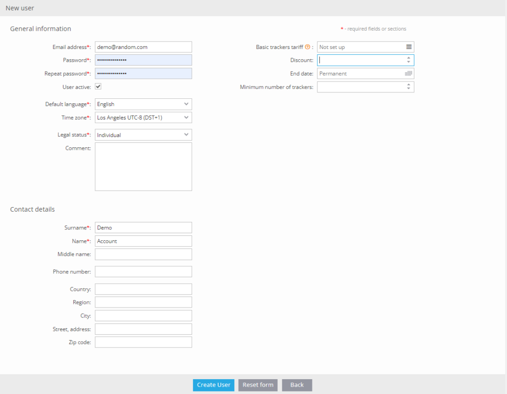
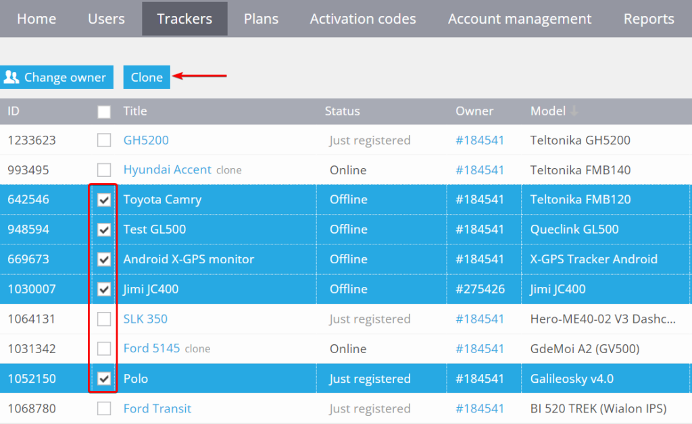
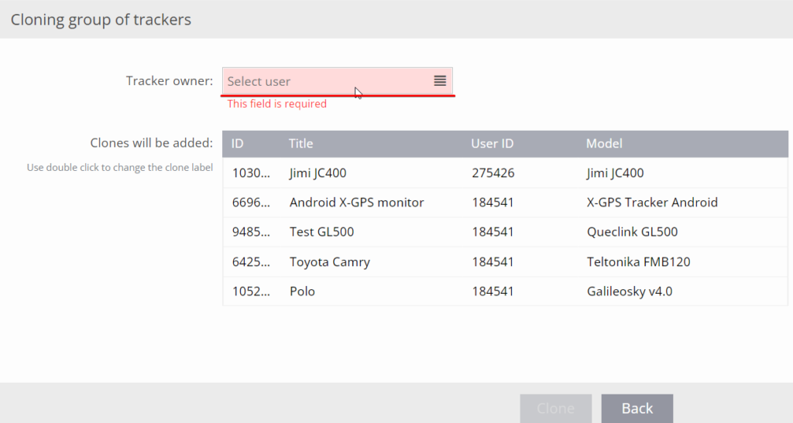
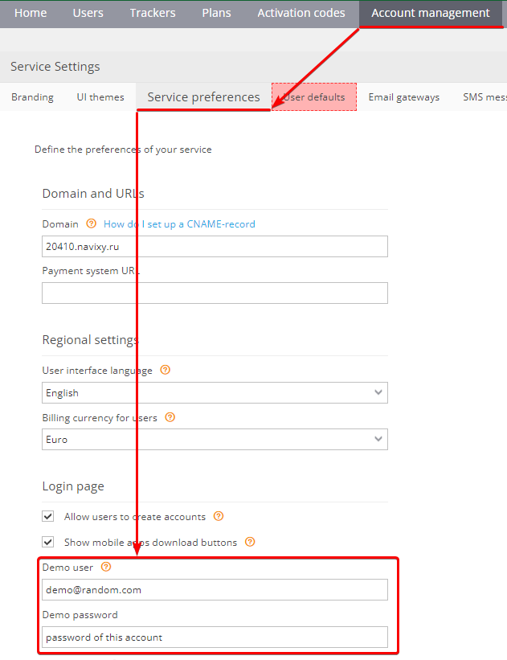
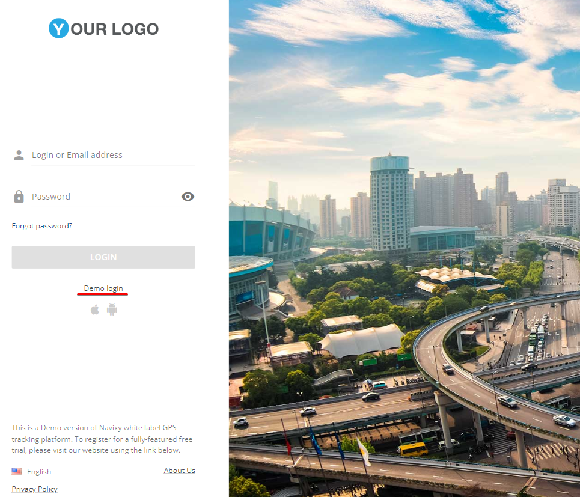

# Demo user account

## What is a user demo account

A demo user account is an account that you can share with potential or current customers to showcase the platform's features. This account has limited rights to prevent customers from making changes to critical settings. For instance, features such as output control, device and sensor configuration, and data forwarding are disabled.

### How to create a demo user

We recommend creating a specific demo user and cloning devices from other accounts into it. This allows for full operation with original devices. To create a demo user, simply use an arbitrary email address, there is no need to use a real email address for this purpose.

Next, it is recommended to clone devices from existing accounts into the demo user account. Select specific devices that you can safely show to potential or current customers to avoid any misunderstandings. To clone devices, navigate to the Trackers tab and select the necessary devices. Then, click on the Clone button.

Then select your demo account as a destination:

To indicate that the specified account is used for the demo purposes, go to the Account Management → Service preferences. In the Demo user fields, enter the login and password that you used when creating the demo account.

### Accessing user demo account

After creating the demo account, your potential customers can access it from the login page or via direct shareable link.

**Login page.** You can find the link to the demo version of your service on the login page. Anyone can access this link to explore all the available features of the platform and get familiar with its functionality.

**Shareable link.** You can also share the following direct link to the User demo account with your customers, for example by sending it to them via email or by publishing it on your corporate website. You can get this link by adding /demo to the your platform url, for example:

* https://yourdomain.com/demo
