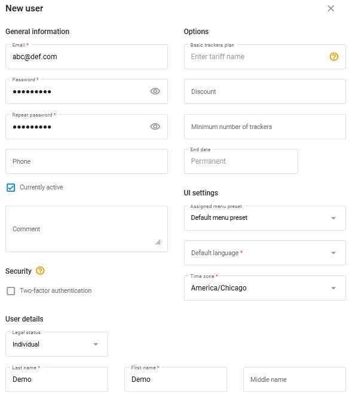
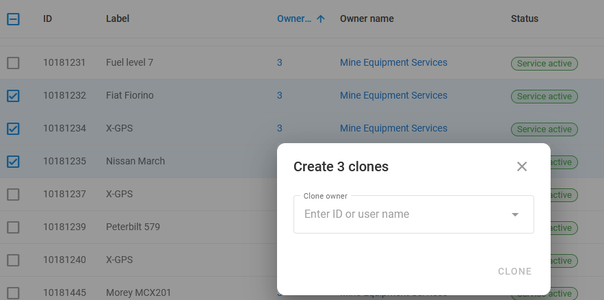
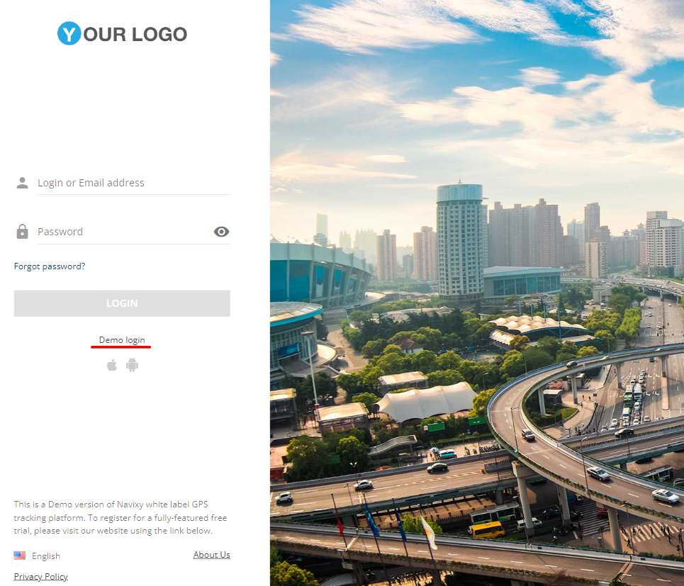

# Demo user account

A demo user account is an account that you can share with potential or existing customers to showcase your product's features. This account has limited rights to prevent customers from making changes to critical settings. For instance, features such as output control, device and sensor configuration, and data forwarding are disabled.

## How to create a demo user

Follow this steps to create and configure a demo user account:



### Create a new user

We recommend creating a specific demo user and cloning devices from other accounts into it. This allows for full operation with original devices. To create a demo user, simply enter a random email address. A real address isn't required.

<figure><figcaption>
Creating a demo user
</figcaption></figure>



### Create tracker clones

We recommend cloning devices from existing accounts for the demo user account. Select specific devices that you can safely show to potential or existing customers to avoid any misunderstandings. To clone devices, navigate to the **Trackers** page and select the necessary devices. Then click **Clone selected trackers** in the toolbar.

Alternatively, if only one tracker is selected, you can click **Create clone** in the right side panel.

<figure><figcaption>
Cloning trackers
</figcaption></figure>



### Add cloned trackers to the demo account

Select your demo account as a destination:

<figure><figcaption>
Selecting owner of multiple clones
</figcaption></figure>

If you're cloning a single tracker with the Create clone option on the right side panel, the window will contain the tracker's information:

<figure><figcaption>
Selecting owner of a single clone
</figcaption></figure>



### Add the demo account to Service preferences

To indicate that the specified account is used for the demo purposes, navigate to **Settings** **→** **Service preferences** and enter the credentials you used for creating the demo account into the corresponding fields:

<figure><figcaption>
Entering demo account credentials
</figcaption></figure>



## Accessing demo account

After creating the demo account, your potential customers can access it from the login page or via a direct shareable link.

### **Login page**

You can find the link to the demo version of your service on the login page. Anyone can access this link to explore all the available features of the platform and get familiar with its functionality.

### **Shareable link**

You can also share the following direct link to the demo account with your customers by sending it to them via email or by publishing it on your corporate website. You can get this link by adding /demo to the your platform URL, for example, "https://yourdomain.com/demo"**.**
